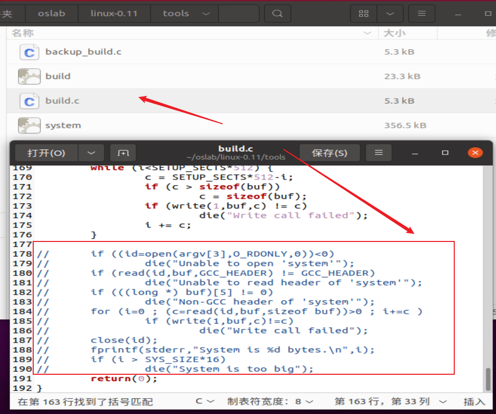
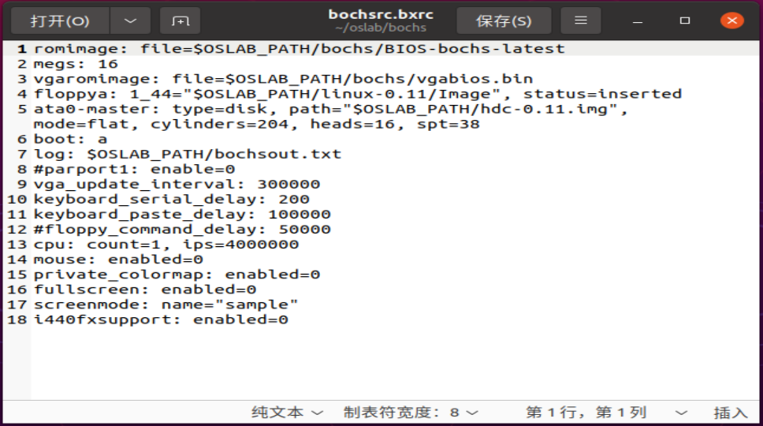
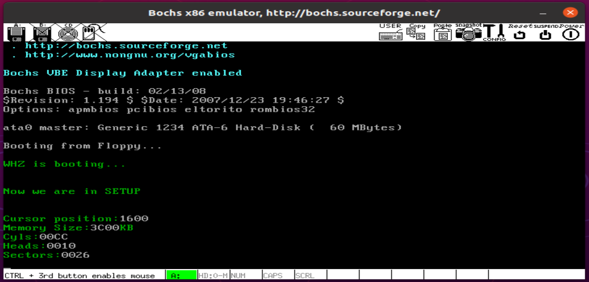

课程的实验地址：
实验楼：https://www.lanqiao.cn/courses/115


## （一） 完成【实验项目一：熟悉实验环境】
实验项目一，只是熟悉一下实验楼的实验环境，这里略过
## （二） 完成【实验项目二：操作系统的引导】
### 1. 实验要求


### 2. 实验内容
#### （1） 改写之后的 bootsect.s 代码：
```
SETUPLEN = 2            ! 要读取的扇区数
SETUPSEG = 0x07e0       ! setup 读入内存后的起始地址，这里 bootsect 没有将自己挪动到 0x90000 处，所以setup=0x07e00

entry _start
_start:
    mov ah, #0x03       ! 第 0x10 号中断例程中的 0x03 号子程序，功能为获取光标位置
    xor bh, bh
    int 0x10

    mov cx, #23         ! 显示字符串的长度
    mov bx, #0x0002     ! bh=第 0 页，bl=文字颜色属性 2
    mov bp, #msg1
    mov ax, #0x07c0
    mov es, ax          ! es:bp 是将要显示的字符串的地址
    mov ax, #0x1301     ! ah=13h 写字符串，al=01 移动光标
    int 0x10


load_setup:
    mov dx, #0x0000                 ! dh=磁头号或面号 dl=驱动器号，软驱从0开始，硬盘从80h开始
    mov cx, #0x0002                 ! ch=磁道号 cl=扇区号
    mov bx, #0x0200                 ! es:bx 指向接收从扇区读入数据的内存区
    mov ax, #0x0200 + SETUPLEN      ! ah=int 13h 的功能号(2 表示读扇区) al=读取的扇区数
    int 0x13                        ! int 13h 是 BIOS 提供的访问磁盘的中断例程

    jnc ok_load_setup               ! 读入成功则跳转
    mov dx, #0x0000
    mov ax, #0x0000                 ! 软驱、硬盘有问题时，会复位软驱
    int 0x13
    jmp load_setup                  ! 重新循环，再次尝试读取

ok_load_setup:
    jmpi 0, SETUPSEG                ! 段间跳转指令 ip=0, cs=SETUPSEG


msg1:                   ! len = 3换行 + 3回车 + 字符串长度
    .byte 13, 10        ! 换行 + 回车
    .ascii "WHZ is booting..."
    .byte 13, 10, 13, 10


.org 510
boot_flag:
    .word 0xAA55        ! 设置引导扇区标记 0xAA55
```

#### （2） 改写之后的 setup.s 代码：
```
INITSEG = 0x9000        ! setup.s 将获得的硬件参数放在内存的 0x90000 处

entry _start
_start:
! 显示字符串 "Now we are in SETUP"
    mov ah, #0x03       ! 第 0x10 号中断例程中的 0x03 号子程序，功能为获取光标位置
    xor bh, bh
    int 0x10

    mov cx, #25         ! 显示字符串的长度
    mov bx, #0x0002     ! bh=第 0 页，bl=文字颜色属性 2
    mov bp, #msg2
    mov ax, cs
    mov es, ax          ! es:bp 是将要显示的字符串的地址
    mov ax, #0x1301     ! ah=13h 写字符串，al=01 移动光标
    int 0x10


! 获取基本硬件参数
    mov ax, #INITSEG
    mov ds, ax          ! 设置 ds = 0x9000

    ! 读取光标的位置并写入 0x90000 处
    mov ah, #0x03       ! 读入光标位置
    xor bh, bh
    int 0x10
    mov [0], dx         ! 将获取的光标位置写入 ds:[0]=0x90000 处

    ! 读取内存大小并写入内存中
    mov ah, #0x88
    int 0x15
    mov [2], ax         ! 将内存大小写入 ds:[2]=0x90002 处

    ! 从 0x41 处拷贝 16 个字节（磁盘参数表）
    ! 在 PC 机中 BIOS 设定的中断向量表中 int 0x41 的中断向量位置(4*0x41 = 0x0000:0x0104)存放的并不是中断程序的地址，而是第一个硬盘的基本参数表。
    mov ax, #0x0000
    mov ds, ax
    lds si, [4 * 0x41]
    mov ax, #INITSEG
    mov es, ax
    mov di, #0x0004
    mov cx, #0x10       ! 重复 16 次，因为每个硬盘参数表有 16 个字节大小。
    rep
    movsb


! 准备打印参数
    mov ax, cs
    mov es, ax
    mov ax, #INITSEG
    mov ds, ax
    mov ss, ax
    mov sp, #0xFF00

    ! 打印光标的位置
    mov ah, #0x03
    xor bh, bh
    int 0x10
    mov cx, #18
    mov bx, #0x0002
    mov bp, #msg_cursor
    mov ax, #0x1301
    int 0x10
    mov dx, [0]
    call print_hex      ! 调用 print_hex 显示信息

    ! 打印内存大小
    mov ah, #0x03
    xor bh, bh
    int 0x10
    mov cx, #14
    mov bx, #0x0002
    mov bp, #msg_memory
    mov ax, #0x1301
    int 0x10
    mov dx, [2]
    call print_hex      ! 调用 print_hex 显示信息
    ! 添加内存单位 KB
    mov ah, #0x03
    xor bh, bh
    int 0x10
    mov cx, #2
    mov bx, #0x0002
    mov bp, #msg_kb
    mov ax, #0x1301
    int 0x10

    ! 打印柱面数
    mov ah, #0x03
    xor bh, bh
    int 0x10
    mov cx, #7
    mov bx, #0x0002
    mov bp, #msg_cyles
    mov ax, #0x1301
    int 0x10
    mov dx, [0x4 + 0x0]
    call print_hex      ! 调用 print_hex 显示信息

    ! 打印磁头数
    mov ah, #0x03
    xor bh, bh
    int 0x10
    mov cx, #8
    mov bx, #0x0002
    mov bp, #msg_heads
    mov ax, #0x1301
    int 0x10
    mov dx, [0x4 + 0x2]
    call print_hex      ! 调用 print_hex 显示信息

    ! 打印扇区
    mov ah, #0x03
    xor bh, bh
    int 0x10
    mov cx, #10
    mov bx, #0x0002
    mov bp, #msg_sectors
    mov ax, #0x1301
    int 0x10
    mov dx, [0x4 + 0x0e]
    call print_hex      ! 调用 print_hex 显示信息
    call print_nl       ! 打印换行回车

inf_loop:
    jmp inf_loop        ! 设置一个无限循环


! 以 16 进制方式打印栈顶的 16 位数
print_hex:
    mov cx, #4          ! 循环的次数，一个 dx 寄存器有 16 位，每 4 位显示一个 ASCII 字符，因此需要循环 4 次
print_digit:
    rol dx, #4          ! 循环左移，将 dx 的高 4 位移到低 4 位处
    mov ax, #0xe0f      ! ah=0x0e为int 0x10的子程序0x0e（显示一个字符串） al=要显示字符的 ASCII 码
    and al, dl          ! 取 dl 的低 4 位，通过与运算放入 al 中
    add al, #0x30       ! 数字 + 0x30 == 对应的 ASCII 码
    cmp al, #0x3a       ! 比较指令，仅对标志寄存器位有影响
    jl outp             ! jl 小于跳转
    add al, #0x07       ! a~f 是 字符 + 0x37 == 对应的 ASCII 码
outp:
    mov bx, #0x0002
    int 0x10
    loop print_digit
    ret
print_nl:
    mov ax, #0xe0d
    int 0x10            ! 打印回车
    mov al, #0xa
    int 0x10            ! 打印换行
    ret


! 提示信息
msg2:                   ! len = 3换行 + 3回车 + 字符串长度
    .byte 13, 10        ! 换行 + 回车
    .ascii "Now we are in SETUP"
    .byte 13, 10, 13, 10
msg_cursor:
    .byte 13, 10
    .ascii "Cursor position:"
msg_memory:
    .byte 13,10
    .ascii "Memory Size:"
msg_kb:
    .ascii "KB"
msg_cyles:
    .byte 13,10
    .ascii "Cyls:"
msg_heads:
    .byte 13,10
    .ascii "Heads:"
msg_sectors:
    .byte 13,10
    .ascii "Sectors:"


.org 510
boot_flag:
    .word 0xAA55
```

#### （3） build.c 需要更改的内容
默认的 build.c 会将 bootsect、setup 和 system 内核的文件名，将三者做简单的整理后一起写入 Image 中（即生成一个操作系统的镜像文件 Image）。

由于我们目前只有 bootsect 和 setup，因此需要更改一部分 build.c 的代码，更改的部分如下（只需要注释代码即可）：



#### （4） 使用 make 命令将 bootsect、setup 一起生成 Image 镜像文件 && 运行 Bochs
```
$ cd ~/oslab/linux-0.11
$ make BootImage
$ ../run
```

#### （5） 在 Bochs 中运行最新编译号的 Image 镜像文件的效果图
- bochs/bochsrc.bxrc 文件中保存的硬件信息


- 运行 Image 镜像文件的效果图



### 3. 实验报告
x86 计算机为了向下兼容，导致启动过程比较复杂，启动过程被硬件强制，软件必须遵守的两个“多此一举”的步骤：

#### （1） bootsect.s 从硬盘中先被加载到内存物理地址 0x7c000 处，后又挪动到了物理地址 0x90000 处
> 原因：
> 由于 BIOS 的硬件限制，引导扇区（bootsect.s） 在计算机启动时，从硬盘中先被加载到内存物理地址 0x7c000 处，后面又为了给 system 模块腾出空间，引导程序又将自己移动到内存靠后的位置，也就是 0x90000 处。
>
> 解决方案：
> 在保证可靠性的前提下尽量扩大实地址模式下 BIOS 可访问的内存的范围，这样就可以直接将引导扇区加载到 0x90000 或者更高的内存地址处，就避免了二次的转移。


#### （2） system 模块从硬盘中先被加载到内存物理地址 0x10000 处，后又挪动到了物理地址 0x00000 处
> 原因：
> 在计算机启动的时候，会执行 BIOS 中的初始化程序，**初始化程序**主要的功能是在内存物理地址 0 处建立 BIOS 所支持的中断向量，即将 BIOS 提供的中断例程的入口地址登记在中断向量表中。
> linux 0.11 的 system 模块被 bootsect.s 程序加载到 0x10000 处，等后续 setup.s 程序执行的时候，又会将 system 模块移动到 0x00000 处，目的是避免 system 模块直接写到 0x00000 处覆盖了中断向量表。（因为在移动 system 模块之前，setup 代码还需要利用 ROM BIOS 中的中断向量表来获取机器的一些参数）
>
> 解决方案：
> 初始化程序时，将 ROM BIOS 的中断向量表放到实模式下能寻址内存的其他地方，这样操作系统的 system 模块就可以直接存放到 0x00000 处，避免二次的转移。