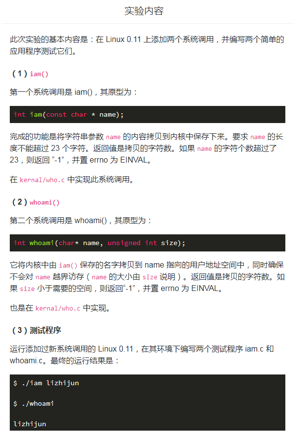
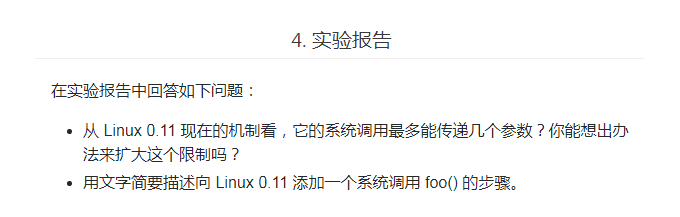
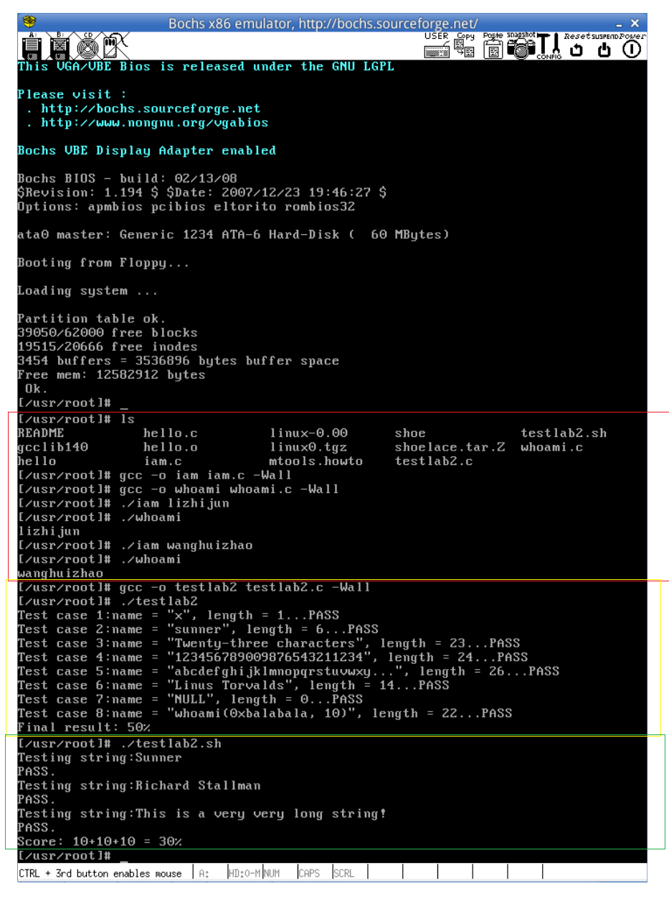

课程的实验地址：
实验楼：https://www.lanqiao.cn/courses/115


## （一）实验相关的要求
### 1. 实验内容


### 2. 实验报告


### 3. 评分标准


## （二）实验
### 1. 需要变动的文件
#### （1） /linux-0.11/include/unistd.h
添加系统调用的编号
\#define __NR_iam 72
\#define __NR_whoami 73

```c
代码更改前：
#define __NR_setreuid	70
#define __NR_setregid	71

#define _syscall0(type,name) \


代码更改后：
#define __NR_setreuid	70
#define __NR_setregid	71
#define __NR_iam 72
#define __NR_whoami 73

#define _syscall0(type,name) \
```

#### （2） /linux-0.11/kernel/system_call.s
更改内核函数中系统调用的总数，因为中断调用的时候会检查系统调用编号是否在合法范围内
nr_system_calls = 74


```c
代码更改前：
# offsets within sigaction
sa_handler = 0
sa_mask = 4
sa_flags = 8
sa_restorer = 12

nr_system_calls = 72


代码更改后：
# offsets within sigaction
sa_handler = 0
sa_mask = 4
sa_flags = 8
sa_restorer = 12

nr_system_calls = 74
```

#### （3） /linux-0.11/include/linux/sys.h
1. 仿照此文件中前面各个系统调用的写法，引用实验要求增加的系统调用（引用外部的函数）
    extern int sys_iam();
    extern int sys_whoami();

```c
代码更改前：
extern int sys_sgetmask();
extern int sys_ssetmask();
extern int sys_setreuid();
extern int sys_setregid();

代码更改后：
extern int sys_sgetmask();
extern int sys_ssetmask();
extern int sys_setreuid();
extern int sys_setregid();
extern int sys_iam();
extern int sys_whoami();
```

2. 在中断处理函数所调用的函数表中增加两个函数引用
    在 “函数指针数组” 中添加 sys_iam 和 sys_whoami，函数在数组中的位置必须和 __NR_xxxxxx 的值对应上。

```c
代码更改前：
fn_ptr sys_call_table[] = { sys_setup, sys_exit, sys_fork, sys_read,
sys_write, sys_open, sys_close, sys_waitpid, sys_creat, sys_link,
sys_unlink, sys_execve, sys_chdir, sys_time, sys_mknod, sys_chmod,
sys_chown, sys_break, sys_stat, sys_lseek, sys_getpid, sys_mount,
sys_umount, sys_setuid, sys_getuid, sys_stime, sys_ptrace, sys_alarm,
sys_fstat, sys_pause, sys_utime, sys_stty, sys_gtty, sys_access,
sys_nice, sys_ftime, sys_sync, sys_kill, sys_rename, sys_mkdir,
sys_rmdir, sys_dup, sys_pipe, sys_times, sys_prof, sys_brk, sys_setgid,
sys_getgid, sys_signal, sys_geteuid, sys_getegid, sys_acct, sys_phys,
sys_lock, sys_ioctl, sys_fcntl, sys_mpx, sys_setpgid, sys_ulimit,
sys_uname, sys_umask, sys_chroot, sys_ustat, sys_dup2, sys_getppid,
sys_getpgrp, sys_setsid, sys_sigaction, sys_sgetmask, sys_ssetmask,
sys_setreuid,sys_setregid };


代码更改后：
fn_ptr sys_call_table[] = { sys_setup, sys_exit, sys_fork, sys_read,
sys_write, sys_open, sys_close, sys_waitpid, sys_creat, sys_link,
sys_unlink, sys_execve, sys_chdir, sys_time, sys_mknod, sys_chmod,
sys_chown, sys_break, sys_stat, sys_lseek, sys_getpid, sys_mount,
sys_umount, sys_setuid, sys_getuid, sys_stime, sys_ptrace, sys_alarm,
sys_fstat, sys_pause, sys_utime, sys_stty, sys_gtty, sys_access,
sys_nice, sys_ftime, sys_sync, sys_kill, sys_rename, sys_mkdir,
sys_rmdir, sys_dup, sys_pipe, sys_times, sys_prof, sys_brk, sys_setgid,
sys_getgid, sys_signal, sys_geteuid, sys_getegid, sys_acct, sys_phys,
sys_lock, sys_ioctl, sys_fcntl, sys_mpx, sys_setpgid, sys_ulimit,
sys_uname, sys_umask, sys_chroot, sys_ustat, sys_dup2, sys_getppid,
sys_getpgrp, sys_setsid, sys_sigaction, sys_sgetmask, sys_ssetmask,
sys_setreuid,sys_setregid, sys_iam, sys_whoami };
```


#### （4） /linux-0.11/kernel/who.c
在 /linux-0.11/kernel 目录下创建一个文件 who.c，在里面实现我们要添加的系统调用，即实现函数 sys_iam() 和 sys_whoami()

实现代码：
```c
#include <asm/segment.h>                // get_fs_byte
#include <errno.h>                      // EINVAL
#include <string.h>                     // strcpy strlen

char _myname[24];       // 23 个字符 + '\0' = 24 操作系统内核在运行的时候就预留出空间存储名字

int sys_iam(const char* name) {
    char temp[30];

    int i = 0;
    // 获取用户态内存中的字符串
    for (i = 0; i < 30; i++) {
        // 从用户态内存中获取输入的字符串
        temp[i] = get_fs_byte(name + i);

        // 如果识别到字符串的末尾，则结束循环
        if (temp[i] == '\0') {
            break;
        }
    }

    int len = strlen(temp);

    if (len > 23) {         // 等于 23 则说明有 23 个字符以及一个空字符
        return -(EINVAL);   // 置 errno 为 EINVAL ，返回 ­-1 ，具体见 _syscalln 的宏展开
    }

    strcpy(_myname, temp);

    return len;
}

int sys_whoami(char* name, unsigned int size) {
    int len = strlen(_myname) + 1;      // 包含字符串末尾的空字符 \0

    if (size < len) {
        return -(EINVAL);
    }

    // 把内核态内存中的 _myname 保存的字符串输出到用户态内存的 name 中
    int i = 0;
    for (i = 0; i < len; i++) {
        put_fs_byte(_myname[i], (name + i));
    }

    return len - 1;
}
```

#### （5） /linux-0.11/kernel/makefile
1. 添加 OBJS 变量后面的依赖文件 who.o

```makefile
代码更改前：
OBJS  = sched.o system_call.o traps.o asm.o fork.o \
	panic.o printk.o vsprintf.o sys.o exit.o \
	signal.o mktime.o

代码更改后：
OBJS  = sched.o system_call.o traps.o asm.o fork.o \
	panic.o printk.o vsprintf.o sys.o exit.o \
	signal.o mktime.o who.o
```

2. 添加依赖 who.s 和 who.o 的生成规则
```makefile
代码更改前：
### Dependencies:
exit.s exit.o: exit.c ../include/errno.h ../include/signal.h \
  ../include/sys/types.h ../include/sys/wait.h ../include/linux/sched.h \
  ../include/linux/head.h ../include/linux/fs.h ../include/linux/mm.h \
  ../include/linux/kernel.h ../include/linux/tty.h ../include/termios.h \
  ../include/asm/segment.h


代码更改后：
### Dependencies:
who.s who.o: who.c ../include/linux/kernel.h ../include/unistd.h
exit.s exit.o: exit.c ../include/errno.h ../include/signal.h \
  ../include/sys/types.h ../include/sys/wait.h ../include/linux/sched.h \
  ../include/linux/head.h ../include/linux/fs.h ../include/linux/mm.h \
  ../include/linux/kernel.h ../include/linux/tty.h ../include/termios.h \
  ../include/asm/segment.h
```


### 2. 启动 linux-0.11 前要做的事情
#### （1） 启动根文件系统镜像
```
$ cd ~/oslab/

# 启动挂载脚本
$ sudo ./mount-hdc
```

#### （2） 更改 /usr/include/unistd.h 文件
- 在 0.11 环境下编译 C 程序，包含的头文件都在 /usr/include 目录下。
- 因此当我们在 0.11 环境下编译 iam.c ，还需要自己手动修改 unistd.h 文件
- （它和 0.11 源码树中的 unistd.h 并不是同一个文件，虽然内容可能相同），没有 __NR_whoami 和 __NR_iam 两个宏，需要手工加上它们，也可以直接从修改过的 0.11 源码树中拷贝新的 unistd.h 过来。

#### （3） 添加测试用的应用程序
在 /usr/root/ 目录下添加两个应用程序 iam.c 和 whoami.c

iam.c
```c
#include <errno.h>
#define __LIBRARY__
#include <unistd.h>
#include <stdio.h>

_syscall1(int, iam, const char*, name);

int main(int argc, char *argv[]) {
    // 调用库函数 API
    iam(argv[1]);

    return 0;
}
```

whoami.c
```c
#include <errno.h>
#define __LIBRARY__
#include <unistd.h>
#include <stdio.h>

_syscall2(int, whoami, char *, name, unsigned int, size);

int main(int argc, char *argv[]) {
    char name[30] = {0};

    // 调用库函数 API
    whoami(name, 30);
    printf("%s\n", name);

    return 0;
}
```

#### （4） 拷贝实验评分标准中的两个文件到文件系统中
- 在当前运行系统下的 /home/teacher 目录下的 testlab2.c
- 在当前运行系统下的 /home/teacher 目录下的脚本 testlab2.sh

#### （5） 卸载文件系统
```
$ cd ~/oslab/

# 卸载
$ sudo umount hdc
```

#### （6） 启动 linux-0.11
使用 Bochs 来启动 linux-0.11 的镜像文件，在里面就可以验证实验的结果了


### 3. 启动了 linux-0.11 后，实验结果示意图



### 4. 实验报告
#### （1） 从 Linux 0.11 现在的机制看，它的系统调用最多能传递几个参数？你能想出办法来扩大这个限制吗？
答：
1. 从 linux-0.11/include/unistd.h 文件中的 _syscall3 可以知道，目前它的系统调用最多能传递 3 个参数。
2. 扩大限制的方法一：多加几个 _syscall ，分别可以传递的参数就可以一直扩大。
3. 扩大限制的方法二：将需要传递的多个参数保存在特定结构的区间中，并将该用户态地址空间的这个区间的首地址作为一个参数传递给系统调用。最后通过寄存器间接寻址方式便可以访问所有参数。当然，这么做的话，参数合法性验证尤其必要。实际上，linux2.6内核废除了_syscall宏，而使用syscall函数，其接受一个可变参数，原理类似，参考《深入理解Linux内核（第三版）》 P409。


#### （2） 用文字简要描述向 Linux 0.11 添加一个系统调用 foo() 的步骤。
答：
1. 更改 /linux-0.11/include/unistd.h 文件
```
添加系统调用的编号
#define __NR_foo num
num 为系统调用号
```

2. 更改 /linux-0.11/kernel/system_call.s 文件
```
更改内核函数中系统调用的总数，因为中断调用的时候会检查系统调用编号是否在合法范围内

nr_system_calls = num
num 为在原值上加 1，即系统调用总数加 1
```

3. 更改 /linux-0.11/include/linux/sys.h 文件
```
1. 仿照此文件中前面各个系统调用的写法，引用实验要求增加的系统调用（引用外部的函数）
    extern int sys_foo();
2. 在中断处理函数所调用的函数表中增加两个函数引用在
    “函数指针数组” 中添加 sys_foo，函数在数组中的位置必须和 __NR_xxxxxx 的值对应上。
```

4. 添加 /linux-0.11/kernel/foo.c 文件
```
创建一个文件 foo.c，在里面实现我们要添加的系统调用 sys_foo()
```

5. 更改 /linux-0.11/kernel/makefile 文件
```
1. 添加 OBJS 变量后面的依赖文件 foo.o
2. 添加依赖 foo.s 和 foo.o 的生成规则
```

6. 用户模式下
```
添加的测试应用程序源代码中
#define __LIBRARY__
#include <unistd.h>
_syscallN 宏展开系统调用，这样就相当于给用户程序提供了系统调用的接口
```


### 5. 本次实验完整的源码
[实验项目2-添加系统调用 代码](https://github.com/wtraceback/HIT-OSLab-Personal)


### 6. 参考
[HIT-OSLab](https://github.com/hoverwinter/HIT-OSLab)