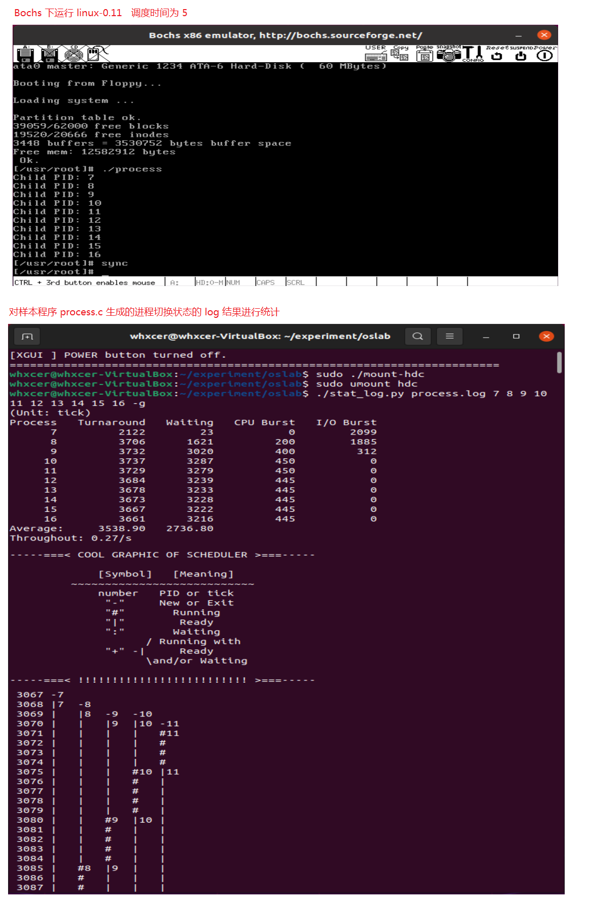

课程的实验地址：
实验楼：https://www.lanqiao.cn/courses/115


## （一）实验相关的要求
### 1. 实验目的


### 2. 实验内容


### 3. 实验报告


### 4. 评分标准


## （二）实际实验步骤的概述
### 1. 主要的实验内容
1. 基于模板 process.c 编写多进程的样本程序，实现如下功能： + 所有子进程都并行运行，每个子进程的实际运行时间一般不超过 30 秒； + 父进程向标准输出打印所有子进程的 id，并在所有子进程都退出后才退出；

2. 在 Linux0.11 上实现进程运行轨迹的跟踪。 + 基本任务是在内核中维护一个日志文件 /var/process.log，把从操作系统启动到系统关机过程中所有进程的运行轨迹都记录在这一 log 文件中。

3. 在修改过的 Linux0.11 上运行样本程序，通过分析 log 文件，统计该程序建立的所有进程的等待时间、完成时间（周转时间）和运行时间，然后计算平均等待时间，平均完成时间和吞吐量。可以自己编写统计程序，也可以使用 python 脚本程序—— stat_log.py（在 /home/teacher/ 目录下） ——进行统计。

4. 修改 0.11 进程调度的时间片，然后再运行同样的样本程序，统计同样的时间数据，和原有的情况对比，体会不同时间片带来的差异。

### 2. 实际的实验步骤
1. 操作系统启动后，在 init/main.c 文件中先打开 /var/process.log 文件
2. 在内核中实现自定义的写文件函数，在内核中用这个函数来写 log 文件
3. 寻找进程状态的切换点，然后添加适当的写文件代码，在合适的时机向 log 文件内写入记录
4. 将修改后的 linux-0.11 重新编译，生成新的系统镜像文件
5. 基于模板 process.c 编写多进程的样本程序，是用来生成各种进程的程序。
6. 启动根文件系统镜像，在其中添加将样本程序 process.c 复制到 /oslab/hdc/usr/root 目录下
7. 卸载根文件系统镜像
8. 启动 Bochs 也就是启动 linux-0.11，编译并运行样本程序 process.c，可以得出在 linux-0.11 上进程运行轨迹的跟踪，也就是可以跟踪 process.c 生成的进程的运行轨迹
9. 关闭 Bochs 前，先运行 sync 命令，它会刷新 cache，确保文件确实写入了磁盘
10. 启动根文件系统镜像，然后将 /oslab/hdc/var/ 目录下的 process.log 文件复制到当前运行的系统中
11. 卸载根文件系统镜像
12. 在当前运行的操作系统中，使用实验自带的 stat_log.py 的 Python 脚本程序对 process.log 日志文件进行统计
13. 修改 linux-0.11 源码 /include/linux/sched.h 中的进程调度的时间片（优先级）
14. 然后重复 4、8、9、10、11、12 这几步的操作
15. 最后比较不同时间片带来的差异

## （三）实验
### 1. 操作系统启动后，在 init/main.c 文件中先打开 /var/process.log 文件

> init/main.c/main() 函数
```c
void main(void)		/* This really IS void, no error here. */
{			/* The startup routine assumes (well, ...) this */
/*
 * Interrupts are still disabled. Do necessary setups, then
 * enable them
 */
 	ROOT_DEV = ORIG_ROOT_DEV;
 	drive_info = DRIVE_INFO;
	memory_end = (1<<20) + (EXT_MEM_K<<10);
	memory_end &= 0xfffff000;
	if (memory_end > 16*1024*1024)
		memory_end = 16*1024*1024;
	if (memory_end > 12*1024*1024)
		buffer_memory_end = 4*1024*1024;
	else if (memory_end > 6*1024*1024)
		buffer_memory_end = 2*1024*1024;
	else
		buffer_memory_end = 1*1024*1024;
	main_memory_start = buffer_memory_end;
#ifdef RAMDISK
	main_memory_start += rd_init(main_memory_start, RAMDISK*1024);
#endif
	mem_init(main_memory_start,memory_end);
	trap_init();
	blk_dev_init();
	chr_dev_init();
	tty_init();
	time_init();
	sched_init();
	buffer_init(buffer_memory_end);
	hd_init();
	floppy_init();
	sti();
	move_to_user_mode();

	/***************添加开始***************/
	// 加载文件系统
	setup((void *) &drive_info);
	// 打开 /dev/tty0，建立文件描述符 0 和 /dev/tty0 的关联 --> 描述符0 == stdin
	(void) open("/dev/tty0",O_RDWR,0);
	// 让文件描述符 1 也和 /dev/tty0 关联 --> 描述符1 == stdout
	(void) dup(0);
	// 让文件描述符 2 也和 /dev/tty0 关联 --> 描述符2 == stderr
	(void) dup(0);
	// 把 log 文件的描述符关联到 3
	// 文件系统初始化，描述符 0、1 和 2 关联之后，才能打开 log 文件，开始记录进程的运行轨迹
	(void) open("/var/process.log", O_CREAT|O_TRUNC|O_WRONLY, 0666);
	// O_CREAT 如果指定文件不存在，则创建这个文件
	// O_WRONLY 只写模式
	// O_TRUNC 如果文件存在，并且以只写/读写方式打开，则清空文件全部内容(即将其长度截短为0)
	// 打开 log 文件的参数的含义是建立只写文件，如果文件已存在则清空已有内容。
	// 文件的权限是所有人可读可写。
	/***************添加结束***************/

	if (!fork()) {		/* we count on this going ok */
		init();
	}
/*
 *   NOTE!!   For any other task 'pause()' would mean we have to get a
 * signal to awaken, but task0 is the sole exception (see 'schedule()')
 * as task 0 gets activated at every idle moment (when no other tasks
 * can run). For task0 'pause()' just means we go check if some other
 * task can run, and if not we return here.
 */
	for(;;) pause();
}
```

### 2. 在内核中实现自定义的写文件函数，在内核中用这个函数来写 log 文件
log 文件将被用来记录进程的状态转移轨迹。所有的状态转移都是在内核进行的。
在内核状态下，write() 功能失效，所以我们要重新 write 文件，也就是自定义自己的 write 函数，即 fprintk，然后将函数放入 kernel/printk.c 文件中

> 在 kernel/printk.c 文件中添加自定义函数 fprintk()
```c
/*
*	customize write function
*/
static char logbuf[1024];
int fprintk(int fd, const char *fmt, ...)
{
    va_list args;
    int count;
    struct file * file;
    struct m_inode * inode;

    va_start(args, fmt);
    count=vsprintf(logbuf, fmt, args);
    va_end(args);
	/* 如果输出到stdout或stderr，直接调用sys_write即可 */
    if (fd < 3)
    {
        __asm__("push %%fs\n\t"
            "push %%ds\n\t"
            "pop %%fs\n\t"
            "pushl %0\n\t"
        /* 注意对于Windows环境来说，是_logbuf,下同 */
            "pushl $logbuf\n\t"
            "pushl %1\n\t"
        /* 注意对于Windows环境来说，是_sys_write,下同 */
            "call sys_write\n\t"
            "addl $8,%%esp\n\t"
            "popl %0\n\t"
            "pop %%fs"
            ::"r" (count),"r" (fd):"ax","cx","dx");
    }
    else
	/* 假定>=3的描述符都与文件关联。事实上，还存在很多其它情况，这里并没有考虑。*/
    {
    	/* 从进程0的文件描述符表中得到文件句柄 */
        if (!(file=task[0]->filp[fd]))
            return 0;
        inode=file->f_inode;

        __asm__("push %%fs\n\t"
            "push %%ds\n\t"
            "pop %%fs\n\t"
            "pushl %0\n\t"
            "pushl $logbuf\n\t"
            "pushl %1\n\t"
            "pushl %2\n\t"
            "call file_write\n\t"
            "addl $12,%%esp\n\t"
            "popl %0\n\t"
            "pop %%fs"
            ::"r" (count),"r" (file),"r" (inode):"ax","cx","dx");
    }
    return count;
}
```

### 3. 寻找进程状态的切换点
寻找进程状态的切换点，然后添加适当的写文件代码，在合适的时机向 log 文件内写入记录

#### （1） 进程的基本状态转移图


#### （2） Linux 0.11 操作系统支持四种进程状态的转移：
##### ① 就绪到运行
就绪与运行间的状态转移是通过 schedule()（它亦是调度算法所在）完成的
> 就绪 <=> 运行：kernel/sched.c/schedule() 函数
```c
/*
 *  'schedule()' is the scheduler function. This is GOOD CODE! There
 * probably won't be any reason to change this, as it should work well
 * in all circumstances (ie gives IO-bound processes good response etc).
 * The one thing you might take a look at is the signal-handler code here.
 *
 *   NOTE!!  Task 0 is the 'idle' task, which gets called when no other
 * tasks can run. It can not be killed, and it cannot sleep. The 'state'
 * information in task[0] is never used.
 */
void schedule(void)
{
	int i,next,c;
	struct task_struct ** p;

/* check alarm, wake up any interruptible tasks that have got a signal */

	for(p = &LAST_TASK ; p > &FIRST_TASK ; --p)
		if (*p) {
			if ((*p)->alarm && (*p)->alarm < jiffies) {
					(*p)->signal |= (1<<(SIGALRM-1));
					(*p)->alarm = 0;
				}
			if (((*p)->signal & ~(_BLOCKABLE & (*p)->blocked)) &&
			(*p)->state==TASK_INTERRUPTIBLE)
			{
				(*p)->state=TASK_RUNNING;
				/*
				* 运行 => 就绪
				*/
				fprintk(3, "%ld\t%c\t%ld\n", (*p)->pid, 'J', jiffies);
			}
		}

/* this is the scheduler proper: */

	while (1) {
		c = -1;
		next = 0;
		i = NR_TASKS;
		p = &task[NR_TASKS];
		while (--i) {
			if (!*--p)
				continue;
			if ((*p)->state == TASK_RUNNING && (*p)->counter > c)
				c = (*p)->counter, next = i;
		}
		if (c) break;
		for(p = &LAST_TASK ; p > &FIRST_TASK ; --p)
			if (*p)
				(*p)->counter = ((*p)->counter >> 1) +
						(*p)->priority;
	}

	/*
	* 编号为 next 的进程将要运行
	* 如果 next 恰好是当前正处于运行态的进程，则状态不改变
	*/
	if (current->pid != task[next]->pid) {
		// 当前进程，如果已经被改变了运行的状态，则记录下来
		if (current->state == TASK_RUNNING) {
			fprintk(3, "%ld\t%c\t%ld\n", current->pid, 'J', jiffies);
		}

		// 下一个要运行的进程
		fprintk(3, "%ld\t%c\t%ld\n", task[next]->pid, 'R', jiffies);
	}

	switch_to(next);
}
```

##### ② 运行到就绪
就绪与运行间的状态转移是通过 schedule()（它亦是调度算法所在）完成的
##### ③ 运行到阻塞和阻塞到就绪
> 运行到阻塞：kernel/sched.c/sleep_on() 函数
```c
void sleep_on(struct task_struct **p)
{
	struct task_struct *tmp;

	if (!p)
		return;
	if (current == &(init_task.task))
		panic("task[0] trying to sleep");
	tmp = *p;
	*p = current;
	current->state = TASK_UNINTERRUPTIBLE;
	/*
	* 运行 => 不可中断阻塞
	* 让出 CPU
	*/
	fprintk(3, "%ld\t%c\t%ld\n", current->pid, 'W', jiffies);
	schedule();
	if (tmp)
	{
		tmp->state=0;
		/*
		* 唤醒阻塞队列中的第一个进程，切换为就绪态
		*/
		fprintk(3, "%ld\t%c\t%ld\n", tmp->pid, 'J', jiffies);
	}
}
```

> 运行到阻塞：kernel/sched.c/interruptible_sleep_on() 函数
```c
void interruptible_sleep_on(struct task_struct **p)
{
	struct task_struct *tmp;

	if (!p)
		return;
	if (current == &(init_task.task))
		panic("task[0] trying to sleep");
	tmp=*p;
	*p=current;
repeat:	current->state = TASK_INTERRUPTIBLE;
	/*
	* 将当前进程置为可中断的阻塞态，放入 *p 指定的阻塞队列的头部，tmp 是原来的头部
	* 当前进程 运行 => 可中断阻塞
	*/
	fprintk(3, "%ld\t%c\t%ld\n", current->pid, 'W', jiffies);
	schedule();
	if (*p && *p != current) {
		(**p).state=0;
		/*
		* 唤醒阻塞队列中的第一个进程，切换为就绪态
		*/
		fprintk(3, "%ld\t%c\t%ld\n", (*p)->pid, 'J', jiffies);
		goto repeat;
	}
	*p=NULL;
	if (tmp)
	{
		tmp->state=0;
		/*
		* 唤醒阻塞队列中的第一个进程，切换为就绪态
		*/
		fprintk(3, "%ld\t%c\t%ld\n", tmp->pid, 'J', jiffies);
	}
}
```

> 主动进入阻塞态：kernel/sched.c/sys_pause() 函数
```c
int sys_pause(void)
{
	current->state = TASK_INTERRUPTIBLE;

	/*
	* 系统无事可做的时候，进程 0 会不停地调用 sys_pause()，以激活调度算法。此时它的状态可以是等待态，
	* 等待有其它可运行的进程；也可以叫运行态，因为它是唯一一个在 CPU 上运行的进程，只不过运行的效果是等待。
	*/
	if (current->pid != 0) {
		/*
		* 运行 => 阻塞
		*/
		fprintk(3, "%ld\t%c\t%ld\n", current->pid, 'W', jiffies);
	}
	schedule();
	return 0;
}
```

> 主动进入阻塞态：kernel/exit.c/sys_waitpid() 函数
```c
int sys_waitpid(pid_t pid,unsigned long * stat_addr, int options)
{
	int flag, code;
	struct task_struct ** p;

	verify_area(stat_addr,4);
repeat:
	flag=0;
	for(p = &LAST_TASK ; p > &FIRST_TASK ; --p) {
		if (!*p || *p == current)
			continue;
		if ((*p)->father != current->pid)
			continue;
		if (pid>0) {
			if ((*p)->pid != pid)
				continue;
		} else if (!pid) {
			if ((*p)->pgrp != current->pgrp)
				continue;
		} else if (pid != -1) {
			if ((*p)->pgrp != -pid)
				continue;
		}
		switch ((*p)->state) {
			case TASK_STOPPED:
				if (!(options & WUNTRACED))
					continue;
				put_fs_long(0x7f,stat_addr);
				return (*p)->pid;
			case TASK_ZOMBIE:
				current->cutime += (*p)->utime;
				current->cstime += (*p)->stime;
				flag = (*p)->pid;
				code = (*p)->exit_code;
				release(*p);
				put_fs_long(code,stat_addr);
				return flag;
			default:
				flag=1;
				continue;
		}
	}
	if (flag) {
		if (options & WNOHANG)
			return 0;
		current->state=TASK_INTERRUPTIBLE;
		/*
		* 当前进程 => 阻塞
		*/
		fprintk(3, "%ld\t%c\t%ld\n", current->pid, 'W', jiffies);
		schedule();
		if (!(current->signal &= ~(1<<(SIGCHLD-1))))
			goto repeat;
		else
			return -EINTR;
	}
	return -ECHILD;
}
```

> 阻塞到就绪：kernel/sched.c/wake_up() 函数
```c
void wake_up(struct task_struct **p)
{
	if (p && *p) {
		(**p).state=0;
		/*
		* 唤醒，阻塞 => 就绪
		*/
		fprintk(3, "%ld\t%c\t%ld\n", (*p)->pid, 'J', jiffies);
		*p=NULL;
	}
}
```

##### ④ 新建和退出
（新建 即 fork() 函数，内核中的实现为 fork.c/copy_process() 函数）
> 新建：kernel/fork.c/copy_process() 函数
```c
/*
 *  Ok, this is the main fork-routine. It copies the system process
 * information (task[nr]) and sets up the necessary registers. It
 * also copies the data segment in it's entirety.
 */
int copy_process(int nr,long ebp,long edi,long esi,long gs,long none,
		long ebx,long ecx,long edx,
		long fs,long es,long ds,
		long eip,long cs,long eflags,long esp,long ss)
{
	struct task_struct *p;
	int i;
	struct file *f;

	p = (struct task_struct *) get_free_page();
	if (!p)
		return -EAGAIN;
	task[nr] = p;
	*p = *current;	/* NOTE! this doesn't copy the supervisor stack */
	p->state = TASK_UNINTERRUPTIBLE;
	p->pid = last_pid;
	p->father = current->pid;
	p->counter = p->priority;
	p->signal = 0;
	p->alarm = 0;
	p->leader = 0;		/* process leadership doesn't inherit */
	p->utime = p->stime = 0;
	p->cutime = p->cstime = 0;
	p->start_time = jiffies;
	p->tss.back_link = 0;
	p->tss.esp0 = PAGE_SIZE + (long) p;
	p->tss.ss0 = 0x10;
	p->tss.eip = eip;
	p->tss.eflags = eflags;
	p->tss.eax = 0;
	p->tss.ecx = ecx;
	p->tss.edx = edx;
	p->tss.ebx = ebx;
	p->tss.esp = esp;
	p->tss.ebp = ebp;
	p->tss.esi = esi;
	p->tss.edi = edi;
	p->tss.es = es & 0xffff;
	p->tss.cs = cs & 0xffff;
	p->tss.ss = ss & 0xffff;
	p->tss.ds = ds & 0xffff;
	p->tss.fs = fs & 0xffff;
	p->tss.gs = gs & 0xffff;
	p->tss.ldt = _LDT(nr);
	p->tss.trace_bitmap = 0x80000000;
	if (last_task_used_math == current)
		__asm__("clts ; fnsave %0"::"m" (p->tss.i387));
	if (copy_mem(nr,p)) {
		task[nr] = NULL;
		free_page((long) p);
		return -EAGAIN;
	}
	for (i=0; i<NR_OPEN;i++)
		if ((f=p->filp[i]))
			f->f_count++;
	if (current->pwd)
		current->pwd->i_count++;
	if (current->root)
		current->root->i_count++;
	if (current->executable)
		current->executable->i_count++;
	set_tss_desc(gdt+(nr<<1)+FIRST_TSS_ENTRY,&(p->tss));
	set_ldt_desc(gdt+(nr<<1)+FIRST_LDT_ENTRY,&(p->ldt));
	/*
	* 新建一个进程
	*/
	fprintk(3, "%ld\t%c\t%ld\n", p->pid, 'N', jiffies);
	p->state = TASK_RUNNING;	/* do this last, just in case */
	/*
	* 新建 => 就绪
	*/
	fprintk(3, "%ld\t%c\t%ld\n", p->pid, 'J', jiffies);
	return last_pid;
}
```

> 退出：kernel/exit.c/do_exit() 函数
```c
int do_exit(long code)
{
	int i;
	free_page_tables(get_base(current->ldt[1]),get_limit(0x0f));
	free_page_tables(get_base(current->ldt[2]),get_limit(0x17));
	for (i=0 ; i<NR_TASKS ; i++)
		if (task[i] && task[i]->father == current->pid) {
			task[i]->father = 1;
			if (task[i]->state == TASK_ZOMBIE)
			{
				/* assumption task[1] is always init */
				(void) send_sig(SIGCHLD, task[1], 1);
			}
		}
	for (i=0 ; i<NR_OPEN ; i++)
		if (current->filp[i])
			sys_close(i);
	iput(current->pwd);
	current->pwd=NULL;
	iput(current->root);
	current->root=NULL;
	iput(current->executable);
	current->executable=NULL;
	if (current->leader && current->tty >= 0)
		tty_table[current->tty].pgrp = 0;
	if (last_task_used_math == current)
		last_task_used_math = NULL;
	if (current->leader)
		kill_session();
	current->state = TASK_ZOMBIE;
	/*
	* 退出一个进程
	*/
	fprintk(3, "%ld\t%c\t%ld\n", current->pid, 'E', jiffies);
	current->exit_code = code;
	tell_father(current->father);
	schedule();
	return (-1);	/* just to suppress warnings */
}
```


### 4. 将修改后的 linux-0.11 重新编译，生成新的系统镜像文件
```
/oslab/linux-0.11$ make all
```

### 5. 基于模板 process.c 编写多进程的样本程序，是用来生成各种进程的程序
编写样本程序 process.c，所谓样本程序，就是一个生成各种进程的程序。
> process.c

```c
#include <stdio.h>
#include <unistd.h>         // fork wait
#include <time.h>
#include <sys/times.h>
#include <sys/types.h>      // typedef int pid_t;
#include <stdlib.h>         // exit

#define HZ	100

void cpuio_bound(int last, int cpu_time, int io_time);

/*
* 要求：
* 1. 所有子进程都并行运行，每个子进程的实际运行时间一般不超过 30 秒；
* 2. 父进程向标准输出打印所有子进程的 id，并在所有子进程都退出后才退出；
*/
int main(int argc, char * argv[])
{
    // 创建 10 个进程
    pid_t proc_id_arr[10];      // 10 个子进程的 PID
    int i;
    for (i = 0; i < 10; i++) {
        proc_id_arr[i] = fork();

        if (proc_id_arr[i] < 0) {  // 创建子进程失败
            printf("Failed to fork child process %d!\n", i + 1);
            exit(-1);       // 非常重要，必须得退出
        } else if (proc_id_arr[i] == 0) {   // 子进程
            cpuio_bound(20, 2 * i, (20 - 2 * i));
            exit(0);        // 非常重要，必须得退出子进程
        } else {    // 父进程
            ;
            // 父进程继续循环 fork
        }
    }

    // 打印所有子进程的 PID
    for (i = 0; i < 10; i++) {
        printf("Child PID: %d\n", proc_id_arr[i]);
    }

    // 等待所有子进程完成后再退出父进程
    wait(&i);

    return 0;
}

/*
 * 此函数按照参数占用CPU和I/O时间
 * last: 函数实际占用CPU和I/O的总时间，不含在就绪队列中的时间，>=0是必须的
 * cpu_time: 一次连续占用CPU的时间，>=0是必须的
 * io_time: 一次I/O消耗的时间，>=0是必须的
 * 如果last > cpu_time + io_time，则往复多次占用CPU和I/O
 * 所有时间的单位为秒
 */
void cpuio_bound(int last, int cpu_time, int io_time)
{
    struct tms start_time, current_time;
    clock_t utime, stime;
    int sleep_time;

    while (last > 0)
    {
        /* CPU Burst */
        times(&start_time);
        /* 其实只有t.tms_utime才是真正的CPU时间。但我们是在模拟一个
         * 只在用户状态运行的CPU大户，就像“for(;;);”。所以把t.tms_stime
         * 加上很合理。*/
        do
        {
            times(&current_time);
            utime = current_time.tms_utime - start_time.tms_utime;
            stime = current_time.tms_stime - start_time.tms_stime;
        } while ( ( (utime + stime) / HZ )  < cpu_time );
        last -= cpu_time;

        if (last <= 0 )
            break;

        /* IO Burst */
        /* 用sleep(1)模拟1秒钟的I/O操作 */
        sleep_time=0;
        while (sleep_time < io_time)
        {
            sleep(1);
            sleep_time++;
        }
        last -= sleep_time;
    }
}
```

### 6. 启动根文件系统镜像，在其中添加将样本程序 process.c 复制到 /oslab/hdc/usr/root/ 目录下
```
$ cd ~/oslab/

# 启动挂载脚本
$ sudo ./mount-hdc

# 将 process.c 文件复制到 /oslab/hdc/usr/root/ 目录下
```

### 7. 卸载根文件系统镜像
```
$ cd ~/oslab/

# 卸载文件系统
$ sudo umount hdc
```

### 8. 启动 Bochs 也就是启动 linux-0.11 进行相关操作
启动 Bochs 也就是启动 linux-0.11，编译并运行样本程序 process.c，可以得出在 linux-0.11 上进程运行轨迹的跟踪，也就是可以跟踪 process.c 生成的进程的运行轨迹
```
# 编译 process.c 文件
$ gcc -o process process.c

# 运行 process.c 文件
$ ./process
```

### 9. 关闭 Bochs 前，先运行 sync 命令，它会刷新 cache，确保文件确实写入了磁盘
```
# sync 命令，刷新 cache，确保文件确实写入了磁盘
$ sync
```

### 10. 启动根文件系统镜像，然后将 /oslab/hdc/var/ 目录下的 process.log 文件复制到当前运行的系统中
```
$ cd ~/oslab/

# 启动挂载脚本
$ sudo ./mount-hdc

# 将 /oslab/hdc/var/ 目录下的 process.log 文件复制到当前运行的系统中
```

### 11. 卸载根文件系统镜像
```
$ cd ~/oslab/

# 卸载文件系统
$ sudo umount hdc
```

### 12. 在当前运行的操作系统中，使用实验自带的 stat_log.py 的 Python 脚本程序对 process.log 日志文件进行统计
```
# 给 stat_log.py 文件加上执行权限
$ chmod +777 stat_log.py

# 运行 state_log.py 文件，并只统计 PID 为 process.c 中生成的子进程
# 例子：
# （只统计 PID 为 0、1、2、3、4 和 5 的进程）
$ ./stat_log.py process.log 0 1 2 3 4 5 -g
```

### 13. 修改 linux-0.11 源码 /include/linux/sched.h 中的进程调度的时间片（优先级）
- **linux-0.11 采用的调度算法是一种综合考虑进程优先级并能动态反馈调整时间片的轮转调度算法。**

- **什么是时间片轮转调度算法呢？**
时间片轮转调度是一种最古老，最简单，最公平且使用最广的算法，又称 RR 调度。每个进程被分配一个时间段，称作它的时间片，即该进程允许运行的时间。
如果在时间片结束时进程还在运行，则CPU将被剥夺并分配给另一个进程。如果进程在时间片结束前阻塞或结束，则CPU当即进行切换。调度程序所要做的就是维护一张就绪进程列表，当进程用完它的时间片后，它被移到队列的末尾。然后，再把CPU分配给就绪队列中新的队首进程，同时也让它执行一个时间片。这样就可以保证就绪队列中的所有进程，在一给定的时间内，均能获得一时间片的处理机执行时间。

- **什么是综合考虑进程优先级呢？**
对正被阻塞的进程来说，一个进程在阻塞队列中停留的时间越长，其优先级越大，被分配的时间片也就会越大。

- **时间片长度的影响**
时间片轮转调度中特别需要关注的是时间片的长度。从一个进程切换到另一个进程是需要一定时间的--保存和装入寄存器值及内存映像，更新各种表格和队列等。假如进程切换(process switch) - 有时称为上下文切换(context switch)，需要5毫秒，再假设时间片设为20毫秒，则在做完20毫秒有用的工作之后，CPU将花费5毫秒来进行进程切换。CPU时间的20%被浪费在了管理开销上。
为了提高CPU效率，我们可以将时间片设为500毫秒。这时浪费的时间只有1%。但考虑在一个分时系统中，如果有十个交互用户几乎同时按下回车键，将发生什么情况？假设所有其他进程都用足它们的时间片的话，最后一个不幸的进程不得不等待5秒钟才获得运行机会。多数用户无法忍受一条简短命令要5秒钟才能做出响应。同样的问题在一台支持多道程序的个人计算机上也会发生。
结论可以归结如下：时间片设得太短会导致过多的进程切换，降低了CPU效率；而设得太长又可能引起对短的交互请求的响应变差。

时间片的初始值是进程 0 的 priority，是在 linux-0.11/include/linux/sched.h 的宏 INIT_TASK 中定义的，如下：
```
#define INIT_TASK \
    { 0,15,15,
// 上述三个值分别对应 state、counter 和 priority;
```
我们只需要修改宏中的第三个值即可（priority），该值即时间片的初始值。

### 14. 然后重复 4、8、9、10、11、12 这几步的操作
1. 修改 linux-0.11 时间片为 5
```
#define INIT_TASK \
/* state etc */	{ 0,15,5, \

// 上述三个值分别对应 state、counter 和 priority;
```


2. linux-0.11 默认的时间片为 15
```
#define INIT_TASK \
/* state etc */	{ 0,15,15, \

// 上述三个值分别对应 state、counter 和 priority;
```


3. 修改 linux-0.11 时间片为 25
```
#define INIT_TASK \
/* state etc */	{ 0,15,25, \

// 上述三个值分别对应 state、counter 和 priority;
```


4. 修改 linux-0.11 时间片为 50
```
#define INIT_TASK \
/* state etc */	{ 0,15,50, \

// 上述三个值分别对应 state、counter 和 priority;
```


### 15. 最后比较不同时间片带来的差异


## （四） 实验报告
**1. 结合自己的体会，谈谈从程序设计者的角度看，单进程编程和多进程编程最大的区别是什么？**
1. 执行方式：
单进程编程所写的程序是顺序执行的，彼此之间有严格的执行逻辑；在没有其他程序的干扰下，数据是同步的。
多进程编程所写的程序是同时触发，交替执行的，也就是并发执行，如某一个进程正在进行 I/O 操作而不占用 CPU 时，可以让 CPU 去执行另外一个进程，这需要采取某种调度算法。虽然共享文件等，但是由于多个进程之间执行顺序无法得知，故而要考虑进程之间的关系和影响，尤其是数据异步，程序员要做好进程之间同步，通信，互斥等。

2. 数据是否同步：
单进程的数据是同步的，因为单进程只有一个进程，在进程中改变数据的话，是会影响这个进程的；
多进程的数据是异步的，因为子进程数据是父进程数据在内存另一个位置的拷贝，因此改变其中一个进程的数据，是不会影响到另一个进程的。

3. CPU 利用率：
单进程编程的 CPU 利用率低，因为单进程在等待 I/O 时，CPU 是空闲的；
多进程编程的 CPU 利用率高，因为当某一进程等待 I/O 时，CPU 会去执行另一个进程，因此 CPU 的利用率高。

4. 总而言之，多进程编程比单进程编程复杂得多，但是多进程编程用途要更广泛。

**2. 你是如何修改时间片的？仅针对样本程序建立的进程，在修改时间片前后，log 文件的统计结果（不包括 Graphic）都是什么样？结合你的修改分析一下为什么会这样变化，或者为什么没变化？**

在 linux-0.11 源码 /include/linux/sched.h 中修改 #define INIT_TASK 宏定义中 priority 的数值
原始时间片为15，修改了三次时间片，分别为 5、25、50，结果如下：
```
时间片为 5
(Unit: tick)
Process     Turnaround      Waiting     CPU Burst       I/O Burst
    7           2122            23          0               2099
    8           3706            1621        200             1885
    9           3732            3020        400             312
    10          3737            3287        450             0
    11          3729            3279        450             0
    12          3684            3239        445             0
    13          3678            3233        445             0
    14          3673            3228        445             0
    15          3667            3222        445             0
    16          3661            3216        445             0
Average:        3538.90         2736.80
Throughout: 0.27/s
```


```
时间片为 15
(Unit: tick)
Process         Turnaround          Waiting         CPU Burst       I/O Burst
    7               2247                142             0               2105
    8               2944                1686            200             1057
    9               2973                2628            345             0
    10              2957                2612            345             0
    11              2942                2597            345             0
    12              2926                2581            345             0
    13              2908                2563            345             0
    14              2893                2548            345             0
    15              2877                2532            345             0
    16              2861                2516            345             0
Average:            2852.80             2240.50
Throughout: 0.34/s
```


```
时间片为 25
(Unit: tick)
Process     Turnaround      Waiting     CPU Burst       I/O Burst
    7           2732            232         0               2500
    8           4188            1807        200             2181
    9           4189            3187        400             602
    10          4288            3763        525             0
    11          4262            3737        525             0
    12          4237            3712        525             0
    13          4211            3686        525             0
    14          4182            3657        525             0
    15          4157            3632        525             0
    16          4131            3606        525             0
Average:        4057.70         3101.90
Throughout: 0.23/s
```


```
时间片为 50
(Unit: tick)
Process     Turnaround      Waiting     CPU Burst       I/O Burst
    7           3458            458         0               3000
    8           4812            2008        200             2604
    9           5313            3358        400             1555
    10          5413            4513        600             300
    11          5412            4712        700             0
    12          5361            4661        700             0
    13          5311            4611        700             0
    14          5258            4558        700             0
    15          5207            4507        700             0
    16          5157            4457        700             0
Average:        5070.20         3784.30
Throughout：0.18/s
```


1. 当时间片非常小的时候，平均周转时间和平均等待时间应该是非常大的，因为进程切换地太频繁，浪费大量的时间在进程切换上。
2. 当时间片适宜的时候，平均周转时间和平均等待时间是最低的，因为既不会浪费大量时间在进程切换上，又不会让只需占用一小会 CPU 的进程等待太多的时间（也就是说对于只占用 CPU 很短时间的进程而言，它不会等待太多的时间）。
3. 当时间片足够大的时候，就变成了先进先出的调度算法，虽然不会浪费时间在进程切换上，但是又可能引起对短的交互请求的响应变差，平均周转时间和平均等待时间可能又会变大。
4. 故而需要设置合理的时间片，既不能过大，也不能过小。


## （五） 本次实验完整的源码
[实验项目3-进程运行轨迹的跟踪与统计 代码](https://github.com/wtraceback/HIT-OSLab-Personal)


## （六） 参考
[时间片轮转调度算法](https://baike.baidu.com/item/%E6%97%B6%E9%97%B4%E7%89%87%E8%BD%AE%E8%BD%AC/7256857?fr=aladdin)

[MOOC哈工大操作系统实验3：进程运行轨迹的跟踪与统计](https://blog.csdn.net/weixin_45666853/article/details/104727107?utm_medium=distribute.pc_relevant.none-task-blog-2~default~CTRLIST~default-2.control&depth_1-utm_source=distribute.pc_relevant.none-task-blog-2~default~CTRLIST~default-2.control)

[fork 函数](https://baike.baidu.com/item/fork/7143171?fr=aladdin)

[exit 函数](https://baike.baidu.com/item/Exit%28%29/1883141?fr=aladdin)

[wait 函数](https://baike.baidu.com/item/Wait/271089)

[《Linux内核完全剖析》（赵炯）](https://book.douban.com/subject/3229243/)

[操作系统原理、实现与实践](https://book.douban.com/subject/30391722/?dt_platform=weibo)