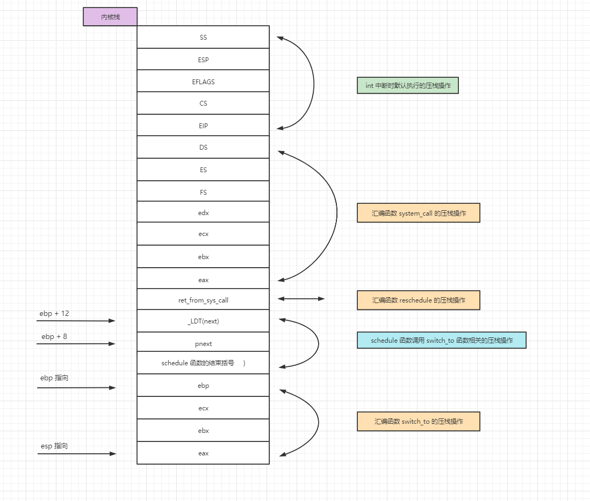
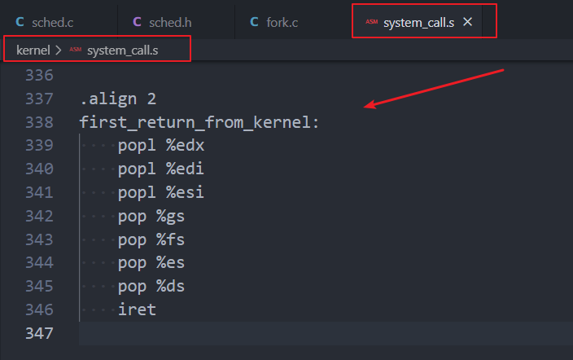

课程的实验地址：
实验楼：https://www.lanqiao.cn/courses/115


## （一） 实验相关的要求
### 1. 实验目的


### 2. 实验内容


### 3. 实验报告


### 4. 评分标准


### 5. 实验提示


## （二） 前置知识点
### 1. 基于 TSS 的进程切换
在现在的 Linux 0.11 中，真正完成进程切换是依靠任务状态段（Task State Segment，简称 TSS）的切换来完成的。

具体的说，在设计“Intel 架构”（即 x86 系统结构）时，每个任务（进程或线程）都对应一个独立的 TSS，TSS 就是内存中的一个结构体，里面包含了几乎所有的 CPU 寄存器的映像。有一个任务寄存器（Task Register，简称 TR）指向当前进程对应的 TSS 结构体，所谓的 TSS 切换就将 CPU 中几乎所有的寄存器都复制到 TR 指向的那个 TSS 结构体中保存起来，同时找到一个目标 TSS，即要切换到的下一个进程对应的 TSS，将其中存放的寄存器映像“扣在” CPU 上，就完成了执行现场的切换，如下图所示。


Intel 架构不仅提供了 TSS 来实现任务切换，而且只要一条指令就能完成这样的切换，即图中的 ljmp 指令。

具体的工作过程是：
- （1）首先用 TR 中存取的段选择符在 GDT 表中找到当前 TSS 的内存位置，由于 TSS 是一个段，所以需要用段表中的一个描述符来表示这个段。此处的 TSS 也是用 GDT 中的某个表项描述，而 TR 寄存器是用来表示这个段用 GDT 表中的哪一项来描述，所以 TR 和 CS、DS 等寄存器的功能是完全类似的。
- （2）找到了当前的 TSS 段（就是一段内存区域）以后，将 CPU 中的寄存器映像存放到这段内存区域中，即拍了一个快照。
- （3）存放了当前进程的执行现场以后，接下来要找到目标进程的现场，并将其扣在 CPU 上，找目标 TSS 段的方法也是一样的，因为找段都要从一个描述符表中找，描述 TSS 的描述符放在 GDT 表中，所以找目标 TSS 段也要靠 GDT 表，当然只要给出目标 TSS 段对应的描述符在 GDT 表中存放的位置————段选择子就可以了，仔细想想系统启动时那条著名的 jmpi 0, 8 指令，这个段选择子就放在 ljmp 的参数中，实际上就 jmpi 0, 8 中的 8（0 表示偏移地址，8 表示段选择子）。
- （4）一旦将目标 TSS 中的全部寄存器映像扣在 CPU 上，就相当于切换到了目标进程的执行现场了，因为那里有目标进程停下时的 CS:EIP，所以此时就开始从目标进程停下时的那个 CS:EIP 处开始执行，现在目标进程就变成了当前进程，所以 TR 需要修改为目标 TSS 段在 GDT 表中的段描述符所在的位置，因为 TR 总是指向当前 TSS 段的段描述符所在的位置。

上面给出的这些工作都是一句长跳转指令 ljmp 段选择子:段内偏移，在段选择子指向的段描述符是 TSS 段时 CPU 解释执行的结果，所以基于 TSS 进行进程/线程切换的 switch_to 实际上就是一句 ljmp 指令：
```c
#define switch_to(n) {
    struct{long a,b;} tmp;
    __asm__(
        ...
        "movw %%dx,%1"
        ...
        "ljmp %0" ::"m"(*&tmp.a), "m"(*&tmp.b), "d"(TSS(n)
        ...
    )
 }
```

提示：
jmpi 与 ljmp 都是段间跳转指令
jmpi 的格式是： jmpi 段内偏移, 段选择子
ljmp 的格式是： ljmp 段选择子, 段内偏移
jmpi 是 linux 下 intel 80x86 的汇编指令，而 ljmp 是 linux 下 AT&T 格式的汇编指令。


### 2. GDT 表中的内容
```c
#define FIRST_TSS_ENTRY 4

#define _TSS(n) ((((unsigned long) n) << 4) + (FIRST_TSS_ENTRY << 3))
```

GDT 表的结构如下图所示，所以第一个 TSS 表项，即 0 号进程的 TSS 表项在第 4 个位置上，4<<3，即 4 * 8，相当于 TSS 在 GDT 表中开始的位置，TSS（n）找到的是进程 n 的 TSS 位置，所以还要再加上 n<<4，即 n * 16，因为每个进程对应有 1 个 TSS 和 1 个 LDT，每个描述符的长度都是 8 个字节，所以是乘以 16，其中 LDT 的作用就是上面论述的那个映射表。TSS(n) = n * 16 + 4 * 8，得到就是进程 n（切换到的目标进程）的 TSS 选择子，将这个值放到 dx 寄存器中，并且又放置到结构体 tmp 中 32 位长整数 b 的前 16 位，现在 64 位 tmp 中的内容是前 32 位为空，这个 32 位数字是段内偏移，就是 jmpi 0, 8 中的 0；接下来的 16 位是 n * 16 + 4 * 8，这个数字是段选择子，就是 jmpi 0, 8 中的 8，再接下来的 16 位也为空。所以 swith_to 的核心实际上就是 ljmp 空， n * 16 + 4 * 8，现在和前面给出的基于 TSS 的进程切换联系在一起了。


### 3. 本次实验要做的事情
虽然用一条 ljmp 指令就能完成任务切换，但这指令的执行时间却很长，这条 ljmp 指令在实现任务切换时大概需要 200 多个时钟周期。而通过堆栈实现任务切换可能要更快，而且采用堆栈的切换还可以使用指令流水的并行优化技术，同时又使得 CPU 的设计变得简单。所以无论是 Linux 还是 Windows，进程/线程的切换都没有使用 Intel 提供的这种 TSS 切换手段，而都是通过堆栈实现的。

本次实践项目就是将 Linux 0.11 中采用的 TSS 切换部分去掉，取而代之的是基于堆栈的切换程序。


## （三） 实验
要实现基于内核栈的任务切换，主要完成如下三件工作：
- （1）重写 switch_to
- （2）将重写的 switch_to 和 schedule() 函数接在一起
- （3）修改现在的 fork()

### 1. schedule 和 switch_to
目前 Linux 0.11 中工作的 schedule() 函数是首先找到下一个进程的数组位置 next，而这个 next 就是 GDT 中的 n，所以这个 next 是用来找到切换后目标 TSS 段的段描述符的，一旦获得了这个 next 值，直接调用上面剖析的那个宏展开 switch_to(next); 就能完成如图 TSS 切换所示的切换了。

现在，我们不用 TSS 进行切换，而是采用切换内核栈的方式来完成进程切换，所以在新的 switch_to 中将用到**当前进程的 PCB**、**目标进程的 PCB**、**当前进程的内核栈**、**目标进程的内核栈**等信息。

由于 Linux 0.11 进程的内核栈和该进程的 PCB 在同一页内存上（一块 4KB 大小的内存），其中 PCB 位于这页内存的低地址，栈位于这页内存的高地址；另外，由于当前进程的 PCB 是用一个全局变量 current 指向的，所以只要告诉新 switch_to() 函数一个指向目标进程 PCB 的指针就可以了。同时还要将 next 也传递进去，虽然 TSS(next) 不再需要了，但是 LDT(next) 仍然是需要的，也就是说，现在每个进程不用有自己的 TSS 了，因为已经不采用 TSS 进程切换了，但是每个进程需要有自己的 LDT，地址分离地址还是必须要有的，而进程切换必然要涉及到 LDT 的切换。

---

需要添加自定义的 pnext 变量，用于指向目标进程的 PCB；由于 linux 0.11 源代码中默认存在的 current 变量指向的是当前进程的 PCB，而我们自定义的 pnext 变量指向的是目标进程的 PCB，所以 pnext 的声明定义仿照 current 变量即可。

声明并定义 pnext 变量：

```c
// 在 schedule 函数中定义 pnext 变量
struct task_struct *pnext = &(init_task.task);
```

---

需要将目前的 schedule() 函数（在 linux-0.11/kernal/sched.c 中）做稍许修改，即将下面的代码：
```c
if ((*p)->state == TASK_RUNNING && (*p)->counter > c)
    c = (*p)->counter, next = i;

//......

switch_to(next);
```

修改为：
```c
if ((*p)->state == TASK_RUNNING && (*p)->counter > c)
    c = (*p)->counter, next = i, pnext = *p;

//.......

switch_to(pnext, _LDT(next));
```


### 2. 实现 switch_to
实现 switch_to 是本次实践项目中最重要的一部分。

由于要对内核栈进行精细的操作，所以需要用汇编代码来完成函数 switch_to 的编写。

这个函数依次主要完成如下功能：由于是 C 语言调用汇编，所以需要首先在汇编中处理栈帧，即处理 ebp 寄存器；接下来要取出表示下一个进程 PCB 的参数，并和 current 做一个比较，如果等于 current，则什么也不用做；如果不等于 current，就开始进程切换，依次完成 PCB 的切换、TSS 中的内核栈指针的重写、内核栈的切换、LDT 的切换以及 PC 指针（即 CS:EIP）的切换。

#### （1） 先将原来的 switch_to 函数的代码注释掉


#### （2）重新编写 switch_to 函数之前需要先定义一些用到的常量或变量
1. 定义 ESP0 和 KERNEL_STACK

```c
ESP0 = 4                # 内核栈指针 ESP0 位于 tss 这一内存块的偏移地址为 4 的地方
KERNEL_STACK = 12       # PCB 中用来保存内核栈指针的域
```
2. 定义全局变量 tss

```c
// 定义了一个全局变量，和 current 类似，用来指向那一段 0 号进程的 TSS 内存。
// 所有进程都共用这个 tss，每次切换内核栈，把下一个进程的内核栈的选择子保存到这个 tss 的 esp0 中，其它的内容不变。
struct tss_struct *tss = &(init_task.task.tss);
```
3. 在进程的 PCB 中添加用来保存内核栈指针的成员
现在的 Linux 0.11 的 PCB 定义中没有保存内核栈指针这个域（kernelstack），所以需要加上，而宏 KERNEL_STACK 就是你加的那个位置，当然将 kernelstack 域加在 task_struct 中的哪个位置都可以，但是在某些汇编文件中（主要是在 kernal/system_call.s 中）有些关于操作这个结构一些汇编硬编码，所以一旦增加了 kernelstack，这些硬编码需要跟着修改，由于第一个位置，即 long state 出现的汇编硬编码很多，所以 kernelstack 千万不要放置在 task_struct 中的第一个位置，当放在其他位置时，修改 kernal/system_call.s 中的那些硬编码就可以了。

```c
struct task_struct {
/* these are hardcoded - don't touch */
	long state;	/* -1 unrunnable, 0 runnable, >0 stopped */
	long counter;
	long priority;
	long kernelstack;
	long signal;
	struct sigaction sigaction[32];
```
4. PCB 改变了，所以需要更改 0 号进程的 PCB 的初始化的值

将原来的代码：
```c
/*
 *  INIT_TASK is used to set up the first task table, touch at
 * your own risk!. Base=0, limit=0x9ffff (=640kB)
 */
#define INIT_TASK \
/* state etc */	{ 0,15,15, \
/* signals */	0,{{},},0, \
/* ec,brk... */	0,0,0,0,0,0, \
/* pid etc.. */	0,-1,0,0,0, \
```
更改为：
```c
/*
 *  INIT_TASK is used to set up the first task table, touch at
 * your own risk!. Base=0, limit=0x9ffff (=640kB)
 */
#define INIT_TASK \
/* state etc */	{ 0,15,15,PAGE_SIZE+(long)&init_task, \
/* signals */	0,{{},},0, \
/* ec,brk... */	0,0,0,0,0,0, \
/* pid etc.. */	0,-1,0,0,0, \
```
5. PCB 改变了，所以有关它的偏移量也要改变

```c
signal	= 12 + 4
sigaction = 16 + 4		# MUST be 16 (=len of sigaction)
blocked = (33*16 + 4)
```

#### （3） 内核栈内容在进程切换时的变化过程

如有疑问，请查看 [操作系统学习笔记-用户级线程和核心级线程](https://www.cnblogs.com/wanghuizhao/p/16972904.html) 的 【中断发生时内核栈和用户栈的关系】

#### （4） 重新编写 switch_to 函数，将它作为一个系统调用函数，放在 linux-0.11/kernal/system_call.s 汇编文件中


```c
.align 2
switch_to:
    pushl %ebp
    movl %esp, %ebp
    pushl %ecx
    pushl %ebx
    pushl %eax
    movl 8(%ebp), %ebx
        # AT&T 风格的基址相对寻址； 8(%ebp) 即 8 + ebp 的值作为偏移地址，类似于 intel 中的 [ebp + 8]
        # 该代码的意思是将 ds:[ebp + 8] 对应内存存储的值送入 ebx 中
    cmpl %ebx, current
    je 1f
# 切换PCB
    movl %ebx, %eax          # ebx 是从参数中取出来的下一个进程的 PCB 指针
    xchgl %eax,current
        # 经过上面这两条指令以后，eax 指向现在的当前进程，ebx 指向下一个进程，全局变量 current 也指向下一个进程。

# TSS中的内核栈指针的重写
    movl tss, %ecx
    addl $4096, %ebx
    movl %ebx, ESP0(%ecx)
# 切换内核栈
    movl %esp,KERNEL_STACK(%eax)        # 将寄存器 esp（内核栈使用到当前情况时的栈顶位置）的值保存到当前 PCB 中
    movl 8(%ebp),%ebx                   # 再取一下 ebx，让其指向下一个进程的 PCB，因为前面修改过 ebx 的值
    movl KERNEL_STACK(%ebx),%esp        # 将下一个进程的内核栈的段选择子放到 esp 寄存器中
# 切换LDT
    movl 12(%ebp),%ecx                  # 负责取出对应 _LDT(next) 的那个参数
    lldt %cx
        # 负责修改 LDTR 寄存器，一旦完成了修改，下一个进程在执行用户态程序时使用的映射表就是自己的 LDT 表了，地址空间实现了分离。
    movl $0x17, %ecx
    mov %cx, %fs
        # LDT 切换完成，需要重置 FS 寄存器，这样程序执行时才会访问新进程的用户态地址空间。
        # fs 的作用：通过 fs 访问进程的用户态内存，LDT 切换完成就意味着切换了分配给进程的用户态内存地址空间，
        # 所以前一个 fs 指向的是上一个进程的用户态内存，而现在需要执行下一个进程的用户态内存，所以就需要用这两条指令来重取 fs。
# 和后面的 clts 配合来处理协处理器，由于和主题关系不大，此处不做论述
    cmpl %eax, last_task_used_math
    jne 1f
    clts

1:    popl %eax
    popl %ebx
    popl %ecx
    popl %ebp
ret
```
#### （5） 添加 switch_to 函数的全局声明

```c
.globl switch_to
```

#### （6） 在使用到 switch_to 的 .c 文件中添加外部声明
由于 switch_to 重新定义了，因此使用新的 switch_to 函数之前，需要在文件顶部添加函数声明。

```c
extern long switch_to(struct task_struct *p, unsigned long address);
```


### 3. 实现 fork
#### （1） 前置知识点
开始修改 fork() 了，和书中论述的原理一致，就是要把进程的用户栈、用户程序和其内核栈通过压在内核栈中的 SS:ESP，CS:IP 关联在一起。

另外，由于 fork() 这个叉子的含义就是要让父子进程共用同一个代码、数据和堆栈，现在虽然是使用内核栈完成任务切换，但 fork() 的基本含义不会发生变化。

将上面两段描述联立在一起，修改 fork() 的核心工作就是要形成如下图所示的子进程内核栈结构。


#### （2） fork 函数的解析


从上图可以看出，fork() 的核心实现为 copy_process 函数

#### （3） 修改 fork 函数
1. 添加 first_return_from_kernel 汇编代码
first_return_from_kernel 要完成什么工作？PCB 切换完成、内核栈切换完成、LDT 切换完成，接下来应该那个“内核级线程切换五段论”中的最后一段切换了，即完成用户栈和用户代码的切换，依靠的核心指令就是 iret，当然在切换之前应该回复一下执行现场，主要就是 eax,ebx,ecx,edx,esi,edi,gs,fs,es,ds 等寄存器的恢复。

```c
.align 2
first_return_from_kernel:
    popl %edx
    popl %edi
    popl %esi
    pop %gs
    pop %fs
    pop %es
    pop %ds
    iret
```
2. 添加 first_return_from_kernel 的全局声明

```c
.globl first_return_from_kernel
```
3. 在使用到 first_return_from_kernel 的 .c 文件中添加外部声明
在使用 first_return_from_kernel 函数之前，需要在文件顶部添加函数声明。

```c
extern long first_return_from_kernel(void);
```
4. 将 copy_process 中为 PCB 中的结构体 tss 赋值的相关的代码注释掉

5. 在 copy_process 中，对子进程的内核栈的初始化，即初始化内核栈
将新的进程的内核栈填写成能进行 PC 切换的样子。

```c
/*
    初始化内核栈
*/
long *krnstack;
krnstack = (long *) (PAGE_SIZE + (long)p);
    // p = (struct task_struct *) get_free_page();用来完成申请一页内存作为子进程的 PCB，
    // 而 p 指针加上页面大小就是子进程的内核栈位置，所以语句 krnstack = (long *) (PAGE_SIZE + (long) p); 就可以找到子进程的内核栈位置

// iret 指令的出栈数据
*(--krnstack) = ss & 0xffff;
*(--krnstack) = esp;
*(--krnstack) = eflags;
*(--krnstack) = cs & 0xffff;
*(--krnstack) = eip;

// “内核级线程切换五段论”中的最后一段切换，即完成用户栈和用户代码的切换
// 依靠的核心指令就是 iret，回到用户态程序，当然在切换之前应该恢复一下执行现场，主要就是 eax,ebx,ecx,edx,esi,edi,gs,fs,es,ds 等寄存器的恢复.
*(--krnstack) = ds & 0xffff;
*(--krnstack) = es & 0xffff;
*(--krnstack) = fs & 0xffff;
*(--krnstack) = gs & 0xffff;
*(--krnstack) = esi;
*(--krnstack) = edi;
*(--krnstack) = edx;

// 处理 switch_to 返回，即结束后 ret 指令要用到的，ret 指令默认弹出一个 EIP 操作
*(--krnstack) = (long)first_return_from_kernel;

// swtich_to 函数中的 “切换内核栈” 后的弹栈操作
*(--krnstack) = ebp;
*(--krnstack) = ecx;
*(--krnstack) = ebx;
*(--krnstack) = 0;              // 实际上是 eax，子进程 fork 返回值为 0，所以这里设置为 0

// 存放在 PCB 中的内核栈指针 指向 初始化完成时内核栈的栈顶
p->kernelstack = krnstack;
```

### 4. 编译运行效果


## （四） 实验报告
### 1. 问题 1
针对下面的代码片段：
```c
movl tss, %ecx
addl $4096, %ebx
movl %ebx, ESP0(%ecx)
```
回答问题：
- （1）为什么要加 4096；
4096 字节等于 4KB。由于 Linux 0.11 进程的内核栈和该进程的 PCB 在同一页内存上（一块 4KB 大小的内存），其中 PCB 位于这页内存的低地址，栈位于这页内存的高地址。ebx 指向下一个进程的 PCB，偏移 4KB 之后，便能指向该进程的内核栈地址。
- （2）为什么没有设置 tss 中的 ss0。
因为 tss.ss0 默认设置为 0x10，已经处于内核态中，而且现在所有的进程都共用一个 tss，因此不需要每次切换都去设置。

### 2. 问题 2
针对代码片段：
```c
*(--krnstack) = ebp;
*(--krnstack) = ecx;
*(--krnstack) = ebx;
*(--krnstack) = 0;
```
回答问题：
- （1）子进程第一次执行时，eax=？为什么要等于这个数？哪里的工作让 eax 等于这样一个数？
eax = 0，目的是为了将父子进程区分开，改写的 copy_process 函数中 *(--krnstack) = 0; ，该代码经过出栈操作后，将 0 赋值给 eax 寄存器，最后经过 iret 指令后，在用户态就能得到调用 fork() 函数的返回值，等于 0 就代表是子进程。（即可以使用这样的代码 if (!fork()) {...}）
- （2）这段代码中的 ebx 和 ecx 来自哪里，是什么含义，为什么要通过这些代码将其写到子进程的内核栈中？
ebx 和 ecx 来自 copy_process() 函数的参数，这些参数来自调用 copy_proces() 的进程的内核栈中，就是父进程的内核栈中，所以对于 fork() 函数而言，子进程是父进程内核栈数据的拷贝，就是要让父子进程共用同一个代码、数据和堆栈。这样可以保证切换到子进程用户态运行时，子进程和父进程处于同样的环境。
- （3）这段代码中的 ebp 来自哪里，是什么含义，为什么要做这样的设置？可以不设置吗？为什么？
ebp 来自于父进程，保存的是父进程用户栈基地址指针。即在 fork 刚刚执行完 copy_process 的时候，它的用户栈是父进程的用户栈，而非自己的用户栈。当子进程进行其他操作时，造成需要的栈将要与父进程不同了，才会创建自己的用户栈。这么做的好处时当一些子进程什么都不做，系统不用分配额外的空间。这就是 Copy On Write。

### 3. 问题 3
- 为什么要在切换完 LDT 之后要重新设置 fs=0x17？而且为什么重设操作要出现在切换完 LDT 之后，出现在 LDT 之前又会怎么样？
为了重新去查 GDT 表，重新取一下段寄存器 fs 的值，是必须要加的，也必须要出现在切换完 LDT 之后，这是因为通过 fs 访问进程的用户态内存，LDT 切换完成就意味着切换了分配给进程的用户态内存地址空间，所以前一个 fs 指向的是上一个进程的用户态内存，而现在需要执行下一个进程的用户态内存，所以就需要重取 fs。
如果出现在 LDT 之前访问的就还是上一个进程的用户态内存。


## （五） 本次实验完整的源码
[实验项目4-基于内核栈切换的进程切换 代码](https://github.com/wtraceback/HIT-OSLab-Personal)


## （六） 参考
[操作系统原理、实现与实践](https://book.douban.com/subject/30391722/?dt_platform=weibo)
[哈工大-操作系统-HitOSlab-李治军-实验4-基于内核栈切换的进程切换](https://blog.csdn.net/qq_42518941/article/details/119182097)
[操作系统实验一到实验九合集(哈工大李治军)](https://blog.csdn.net/leoabcd12/article/details/122268321)