## （一） 绪论
### 1. 多进程
多进程并发结构，即将多个进程同时放在内存中启动执行，然后在这些进程之间来回切换交替执行，这样的结构可以让 CPU 的工作效率大幅提升，也提高了整个计算机硬件的工作效率。因此，多进程来回切换、交替执行是操作系统的核心工作，一言以蔽之，CPU 切换是整个操作系统的发动机。

### 2. 由进程引出的线程
进程切换由 **资源切换** 和 **指令流切换** 两部分构成，其中 **资源切换** 是将分配给进程的非 CPU 以外的资源进行切换（内存、文件系统等），如对当前地址空间的切换；而 **指令流切换** 就是 CPU 切换，也就是线程切换。


并发是 CPU 高效工作的基础，而并发的基本含义就是多段程序交替执行（进程是 进行/运行 中的程序）。既然是多段程序之间交替执行，那这种交替就不一定总存在于两段“很远”的代码之间，如浏览器程序和编译器程序之间的交替。即使是在同一个可执行文件内（一个进程内），两个函数之间也可以交替执行，如在一个浏览器内部有两个函数 GetData() 和 Show()，这两个函数也可以交替执行，这样的交替执行就产生了 **线程** 概念。

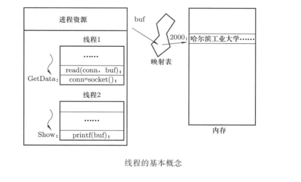
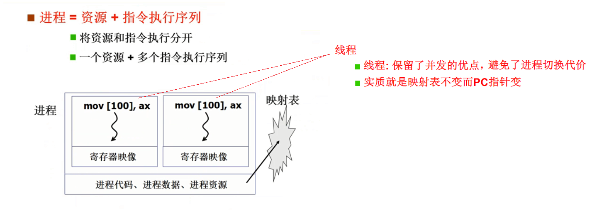

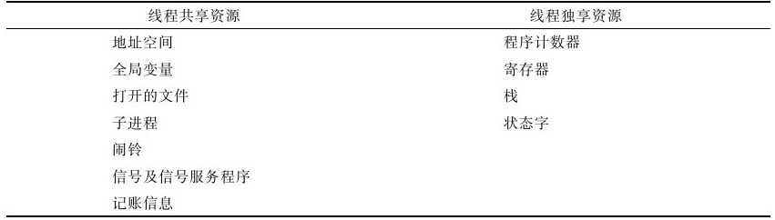


### 3. 线程的特性
- 在线程模式下，一个进程至少有一个线程，但也可以有多个线程。
- 多线程保留了多进程的优点：并发。避免了进程切换的代价（切换映射表需要耗费比较多的时间）。
- 将进程分解为线程还可以有效地利用 **多处理器** 和 **多核处理器**。
在没有线程的情况下，增加一个处理器并不能提高一个进程的执行速度。但如果分解为多个线程，则可以让不同的线程同时运转在不同的处理器上，从而提高了进程的执行速度。例如，当我们使用文字处理软件如 Microsoft Word 时，实际上是打开了多个线程。这些线程一个负责显示，一个接收输入，一个定时进行存盘。
- **在多处理器上**，可以让每个处理器上执行同样的进程，但每个处理器运行的指令序列不一样，从而提高了进程的执行速度。
- **在一个多核处理器上**，一个处理器上有多个核心，一个进程在一个处理器上执行时，进程中不同的线程可以并行执行在该处理器不同的核心上，从而提高了进程的执行速度。


### 4. 一个多线程实例
示例一个采用了线程思想设计的浏览器，使用浏览器打开Mooc课网，可以看到在浏览器上首先出现的是网页中的文字，过一段时间后一些小的图片被显示出来，而那些更大的图片和动画则需要再过一段时间才能被渲染出来。这样实现的好处是用户很快就能看到一些文字信息，然后再是图片等信息，而不是等待较长一段时间以后看到网页的全部信息，显然这种逐步显示的方式其用户交互性要友好得多。


- **如果没有线程，那么只有一个进程来完成上述工作的效果是怎样的？**
如果只有一个进程，执行的代码必然是首先将页面布局、文本信息、图片对象等内容全部下载下来，然后在逐个解码渲染，最后将所有的信息全部整理好输出到屏幕上，结果就是用户面对空白屏幕等待了较长一段时间，然后所有网页信息全部被显示出来。
- **如何实现呢？**
在这个浏览器实现过程中，共启动了四个线程，分别是【获取数据的线程 GetData】，【显示文本的线程 ShowText】，【解压图片的线程 ProcessImage】和【渲染图片的线程 ShowImage】。这样就可以先调度获取数据的线程，将网页的文本信息下载下来，然后切换到文本显示的线程将文本信息显示在浏览器中，接着在切换回获取数据的线程，去获取图像信息；这时再切换到解压图片的线程，等待图片解码完成后切换到渲染图片的线程，完成图片的显示，就有了上图的效果。
- **为什么用四个线程，而不是四个进程来实现这样的浏览器呢？**
主要的关键是 GetData、ShowText、ProcessImage、ShowImage 是否要使用不同的“进程资源”，GetData 将数据下载到内存缓冲区后，ShowText 从一个内存缓冲区中读取数据并将其显示到屏幕上，显然此时不需要使用地址隔离策略将这两个内存缓冲区分离在两个不同的进程中，因此此处并不存在安全问题，而这种隔离还会造成内存的浪费和代码执行效率的降低（一个进程中，不存在内存映射表的切换，缓冲区中的内容是共享的；如果是多个进程，那么就有多个映射表，经过映射表映射，数据会分布在内存的不同区域，而且进程间切换耗时长）。因此 GetData、ShowText、ProcessImage、ShowImage 是四个并发的指令执行序列，并使用共同地址空间等进程资源，所以是四个线程。


### 5. 用户级线程和核心级线程
#### （1） 概念
线程是在一个地址空间下启动并交替执行多个程序，交替执行的多个线程可以由操作系统管理，也可以由用户程序自己管理（进程本身自己管理）。由用户程序自己管理的线程对操作系统透明，操作系统完全不知道这些线程的存在，这样的线程被称为**用户级线程**。相应地，由操作系统管理的线程是**内核级线程**。

由进程自己管理就是用户态线程的实现，由操作系统管理就是内核态线程实现。用户态线程和内核态线程的判断以线程控制块（TCB）所处的位置为依据：位于操作系统内核叫内核态实现，位于用户层叫用户态实现。


#### （2） 进程是否也存在用户态和内核态的实现呢？
**不存在**，因为进程是在 CPU 上实现并发（多道编程），而 CPU 是由操作系统管理的，因此，进程的实现只能由操作系统内核来控制，不存在用户态实现的情况。

### 6. 线程与进程
下图给出了线程和进程的区别与联系，通过该图给出的对比结果可以进一步加深对线程和进程的理解。
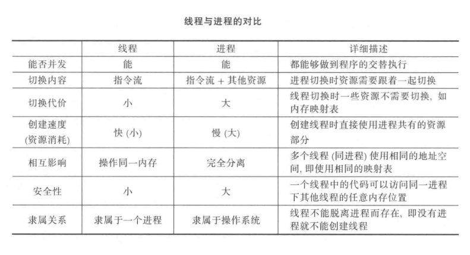


## （二） 用户级线程
### 1. 用户级线程之间的切换
以前面多线程浏览器为例来分析用户级线程的切换。如下图所示，假设启动了两个用户级线程 GetData 和 ShowText，当 GetData 下载了网页文本数据时，GetData 可以调用用户态函数 Yield() 让出 CPU。此时 Yield 会通过将 PC 指针修改为 300 来切换到 ShowText 线程。在 ShowText 将文本数据显示到屏幕上以后，再调用用户态函数 Yield() 让出 CPU，Yield 又会再次修改 PC 指针为 100，从而切换回 GetData 继续执行。

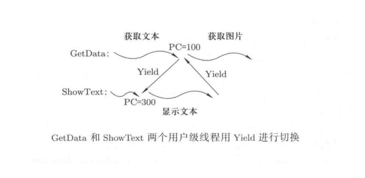

可以从上面的示例看出 Yield() 是完成切换的核心函数。

### 2. 两个线程共用一个栈（错误示范）
使用一个更具体的例子来说明 Yield 的工作过程，两个用户级线程，其中线程 1 执行 A() 函数，并在 A() 函数中调用 B() 函数；线程 2 执行 C() 函数，在 C() 函数中调用 D() 函数，如下图所示。

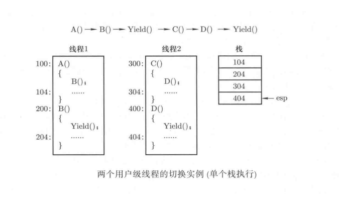

首先线程 1 执行，进入函数 A() 执行，当要执行调用函数 B() 时，要通过栈来保存一些信息，以便在函数 B() 执行完时再跳回 A() 继续执行，这是函数调用的基本常识。因此现在需要将返回地址 104 压栈；接下来进入函数 B() 执行。现在要跳到函数 Yield() 进行线程切换，所以地址 204 也会被压栈。现在开始执行 Yield() 函数中的代码，想一想这段代码功能是什么呢？显然就是要找到下一个线程以及下一个线程切换出去时的执行位置，然后跳转到这个位置。因为线程在同一地址空间中，所以直接跳转到这个位置即可，在这个例子中就是 “jmp300”。

所以我们可以写出此时的 Yield( ) 为：
```c
Yield () {
    jmp 300;
}

// A() --> B() --> Yield()
```

继续执行，现在线程 2 执行，进入函数 C()，要跳入函数 D() 前需要先将地址 304 压栈并跳入 D() 函数中执行。现在要再次调用 Yield() 来切换线程，地址 404 压栈，然后执行 Yield() 函数。不难想象，此时的 Yield( ) 应该为：
```c
Yield () {
    jmp 204;
}

// A() --> B() --> Yield() --> 线程 2 的 C() --> D() --> Yield()
```

上图给出了程序运转到此时栈中的内容，从 PC=204 再往下执行会怎么样？不断地“取指”“执行”，当执行到 B() 的 “}” 时会弹栈进行函数返回，栈中弹出的是地址 404，跳到 404 执行。但是，应该跳转到 104 去执行才对啊！

显然是栈出了问题，404 是线程 2 中的一个地址，而 B() 函数是线程 1 中的一个函数。那是什么原因导致上图中的栈出现错误，线程 1 的函数 B() 返回到了线程 2 的地址 404？两个线程的栈扭结在一起了！**如果解决这个问题？**
解决办法是分别使用两个栈，如果每个线程用自己的栈，那么在线程中执行函数调用和返回时就不会莫名其妙地跳转到其他线程中了。


### 3. 每个线程拥有自己的栈（正确示范）
解决办法是分别用两个栈；处理两个线程，应该使用两个栈，在不同的线程里面使用不同的栈。在线程一中使用栈一，线程二中使用栈二。上面的例子就变成如下图所示的样子。由于每个线程拥有自己的栈，所以在 Yield() 切换的时候不仅要修改 PC 的值，还要完成栈的切换。所以在下图中执行的 Yield()，其具体动作为：
```c
Yield() {
    tcb2.esp = 2004;        // 线程 2 的 TCB 保存线程 2 下一个将要执行的指令的位置
    esp = 1004;             // 将线程 1 中保存的下一个将要执行的指令的位置复原到 CPU 的 esp 寄存器中
    jmp 204;
}
```

现在从地址 204 处继续往下执行，当遇到 B() 函数的 “}” 时，要从栈中弹出 EIP，弹出来的是 204，再去 204 执行 ······ 还是不太对，分析一下，栈里为什么有 204？地址 204 是调用 Yield() 函数才压进栈的，这个地址应该在 Yield() 函数返回时弹出，但 Yield() 函数的 “}” 没有得到执行，因为 “jmp 204; }” 总在执行 “}” 之前就执行 jmp 指令跳转走了。怎么办？

解决方法很容易想到将语句 “jmp 204” 去掉，因为 Yield() 函数中的 “}” 就能保证跳到地址 204 处执行，所以 jmp 204 这条语句完全可以不要，也不应该要。实际上，用 Yield() 函数完成线程切换，切换完成后要执行的指令应该是 Yield() 函数后面的指令，而这条指令的地址必然已经被 Yield() 函数调用压到了线程栈中，所以 Yield() 在切换完栈以后，用 “}” 从栈中弹出的就是调用 Yield() 函数时的返回地址。因此 Yield() 函数只要完成线程 TCB 的切换和栈切换即可，即
```c
Yield() {
    tcb2.esp = 2004;        // 线程 2 的 TCB 保存线程 2 下一个将要执行的指令的位置
    esp = 1004;             // 将线程 1 中保存的下一个将要执行的指令的位置复原到 CPU 的 esp 寄存器中
}
```

现在再来分析下图给出的实例。当 Yield() 函数切换到新的栈地址 1004 以后，Yield() 会遇到并执行 “}” 这个 “ret” 指令弹出地址 204 赋给 EIP。现在开始从地址 204 处继续向下执行，当遇到 B() 中的 “}” 时会再一次弹栈返回，返回地址 104 执行，即返回 A() 函数执行。显然这正是想要的正确执行序列！

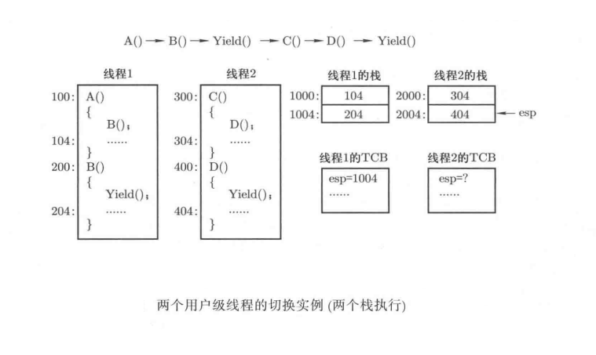

### 4. 总结
总结上面给出的实例可以得到下面的基本结论：
1. 用户级线程的切换就是在切换位置上调用 Yield() 函数。
2. Yield() 函数完成的基本工作是找到下一个线程 TCB，然后根据当前线程的 TCB 和下一个线程的 TCB 完成用户栈的切换。具体来说，就是将寄存器 ESP 中的值保存在当前线程 TCB 中，然后从下一线程的 TCB 中取出保存的 esp 值赋给 ESP 寄存器。
3. 在切换到新栈以后用 Yield() 函数中的 “}” 将 PC 指针切换到下一个线程要执行的指令处。
4. 当然还需要在线程切换时保存和恢复一些执行现场，无非就是保存一些通用寄存器，这些寄存器的值也要放在线程各自的栈中来保存，在栈切换完成以后弹栈恢复下一个线程的执行现场。

下面给出了 Yield() 函数的代码实现，为了方便论述，其中既有 C 语言代码又有汇编语言代码，在真正实现时需要用 C 语言内嵌汇编语言来将其写成一个 C 语言函数。

```c
// 用户级线程 （ Yield() 函数实现代码 ）
Yield() {
    next = FindNext();
    push %eax
    push %ebx
    ······
    mov %esp, TCB[current].esp
    mov TCB[next].esp, %esp
    ······
    pop %ebx
    pop %eax
}
```


## （三） 内核级线程
### 1. 多处理器和多核
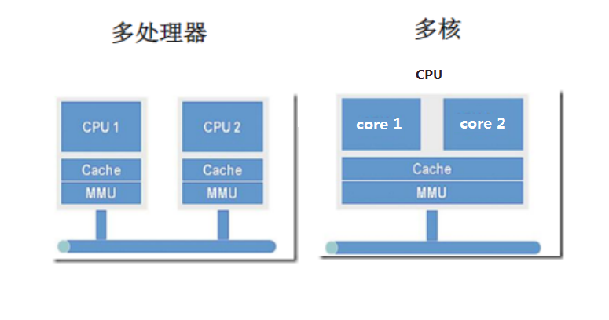
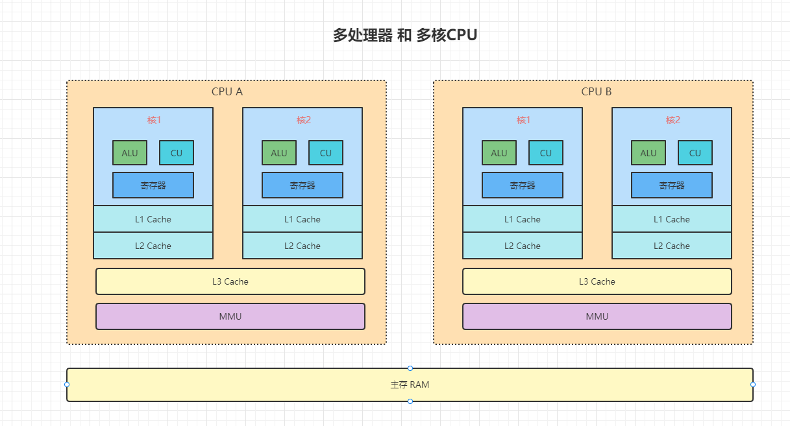

```进程的切换```：
1. 切换指令流（切换线程）
2. 切换资源 （文件系统，内存等，如：MMU 内存映射，每个进程都有自己的内存映射，一个进程中的所有线程共享这个 MMU）

```老式处理器结构```：
上面的图片中所示的 CPU 是老式处理器结构，即 1 个 CPU 中有多个物理核心共用一个 ```MMU```，这种情况下，1 个 CPU 一次只能处理一个进程，但是能同时并行执行两个线程，也就是该进程内有 2 个线程的话，可以并行执行，即一个物理核心执行一个线程。

```现代的处理器结构```：
现代的 CPU 已经实现了每个核心有自己单独的 ```MMU```，比如 intel core 系列，这种情况下，当 1 个 CPU 上出现这样的多个核心，这时候的多核 CPU 能支持多进程并行执行，因为它们有自己单独的 ```MMU```；英特尔还研发了一种技术：```超线程```，超线程技术把一个物理核心虚拟出两个逻辑核心，实现了在一个物理核心中，提供两个逻辑线程，让单个物理核心也能使用线程级的并行计算，进而兼容多线程操作系统和软件。超线程技术充分利用空闲CPU资源，在相同时间内完成更多工作。
虽然采用超线程技术能够同时执行两个线程，但是当两个线程同时需要某个资源时，其中一个线程必须让出资源暂时挂起，直到这些资源空闲以后才能继续。因此，超线程的性能并不等于两个CPU核心的性能。而且，超线程技术的CPU需要芯片组、操作系统和应用软件的支持，才能比较理想地发挥该项技术的优势。

### 2. 内核级线程的引出
一个用户级线程在执行过程中可能会进入内核态，如上面例子中线程 GetData 会通过网卡向网站发出数据下载请求，网卡是由操作系统负责驱动、管理的，所以 GetData 发出数据下载请求要借助系统调用进入操作系统内核才能完成。用户级线程进入操作系统内核以后，很可能要发生 CPU 切换，例如 GetData 要等待网络连接成功，在这段等待过程中，CPU 完全可以切换出去执行其他程序来实现 CPU 的高效利用。

此时就会出现如下图所示的情况：即使用户级线程 ShowText 可以执行，但由于操作系统无法感知到用户级线程 ShowText 的存在（因为线程 ShowText 对应的 TCB 等信息都处在用户态），所以操作系统此时不可能切换到线程 ShowText 去执行。也就是说，如果一个用户级线程在内核中阻塞，则这个进程的所有用户级线程将全部阻塞。这就限制了用户级线程的并发程度，从而限制了由并发性带来的计算机硬件工作效率的提升。

自然地，和用户级线程对应的是内核级线程概念。用户级线程是完全在用户态内存中创建的一个指令执行序列，即用户级线程的 TCB、栈等内容都是创建在用户态中的，操作系统完全不知道。现在，内核级线程就是要让内核态内存和用户态内存合作创建一个指令执行序列，内核级线程的 TCB 等信息是创建在操作系统内核中的，操作系统通过这些数据结构可以感知和操纵内核级线程，如下图所示的情况。

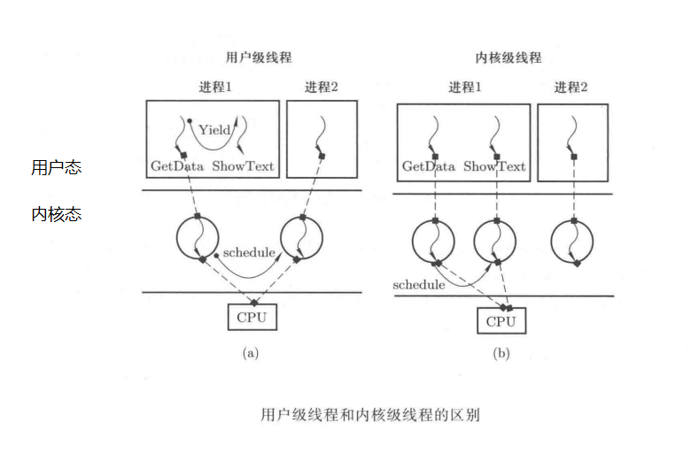

根据前面用户级线程实例 GetData 的分析结果不难得出这样的结论：内核级线程较用户级线程而言具有更好的并发性，硬件工作效率也会更高一些。


### 3. 内核级线程和多核处理器的结合
下面再用一个例子来进一步说明内核级线程是如何提高硬件使用效率的。对于如下图所示的双核处理器(multi-coreprocessor)结构，如果计算机系统中有两个用户级线程．由千操作系统并不知道存在两个指令执行序列，所以只能用到处理器中的一个核来执行其中的一个执行序列。即使调用 Yield 切换到下一个执行序列，仍然只是利用一个核工作，双核处理器中的另一个核一直空闲。而如果计算机系统中创建了两个内核级线程，此时操作系统能操纵两个指令执行序列，会将核 1 分配给第一个执行序列，将核 2 分配给第二个执行序列，两个核可以同时“取指——执行”，硬件工作效率得到显著提升。

进一步，对于如下图所示的双核结构，如果计算机系统中有两个进程，虽然两个进程对应的两个执行序列都可以被操作系统感知，但对应于两个进程的两个执行序列并不适合并行地放在多核处理器中的多个核上执行。这是因为多核处理器中的多个核通常要共享存储管理部件(memory management unit，MMU)以及一些缓存等为了避免进程之间的影响，进程之间应该做到地址隔离，即每个进程使用自己的地址空间和地址映射表，硬件 MMU 就是用来查找地址映射表的硬件，而某些缓存就用来暂存一些最近的地址映射结果。

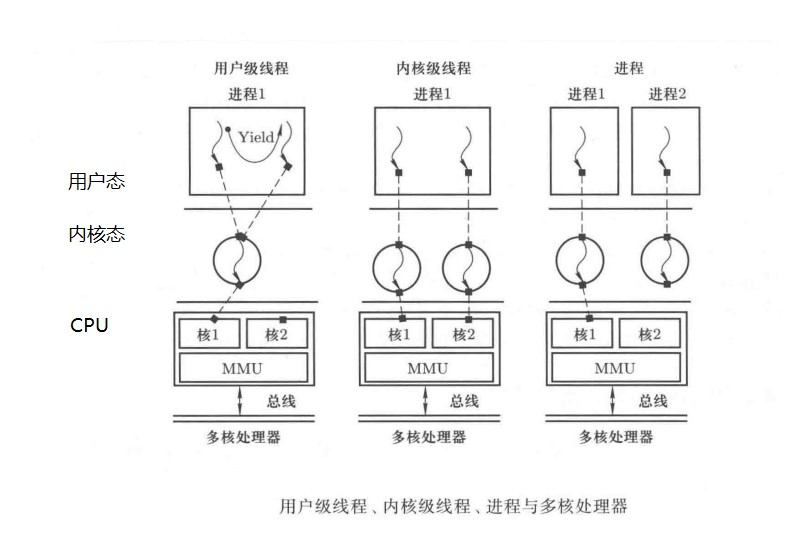

如果将两个进程并行地放在一个多核处理器的两个核上，虽然表面上可以让两个执行序列同时向前执行，但是共享 MMU 不可能同时去查两个不同的表，而且缓存也不能发挥作用了，因为进程 1 程序中地址 100 对应物理内存单元 1100，而进程 2 程序中的地址 100 却对应物理内存单元 2100。而两个内核级线程使用的是同一个地址空间，MMU、缓存本身都是可以共享的，所以内核级线程非常适合于多核处理器结构，而多核处理器是现代处理器设计中的一种主流技术，目前绝大多数现代操作系统都支持内核级线程。

**内核级线程有其优点**：可以提高并发性，可以有效支持多核处理器等；
**进程也有其优点**：以进程为单位来分配计算机资源，方便管理进程之间互相分离，安全性高、可靠性好等；
**用户级线程也有其优点**：用户在应用程序中随意创建创建，代价小、灵活性大，同时具有一定的并发性等。
因此在操作系统中，这三个概念往往是同时存在并实现的。


### 4. 用户级线程、内核级线程、进程这三者的内在关系的概括
1. 引出进程的目标是为了管理 CPU，即通过执行程序来使用 CPU。进程、内核级线程、用户级线程都是执行一个指令序列，没有本质区别，所以这三者都属于 CPU 管理范畴。
2. 要执行一个指令序列，除了通过分配栈、创建数据结构记录执行位置等以外，还要分配内存等资源，这就是进程的概念。
3. 将进程中的资源和执行序列分离以后引出了线程概念，进程必须在操作系统内核中创建，这是因为进程创建要涉及计算机硬件资源的分配。因此进程中的那个执行序列实际上就是一个内核级线程。
4. 内核级线程是操作系统在一套进程资源下创建的、可以并发执行的多个执行序列，操作系统为每个这样的执行序列创建了相应的数据结构来实现对这些内核级线程控制，如切换、调度等。
5. 同样地，上层应用程序也可以创建并交替执行多个指令执行序列，因为执行程序所需要的资源已经在创建进程时分配好了。此时启动多个执行序列所需要的 TCB 和用户栈等信息完全可以由应用程序自己编程实现，由应用程序负责操控多个执行序列，对操作系统而言完全透明。

### 5. 用户级线程和内核级线程的区别
用户级线程的切换，主要分为三步：
1. TCB 切换
2. 根据 TCB 中存储的栈指针完成用户栈切换
3. 根据用户栈中压入函数返回地址完成 PC 指针切换


不难想象，内核级线程的切换也要完成 “TCB切换、栈切换、PC指针切换” 这三件事，那么它和用户级线程的区别应该在哪里呢？
1. 区别一：
内核级线程的 TCB 存储在操作系统内核中，因此完成 TCB 切换的程序应该执行在操作系统内核中。这是第一个重要区别，即用户级线程通过调用用户态函数Yield()完成切换，而内核级线程必须进入内核才能引起切换。所以内核级线程间切换的故事应该从进入内核中断开始，因为中断会导致从用户态到内核态的切换。
2. 区别二：
由于进入内核才能完成内核级线程的切换，所以要在内核中的某个地方完成 PC 指针切换。仿照用户级线程，这个 PC 指针也应该放在栈中，利用栈完成切换。对于内核级线程，这个栈应该是内核栈即首先切换内核栈然后引发 PC 指针切换。因此和用户级线程相比，内核级线程的第二个重要区别是切换栈要同时切换用户栈和内核栈。

综上所述用户级线程切换的核心是根据存放在用户程序中的 TCB 找到用户栈，通过用户栈切换完成用户级线程的切换，整个切换过程通过调用 Yiled() 函数引发。内核级线程切换的核心是首先进入操作系统内核并在内核中找到线程 TCB，进而根据 TCB 找到线程的内核栈，通过内核栈切换完成内核级线程切换，整个切换过程由中断引发。

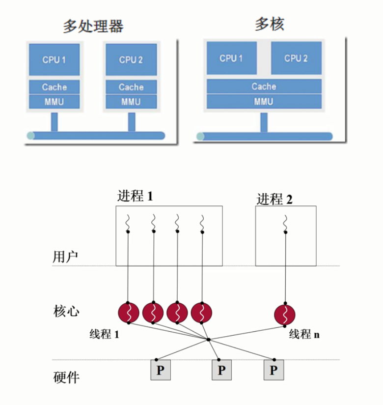
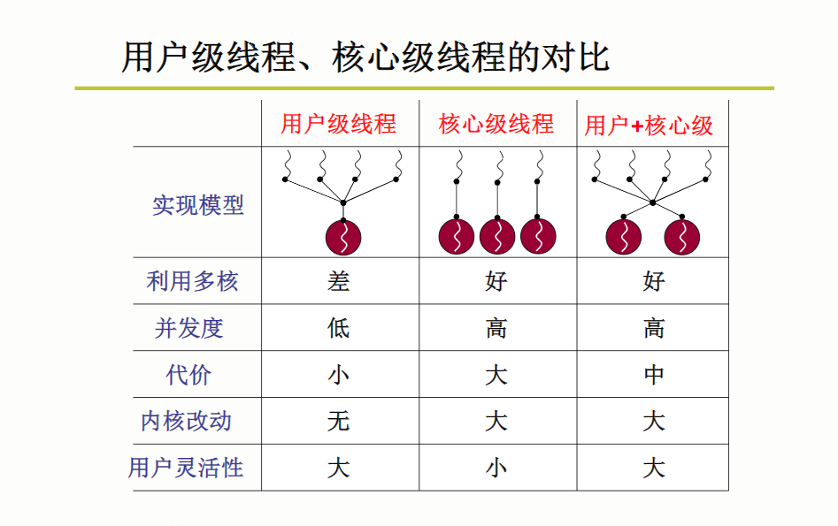


### 6. 内核级线程之间的切换
#### （1） 中断发生时内核栈和用户栈的关系
从中断开始分析内核级线程切换的完整故事，首先需要弄明白中断以后会发生了什么。

从【实验项目2-添加系统调用】中可知，用户态程序调用操作系统提供的 API 的步骤如下：
```c
库函数 --> 库函数中的内嵌汇编 --> int 指令（"int $0x80"） --> 内核的中断处理 set_system_gate(0x80,&system_call) --> system_call --> sys_call_table
```
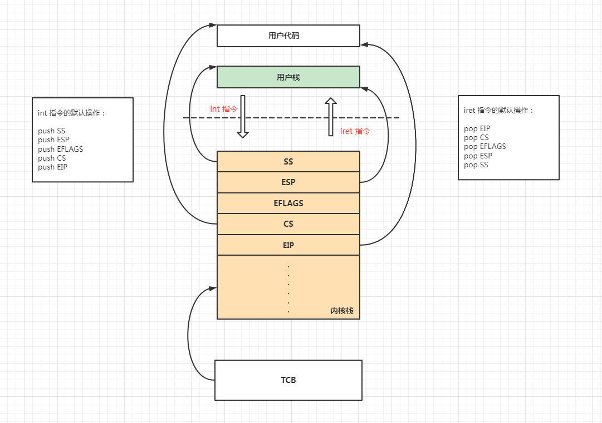

如下图所示，在执行指令 int/iret 时栈要发生的变化，int 指令执行时，会找到当前进程的内核栈然后将用户态执行的一些重要信息，如当前用户栈栈顶位置 SS:ESP、标志寄存器 EFLAGS 以及当前程序执行位置 CS:EIP 压到内核栈中。实际上，所有外部中断，比如时钟中断、键盘中断、磁盘读写完成中断等，都会引起上述动作。而 iret 指令正好是 int 指令的逆过程。

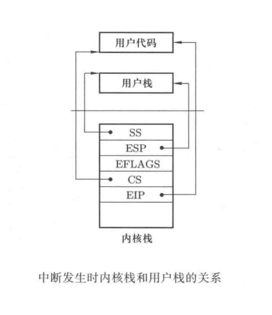
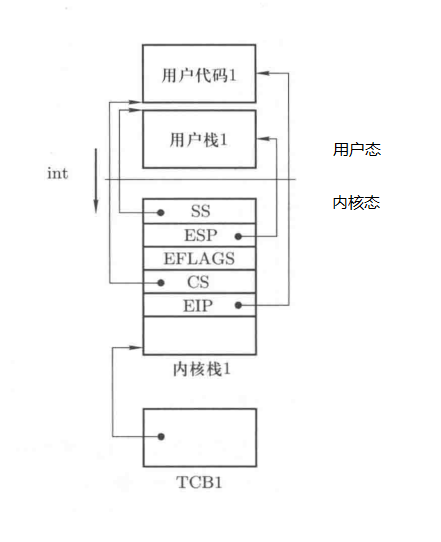

上述中断压栈工作并不难理解:
1. 在 C 语言程序执行时，栈是用来在函数跳转时保存返回地址等重要信息以备将来返回的。现在要从用户态程序跳转到内核态中断处理函数，这当然也是一种跳转，所以用一个栈保存返回地址 CS:EIP 是很自然的。
2. 既然引入栈是为了实现函数跳转，在操作系统内核里也要发生函数跳转。所以要在指令 int 执行那一刻启动内核栈，这样一进入操作系统内核就可以进行函数调用了。
3. 内核栈和用户栈不应该是同一个栈，内核栈应该是一段具有内核特权级的内存区域，其原因仍然是为了保护内核。
4. 既然用户栈和内核栈不是同一个栈，那么在进入内核以后除了记录将来跳转回去的执行地址 CS:EIP 外，当然也应该记录跳转回去要使用的用户栈地址，如上图中的 SS:ESP。
5. 另外在用户态和内核态中，标志寄存器都会发生变化，所以也要保存。


#### （2） 切换五段论
既然在内核栈中记录了当前用户栈的位置和当前用户程序执行的位置，那么在内核级线程切换时就可以利用这两个信息完成 PC 指针的切换以及用户栈的切换。因此在内核级线程切换时，首先找到 TCB，并根据 TCB 切换内核栈，然后再根据内核栈完成用户栈切换以及程序 PC 指针的切换。

总的来说，内核级线程切换仍然完成三个工作 **切换TCB**、**切换栈** 和 **切换PC指针**，但是这些切换动作要分散在中断入口、中断处理、线程调度、上下文切换以及中断返回等多个地方。不像用户级线程切换那样，所有切换动作都在一个 Yield() 函数中。因此内核级的切换过程就复杂得多，为清晰起见，我们将内核级线程的切换过程归纳整理为下图所示的五个阶段。

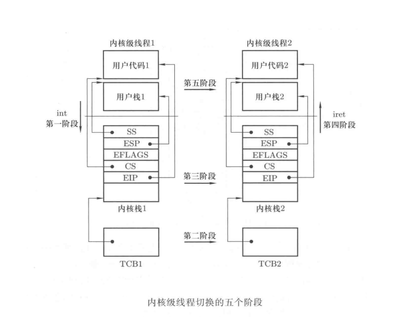

这五个阶段的具体实现为：
1. 第一阶段
第一阶段是**中断进入**，就是 int 指令或其他硬件中断的中断处理人口，核心工作是要记录当前程序在用户态执行时的信息，如当前使用的用户栈、当前程序执行位置、当前执行的现场信息等。其中用户栈地址 SS:ESP 和 PC 指针信息 CS:EIP 已经由中断处理硬件自动压入当前线程对应的内核栈中了，只有当前的执行现场信息还没有保存。所以在进入中断处理程序的开始处需要编写代码保护用户态程序当前执行现场（保护在内核栈中）。此处以 "int 0x80" 为例，应该在中断处理程序 system_call 的开始处执行下面的代码，即中断进入代码。
```c
// 内核级线程的五个阶段（中断进入代码）

push %ds
push %es
push %fs
pushl %edx
pushl %ecx
pushl %ebx
```
以上代码用于保护用户态程序执行现场。接下来就可以使用这些寄存器来执行内核态中断处理程序了，如用 “movl $0x10, %edx” “mov %dx, %ds” “mov %dx, %es” 来将段寄存器 DS、ES 设置为内核数据段选择子，这样以后再访问的数据就是内核数据了。

2. 第二阶段
内核级线程切换的第二阶段是**调用 schedule，引起 TCB 切换**。在中断处理程序中，如果发现当前线程启动了磁盘读写等操作，即发现当前线程应该让出 CPU 时，系统内核就会调用 schedule() 函数来完成 TCB 的切换。具体做法很简单，例如在向磁盘发出读写指令以后，将当前线程（可以定义一个内核全局变量 current 来指向当前线程的 TCB)的状态修改为阻塞，具体代码实现为 current->state=阻塞，并将 current 添加到一个等待某个磁盘块读写完成的等待队列链表上。接下来调用函数 schedule() 实现 TCB 切换。
为了完成 TCB 的切换，schedule() 函数首先从就绪队列中选取出下一个要执行线程的 TCB，具体的寻找程序就是调度算法相关的程序实现了。找到下一个 TCB 以后，此处用 next 指针指向这个 TCB，利用 current 和 next 指针指向的信息就可以开始内核级线程切换的第三阶段了。
3. 第三阶段
内核级线程切换的第三阶段是**内核栈的切换**，具体来说，就是将当前的 ESP 寄存器存放在 current 指向的 TCB 中，再从 next 指向的 TCB 中取出 esp 字段赋值给 ESP 寄存器。由于现在执行在内核态，所以当前寄存器 ESP 指向的就是当前线程的内核栈，而放在 TCB 中的 esp 也是线程的内核栈地址，所以这样的切换是内核栈切换，实现代码很简单：
```c
current->esp = esp;
esp = next->esp;

// 当然应该将这两句代码用汇编程序实现，实现过程并不困难。
```
4. 第四阶段
内核级线程切换的第四阶段是**中断返回**，这是要为内核级线程切换的最后一个阶段“用户栈切换“做准备，同时也和内核级线程切换的第一阶段“中断进入”相对应。在这一阶段中，要将存放在下一个线程的内核栈（因为内核栈巳经切换完成）中的用户态程序执行现场恢复出来，这个现场是这个线程在切换出去时由中断入门程序保存的。仍然以上而给出的 system_call 为例，此时要用 pop 将压到内核栈中的寄存器恢复出来，中断返同代码如下：
```c
// 内核级线程的五个阶段（中断返回代码）

popl %ebx
popl %ecx
popl %edx
pop %fs
pop %es
pop %ds
```
5. 第五阶段
内核级线程切换的最后一个阶段是**用户栈切换**，实际上就是切换用户态程序 PC 指针以及相应的用户栈，即需要将 CS:EIP 寄存器设置为当前用户程序执行地址，将 SS:ESP 寄存器设置为当前用户栈地址即可，而这两个信息现在就在下一个线程的内核栈中，只要执行 iret 指令就可以完成这个切换了。


## （四） 参考
[《操作系统原理、实现与实践》 - 李志军](https://book.douban.com/subject/30391722/)
[《操作系统之哲学原理(第2版)》](https://book.douban.com/subject/10528447/)
[MOOC-李志军-操作系统](https://www.icourse163.org/course/HIT-1002531008?outVendor=zw_mooc_pclszykctj_)