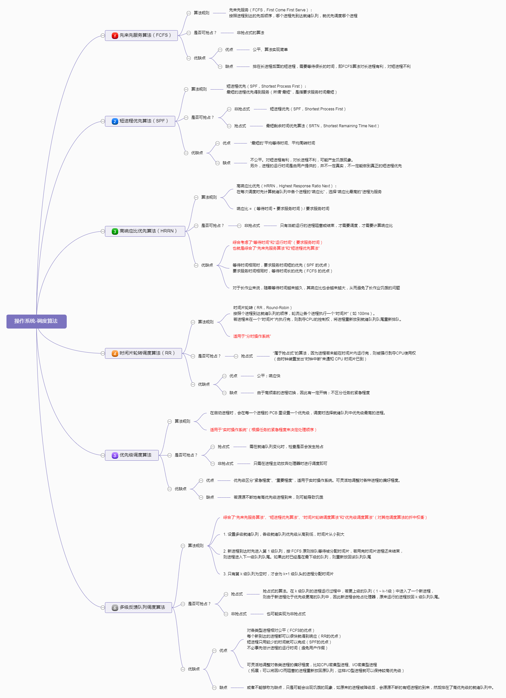
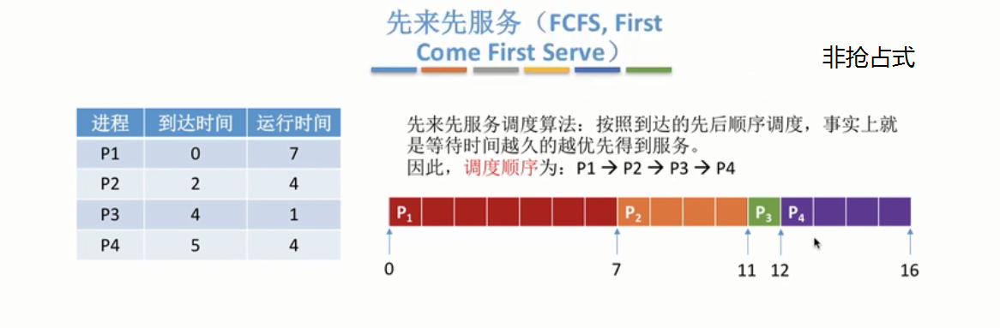
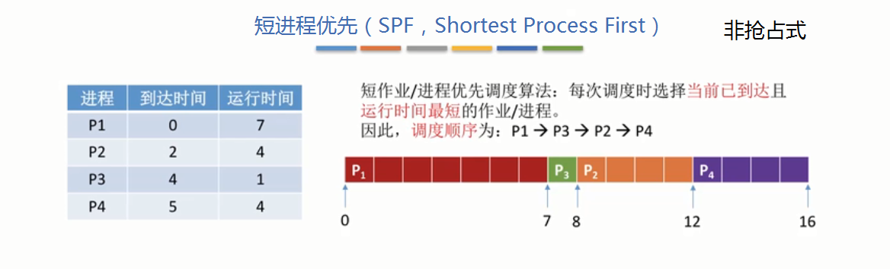
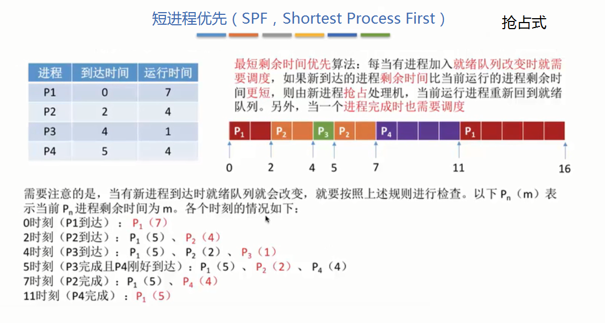
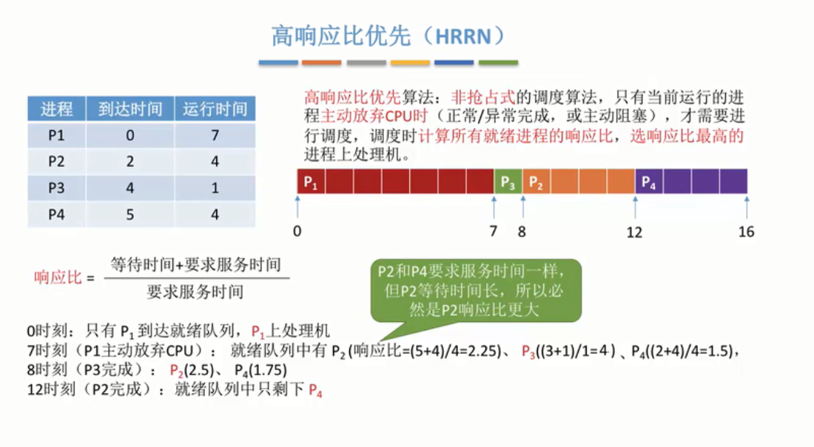
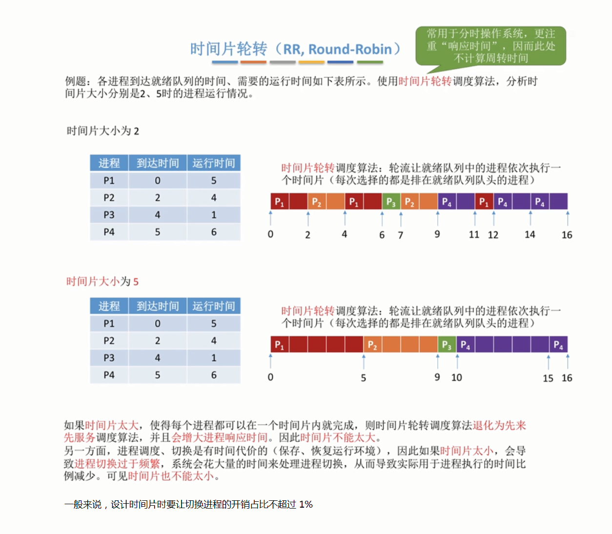
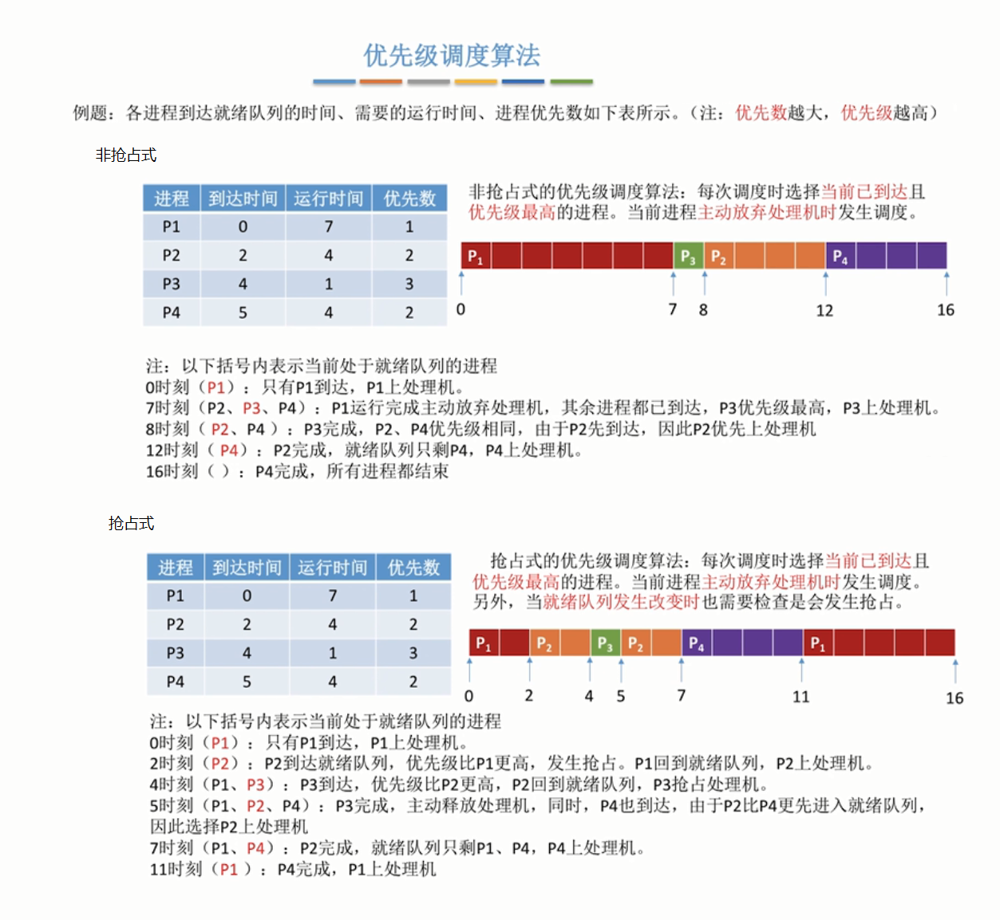
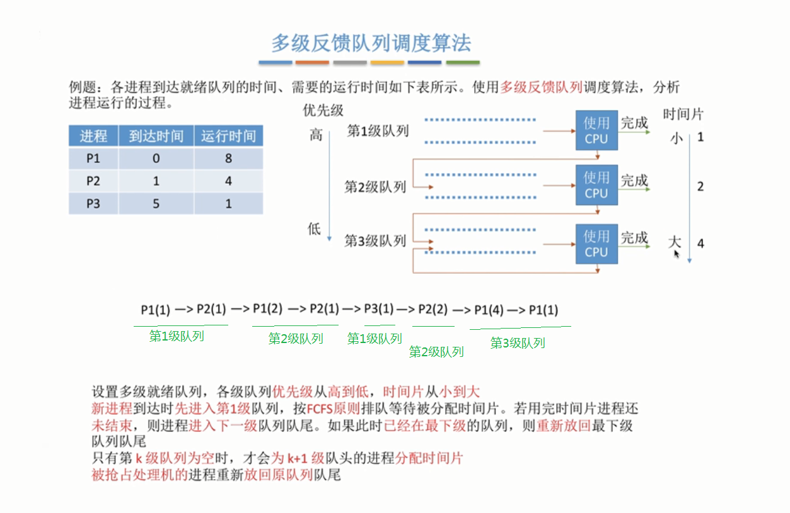

### 1. 调度算法的种类

### 2. 各个调度算法的具体示例
#### （1） 先来先服务算法（FCFS）

#### （2） 短进程优先算法（SPF）
1. 短进程优先（非抢占式）

2. 短进程优先（抢占式）

#### （3） 高响应比优先算法（HRRN）

#### （4） 时间片轮转调度算法（RR）

#### （5） 优先级调度算法

#### （6） 多级反馈队列调度算法

### 3. 参考
[王道 操作系统-调度算法视频](https://www.bilibili.com/video/BV1YE411D7nH?p=15&vd_source=4859610c015d401745b90b6ed755b9d6)
