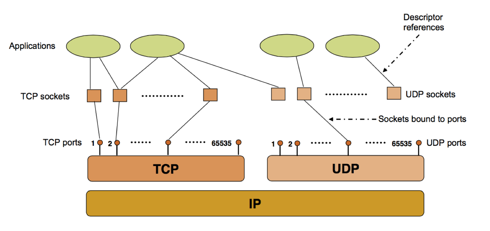

## （一） 绪论
进程之间的交互称为进程间通信（Inter-Process Communication, IPC）。

- 进程之间的通信是如何进行的呢？
由于进程是人类的创造，我们只要看看人类是如何通信的就知道了。人类通信的方式无外乎对白（通过声音沟通）、打手势、写信、发电报、拥抱等方法。类似，进程也可以同样的方式进行通信。


## （二） 进程间通信的方式
### 1. 进程对白：管道
#### （1） 管道（无名管道、匿名管道）
人们最常使用的通信手段就是对白。对白的特点就是一方发出声音，另一方接收声音。而声音的传递则通过空气（当面或无线交谈）、线缆（有线电话）进行传递。类似，**进程对白就是一个进程发出某种数据信息，另外一方接收数据信息，而这些数据信息通过一片共享的存储空间进行传递。**

在这种方式下，一个进程向这片存储空间的一端写入信息，另一个进程从存储空间的另外一端读取信息。这看上去像什么？**管道**（见下图）。


**管道所占的空间既可以是内存，也可以是磁盘。要创建一个管道，一个进程只需调用管道创建的系统调用即可。该系统调用所做的事情就是在某种存储介质上划出一片空间，赋给其中一个进程写的权利，另一个进程读的权利即可。**

1. shell 命令行下的管道
```shell
$ sort < file1 | grep test

# 上述命令的意思是对 file1 的内容进行排序，排完序的结果作为程序 grep 的输入，在结果里面找出所有包括字符串 test 的文本行。
# 在 “排序”（sort） 和 “查找”（grep） 之间创建了一个管道，数据从 sort 流向 grep。即 sort 的结果将作为 grep 的输入。
```

2. 在程序里面的管道
在程序里，创建管道需要使用系统调用 **popen()** 或者 **pipe()**。
**popen() 系统调用**需要提供一个目标进程作为参数，然后在调用该函数的进程和给出的目标进程之间创建一个管道。这很像人们打电话时必须提供对方的号码，才能创建连接一样。创建时还需要提供一个参数表明管道类型：读管道或者写管道。
**pipe() 系统调用**将返回两个文件描述符（文件描述符是用来识别一个文件流的一个整数，与句柄不同），其中一个用于从管道进行读操作，一个用于写入管道。也就是说，pipe() 将两个文件描述符连接起来，使得一端可以读，另一端可以写。

3. 管道的特点
管道的一个重要特点是使用管道的两个进程之间必须存在某种关系，例如，使用 popen()系统调用 需要提供另一端进程的文件名，使用 pipe()系统调用 的两个进程则分别隶属于父子进程。

#### （2） 记名管道
如果要在两个不相关的进程（如两个不同进程里面的进程）之间进行管道通信，则需要使用记名管道。顾名思义，记名管道是一个有名字的通信管道。

记名管道与文件系统共享一个名字空间，即我们可以从文件系统中看到记名管道。也就是说，记名管道的名字不能与文件系统里的任何文件名重名。

一个进程创建一个记名管道后，另外一个进程可使用 open 来打开这个管道（无名管道则不能使用 open 操作），从而与另外一端进行交流。

#### （3） 无名管道和记名管道的优缺点
管道和记名管道虽然具有简单、无需特殊设计（指应用程序方面）就可以和另外一个进程进行通信的优点，但其缺点也很明显。
1. 首先是管道和记名管道并不是所有操作系统都支持。主要支持管道通信方式的是 UNIX 和 类UNIX（如Linux） 的操作系统。这样，如果需要在其他操作系统上进行通信，管道机制就多半会力不从心了。
2. 其次，管道通信需要在相关的进程间进行（无名管道），或者需要知道按名字来打开（记名管道），而这在某些时候会十分不便。


### 2. 进程对白：套接字
#### （1） 套接字绪论
套接字（socket）是一种操作系统提供的进程间通信机制。

在操作系统中，通常会为应用程序提供一组应用程序接口（API），称为套接字接口（英语：socket API）。应用程序可以通过套接字接口，来使用网络套接字，以进行资料交换。

套接字首先在 BSD 操作系统中出现，随后几乎渗透到所有主流操作系统中。套接字的功能非常强大，可以支持不同层面、不同应用、跨网络的通信。


#### （2） 套接字的种类
- 网络模型图

- 网络模型和套接字的结合



套接字由于其功能强大而获得了很大发展，并出现了许多种类。不同的操作系统均支持或实现了某种套接字功能。

按照传输媒介是否为本地，套接字可以分为：
1. 本地（UNIX域）套接字
2. 网络套接字

网络套接字又按照其提供的数据传输特性分为几个大类：
1. 数据报套接字（datagram socket; SOCK_DGRAM）：
提供双向消息流。数据报套接字是一种无连接套接字，使用用户数据报协议（UDP）传输数据。每一个数据包都单独寻址和路由。这导致了接收端接收到的数据可能是乱序的，有一些数据甚至可能会在传输过程中丢失。不过得益于数据报套接字并不需要创建并维护一个稳定的连接，数据报套接字所占用的计算机和系统资源较小。
2. 数据流套接字（stream socket; SOCK_STREAM）：
提供双向消息流。连接导向型通信套接字，使用传输控制协议（TCP）、流控制传输协议（SCTP）或者数据拥塞控制协议（DCCP）传输数据。流套接字提供可靠并且有序的数据传输服务。在互联网上，流套接字通常使用 TCP 实现，以便应用可以在任何使用 TCP/IP 协议的网络上运行。
3. 原始套接字（raw socket）：
原始套接字是一种网络套接字。允许直接发送和接受 IP 数据包并且不需要任何传输层协议格式。原始套接字主要用于一些协议的开发，可以进行比较底层的操作。

套接字从某种程度上来说非常繁杂，各种操作系统对其处理并不完全一样。因此，如要了解某个特定套接字实现，请查阅关于该套接字实现的具体手册或相关文档。


#### （3） 网络套接字的使用步骤
1. 使用套接字进行通信需要双方均创建一个套接字，其中一方作为服务器方，另外一方作为客户方。
2. 服务器方必须先创建一个服务区套接字，然后在该套接字上进行监听，等待远方的连接请求。
3. 欲与服务器通信的客户端则创建一个客户套接字，然后向服务区套接字发送连接请求。
4. 服务器套接字在收到连接请求后，将在服务器方机器上创建一个客户套接字，与远方的客户机上的客户套接字形成点到点的通信通道。
5. 之后，客户方和服务器方就可以通过 send 和 recv 命令在这个创建的套接字通道上进行交流了。


#### （4） 基于 TCP 协议的 Socket 编程基本流程图


#### （5） Socket 编程示例
使用套接字进行通信稍微有点复杂，下面以一个网页浏览的例子对套接字这种通信方式予以说明。

1. 服务器端
对于一个网站来说，要想提供正常的网页浏览服务，其网站服务器需要首先创建一个服务区套接字，作为外界与本服务器的通信信道。
```python
import socket


def run():
    # 网站服务器创建服务区套接字 serversocket
    with socket.socket(socket.AF_INET, socket.SOCK_STREAM) as serversocket:
        # 套接字与某公共主机以及端口绑定
        serversocket.bind((socket.gethostname(), 80))

        # 将套接字变为一个服务区套接字，进行监听，数字5将端口上的等待队列长度限制为5，即超过5个的请求将被拒绝。
        serversocket.listen(5)

        # 用一个无限循环来处理请求
        while True:
            # 接收外部连接请求，当有客户端过来连接的时候, serversocket.accept 函数就会返回 2 个值
            clientsocket, address = serversocket.accept()

            # 开一个新的线程来处理请求, 第二个参数是传给新函数的参数列表, 必须是 tuple
            # 可以通过服务器端的 clientsocket 的 recv 和 send 和客户端的套接字发送信息
            _thread.start_new_thread(process_request, (clientsocket,))


def process_request(clientsocket):
    """
    处理每一个连接的 request
    """
    buffer_size = 1024

    # 获取请求的数据
    # recv 可以接收客户端发送过来的数据，返回值是一个 bytes 类型
    r = clientsocket.recv(buffer_size)
    r = r.decode('utf-8')
    log('request is:\n{}'.format(r))

    response = b'HTTP/1.1 200 OK\r\nContent-Type: text/html;charset=utf-8\r\n\r\n<h1>Hello World!</h1>'
    clientsocket.sendall(response)            # 用 sendall 发送给客户端

    clientsocket.close()                          # 发送完毕后, 关闭本次连接
    print('线程关闭')

```

2. 客户端
客户端浏览器创建的客户机套接字，用于和网站连接
```python
import socket


def browser(host, port):
    # 创建一个一个 socket 实例
    # 参数 socket.AF_INET 表示是 ipv4 协议
    # 参数 socket.SOCK_STREAM 表示是 tcp 协议
    # 这两个其实是默认值, 所以可以不写
    # s = socket.socket(socket.AF_INET, socket.SOCK_STREAM)
    s = socket.socket()

    # 建立连接：通过 3 次握手建立 tcp 连接
    s.connect(host, port)

    # 发送请求 （建立连接后，浏览器自动添加请求中必要的 headers，然后发送请求）
    request = 'GET {} HTTP/1.1\r\nHost: {}\r\nConnection: close\r\n\r\n'.format('/', host)
    s.sendall(request.encode('utf-8'))

    # 获取响应的数据
    buffer_size = 1024
    r = s.recv(buffer_size)
    r = response.decode('utf-8')
    log('request is:\n{}'.format(r))
```

- 客户端程序可以使用套接字 s 来发送请求、索取网页，而服务器端则使用套接字 clientsocket 进行发送和接收消息。
- 这里需要指出的是服务区套接字既不发送数据，也不接收数据（指不接收正常的用户数据，而不是连接请求数据），而仅仅生产出“客户”套接字。
- 当其他（远方）的客户套接字发出一个连接请求时，我们就创建一个客户套接字。一旦服务区套接字创建客户套接字 clientsocket，那么与客户的通信任务就交给了这个刚刚创建的客户套接字 clientsocket 。而原本的服务器套接字 serversocket 则回到其原来的监听操作上。


### 3. 进程电报：信号
管道和套接字这两种通信机制的缺点：
1. 首先，如果使用管道和套接字方式来通信，必须事先在通信的进程间建立连接（创建管道或套接字），这需要消耗系统资源
2. 其次，通信是自愿的。即一方虽然可以随意向管道或套接字发送信息，但对方却可以选择接收的时机。即使对方对此充耳不闻，你也奈何不得
3. 再次，由于建立连接消耗时间，一旦建立，我们就想进行尽可能多的通信。而如果通信的信息量微小，如我们只是想通知一个进程某件事情的发生，则用管道和套接字就有点“杀鸡用牛刀”的味道，效率十分低下。


**解决方案：信号**
1. 想迫使一方对我们的通信立即做出回应。
2. 我们不想事先建立任何连接，而是临时突然觉得需要与某个进程通信。
3. 传输的信息量微小，使用管道或套接字不划算。


**信号是什么？**
在计算机里，信号就是一个内核对象，或者说是一个内核数据结构。发送方将该数据结构的内容填好，并指明该信号的目标进程后，发出特定的软件中断。操作系统接收到特定的中断请求后，知道是有进程要发送信号，于是到特定的内核数据结构里查找信号接收方，并进行通知。接到通知的进程则对信号进行相应处理。

信号非常类似我们生活当中的电报。如果你想给某人发一封电报，就拟好电文，将报文和收报人的信息都交给电报公司。电报公司则将电报发送到收报人所在地的邮局（中断），并通知收报人来取电报。发报时无需收报人事先知道，更无需进行任何协调。如果对方选择不对信号做出响应，则将被操作系统终止运行。


### 4. 进程旗语：信号量
信号量（semaphore）是由荷兰人 E.W.Dijkstra 在 20 世纪 60 年代所构思出的一种程序设计构造。其原型来源于铁路的运行：在一条单轨铁路上，任何时候只能有一列列车行驶在上面。而管理这条铁路的系统就是信号量。任何一列火车必须等到表明铁路可以行驶的信号后才能进入轨道。当一列列车进入单轨运行后，需要将信号改为禁止进入，从而防止别的火车同时进入轨道。而当列车驶出单轨后，则需要将信号变回允许进入状态。这很像以前的旗语。

在计算机里，信号量实际上就是一个简单整数。一个进程在信号变为 0 或者 1 的情况下推进，并且将信号变为 1 或 0 来防止别的进程推进。当进程完成任务后，则将信号再改变为 0 或 1 ，从而允许其他进程执行。

需要注意的是，信号量不只是一种通信机制，更是一种同步机制。。


### 5. 进程拥抱：共享内存
#### （1） 共享内存的概要
管道、套接字、信号、信号量，虽然满足了多种通信需要，但还是有一种需要未能满足。这就是两个进程需要共享大量数据。解决方案就是 **共享内存**。

共享内存就是两个进程共同拥有同一片内存。对于这片内存中的任何内容，二者均可以访问。要使用共享内存进行通信，一个进程首先需要创建一片内存空间专门作为通信用，而其他进程则将该片内存映射到自己的（虚拟）地址空间。这样，读写自己地址空间中对应共享内存的区域时，就是在和其他进程进行通信。


看起来共享内存和管道有点像，有些管道不也是一片共享内存？差异点如下：
1. 首先，使用共享内存机制通信的两个进程必须在同一台物理机器上；
2. 其次，共享内存的访问方式是随机的，而不是只能从一端写，另一端读，因此其灵活性比管道和套接字大很多，能够传递的信息也复杂得多。

#### （2） 共享内存的缺点
1. 共享内存的缺点是管理复杂，且两个进程必须在同一台物理机器上才能使用这种通信方式。
2. 共享内存的另外一个缺点是安全性脆弱。因为两个进程存在一片共享的内存，如果一个进程染有病毒，很容易就会传给另外一个进程。


### 6. 信件发送：消息队列
消息队列是一列具有头和尾的消息排列。新来的消息放在队列尾部，而读取消息则从队列头部开始。


消息队列看起来也很像管道，一头读，一头写，但还是有差异的：
1. 首先，它无需固定的读写进程，任何进程都可以读写（当然是有权限的进程）
2. 其次，它可以同时支持多个进程，多个进程可以读写消息队列。即所谓的多对多，而不是管道的点对点
3. 另外，消息队列只在内存中实现
4. 最后，它并不是只在 UNIX 和 类UNIX 操作系统中实现。几乎所有主流操作系统都支持消息队列

### 7. 其他通信机制
除了上面介绍的主流通信方式外，有些操作系统还提供了一些其所特有的通信机制
1. Windows 支持的进程通信方式就有所谓的 剪贴板（clipboard）、COM/DCOM、动态数据交换（DDE）、邮箱（mailslots）
2. Solaris 则有所谓的 Solaris 门机制，让客户通过轻量级（16KB）系统调用使用服务器的服务。


## （三） 参考
[Python socket 基本知识与工作原理 ](https://baolei.me/2018/11/02/python%20socketbasic%20knowledge/)
[维基-套接字](https://zh.m.wikipedia.org/zh-cn/%E7%B6%B2%E8%B7%AF%E6%8F%92%E5%BA%A7)
[操作系统之哲学原理(第2版)](https://book.douban.com/subject/10528447/)