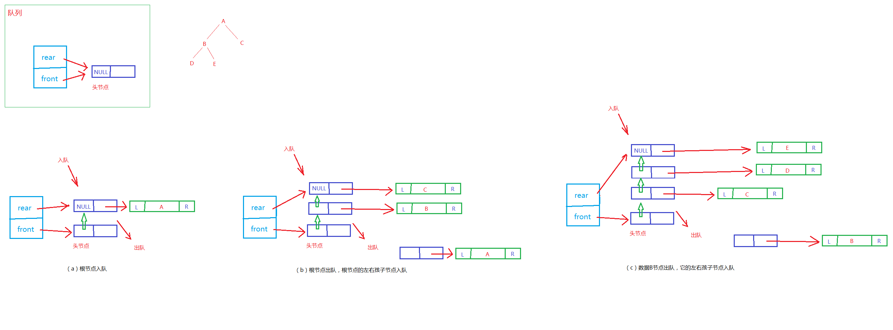

###### 1. 示意图



###### 2. 代码实现
```
#include <stdio.h>
#include <stdlib.h>
#include <stdbool.h>

// 树的节点
typedef struct treeNode {
    char data;
    struct treeNode *lchild;
    struct treeNode *rchild;
} TreeNode;

// 链式队列的节点
typedef struct linkNode {
    TreeNode *value;
    struct linkNode *next;
} LinkNode;

// 队列
typedef struct queue {
    LinkNode *front;
    LinkNode *rear;
} Queue;

void initQueue(Queue *pq);
void enQueue(Queue *pq, TreeNode *T);
bool isEmpty(Queue *pq);
TreeNode *outQueue(Queue *pq);
TreeNode *createBTree();
void levelOrderTraversal(TreeNode *T);

int main() {
    TreeNode *T = createBTree();
    printf("层序遍历的结果为：\n");
    levelOrderTraversal(T);
    printf("\n");

    return 0;
}

// 队列的初始化
void initQueue(Queue *pq) {
    LinkNode *p = (LinkNode *)malloc(sizeof(LinkNode));

    if (NULL == p) {
        printf("动态内存分配失败！\n");
        exit(-1);
    } else {
        p->next = NULL;
        pq->front = p;
        pq->rear = p;
    }

    return;
}

// 入队操作
void enQueue(Queue *pq, TreeNode *T) {
    LinkNode *n = (LinkNode *)malloc(sizeof(LinkNode));

    if (NULL == n) {
        printf("动态内存分配失败！\n");
        exit(-1);
    } else {
        n->value = T;
        n->next = NULL;

        pq->rear->next = n;     // 将新节点挂到队列尾部
        pq->rear = n;           // 将尾指针指向新的节点
        return;
    }
}

// 判断当前队列是否为空
bool isEmpty(Queue *pq) {
    if (pq->front == pq->rear) {
        return true;
    } else {
        return false;
    }
}

// 出队操作
TreeNode *outQueue(Queue *pq) {
    if ( isEmpty(pq) ) {
        printf("队列为空，无法出队！\n");
        return NULL;
    } else {
        LinkNode *p = pq->front->next;
        pq->front->next = p->next;
        TreeNode *t = p->value;
        free(p);

        if (NULL == pq->front->next) {  // 出队后，如果队列为空
            pq->rear = pq->front;       // 将尾指针也指向无用的头节点
        }

        return t;
    }
}

// 创建一个链式二叉树
TreeNode *createBTree() {
    TreeNode *pa = (TreeNode *)malloc(sizeof(TreeNode));
    TreeNode *pb = (TreeNode *)malloc(sizeof(TreeNode));
    TreeNode *pc = (TreeNode *)malloc(sizeof(TreeNode));
    TreeNode *pd = (TreeNode *)malloc(sizeof(TreeNode));
    TreeNode *pe = (TreeNode *)malloc(sizeof(TreeNode));

    pa->data = 'A';
    pa->lchild = pb;
    pa->rchild = pc;

    pb->data = 'B';
    pb->lchild = pd;
    pb->rchild = pe;

    pc->data = 'C';
    pc->lchild = pc->rchild = NULL;

    pd->data = 'D';
    pd->lchild = pd->rchild = NULL;

    pe->data = 'E';
    pe->lchild = pe->rchild = NULL;

    return pa;
}

// 链式二叉树的层序遍历
void levelOrderTraversal(TreeNode *T) {
    Queue q;
    initQueue(&q);  // 初始化队列，造出一个空的队列
    enQueue(&q, T);

    while( !isEmpty(&q) ) {
        TreeNode * t = outQueue(&q);
        printf("%c ", t->data);

        if (NULL != t->lchild) {
            enQueue(&q, t->lchild);
        }

        if (NULL != t->rchild) {
            enQueue(&q, t->rchild);
        }
    }
}
```
链式队列比较耗内存空间，因为需要申请生成新的队列节点，可以尝试用数组去实现队列（即：静态队列）。
