看到一篇关于希尔排序的讲解，写的很不错，这边转发一下。
转载自：[https://blog.csdn.net/qq_39207948/article/details/80006224](https://blog.csdn.net/qq_39207948/article/details/80006224)

# 1. 定义
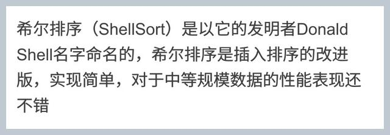
希尔排序（Shellsort），也称**递减增量排序算法**，是插入排序的一种更高效的改进版本。实现简单，对于中等规模数据的性能表现还不错。希尔排序是非稳定排序算法。

希尔排序是基于插入排序的以下两点性质而提出改进方法的：
- 1). 插入排序在对几乎已经排好序的数据操作时，效率高，即可以达到线性排序的效率
- 2). 但插入排序一般来说是低效的，因为插入排序每次只能将数据移动一位

# 2. 算法思想

温馨提示：[菜鸟教程-插入排序](https://www.runoob.com/w3cnote/insertion-sort.html)（由于希尔排序是在插入排序的基础上进行改进的，因此需要对插入排序有一定的了解，才能弄懂希尔排序，对插入排序不熟悉的建议先阅读此文）

一天，一尘拿着扑克自己在那玩，刚被师傅看见了


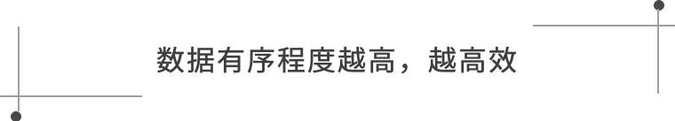


- 1). 首先它把较大的数据集合分割成若干个小组（逻辑上分组），然后对每一个小组分别进行[插入排序](https://so.csdn.net/so/search?q=%E6%8F%92%E5%85%A5%E6%8E%92%E5%BA%8F&spm=1001.2101.3001.7020)，此时，插入排序所作用的数据量比较小（每一个小组），插入的效率比较高

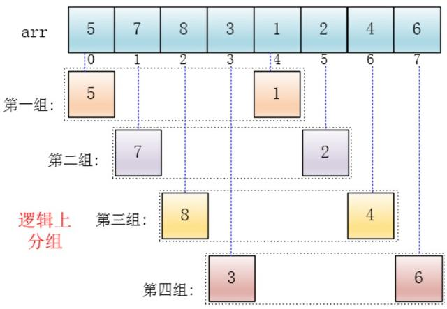

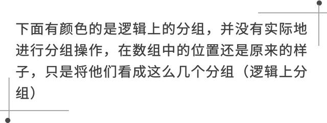

- 2). 可以看出，他是按下标相隔距离为4分的组，也就是说把下标相差4的分到一组，比如这个例子中a[0]与a[4]是一组、a[1]与a[5]是一组...，这里的差值（距离）被称为增量

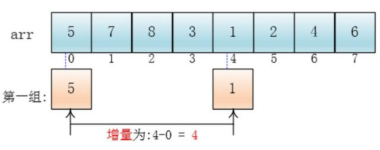

- 3). 每个分组进行插入排序后，各个分组就变成了有序的了（整体不一定有序）

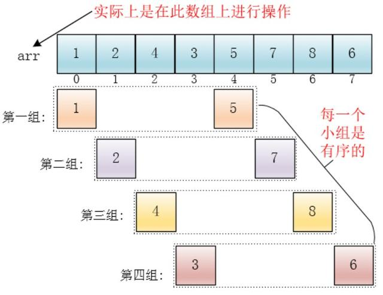

- 4). 此时，整个数组变的部分有序了（有序程度可能不是很高）

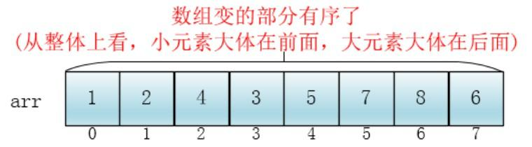

- 5). 然后缩小增量为上个增量的一半:2，继续划分分组，此时，每个分组元素个数多了，但是，数组变的部分有序了，插入排序效率同样比高

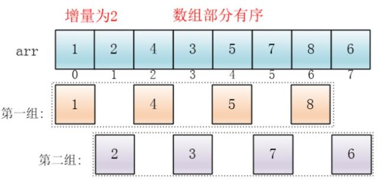

- 6). 同理对每个分组进行排序（插入排序），使其每个分组各自有序

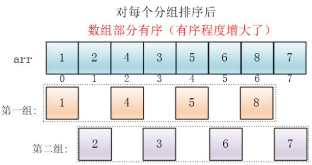

- 7). 最后设置增量为上一个增量的一半：1，则整个数组被分为一组，此时，整个数组已经接近有序了，插入排序效率高

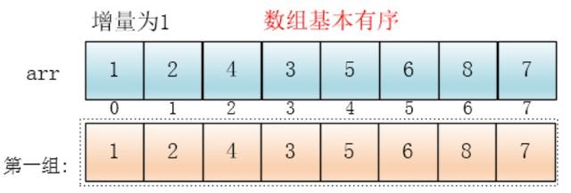

- 8). 同理，对这仅有的一组数据进行排序，排序完成


# 3. 希尔排序的代码


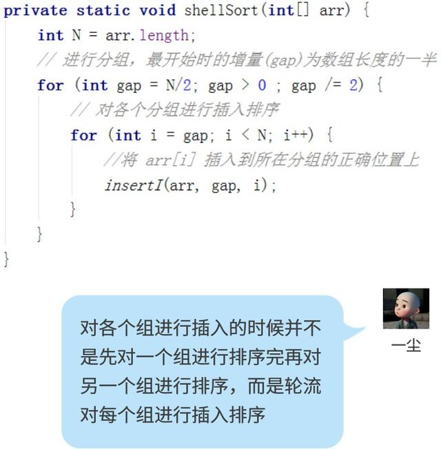

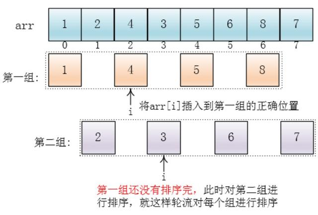

随后一尘写出了插入arr[i]到所在组正确位置的代码（insertI）

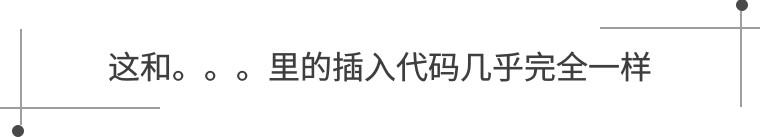

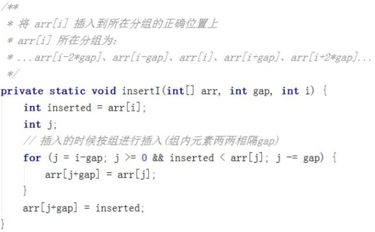


**代码实现（C语言）**
自己可以尝试在纸上手动计算整个过程，当希尔排序的算法在纸上过一遍之后，就会发现该算法简单易懂了
```
#include <stdio.h>

void shellSort(int *arr, int len) {
    // 最开始的步长，求中位数：len / 2 或 len >> 1
    // 进行分组，最开始时的增量(gap)为数组长度的一半
    for (int gap = len / 2; gap > 0; gap = gap / 2) {
        // 以下都是和插入排序相关的了，对各个分组进行插入排序
        for (int i = gap; i < len; i++) {
            int key = arr[i];
            // 逻辑上，以 key 前面的第 gap 个元素为有序序列的起始点
            int j = i - gap;
            while (j >= 0 && arr[j] > key) {
                // 对于前面已排序的元素，以 gap 为步长间隔向后替换或向前搜索
                arr[j + gap] = arr[j];
                j = j - gap;
            }
            arr[j + gap] = key;
        }
    }
}

int main() {
    int arr[] = { 220, 34, 3, 32, 82, 55, 891, 50, 37, 5, 64, 35, 9, 10 };
    int len = sizeof(arr) / sizeof(arr[0]);

    shellSort(arr, len);
    for (int i = 0; i < len; i++) {
        printf("%d  ", arr[i]);
    }
    printf("\n");

    return 0;
}

```

# 4. 希尔排序的时间复杂度


希尔排序的复杂度和增量序列是相关的

- 1). {1, 2, 4, 8, ...} 这种序列并不是很好的增量序列，使用这个增量序列的时间复杂度（最坏情形）是 O(n^2)

- 2). Hibbard 提出了另一个增量序列 {1, 3, 7, ..., 2^k-1 }，这种序列的时间复杂度(最坏情形)为 O(n^1.5)

- 3). Sedgewick 提出了几种增量序列，其最坏情形运行时间为 O（n^1.3）,其中最好的一个序列是 {1, 5, 19, 41, 109, ... }

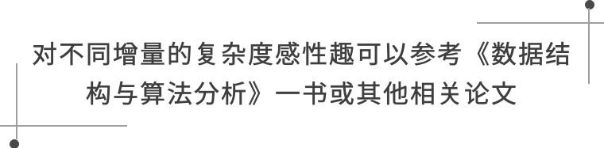


# 5. 希尔排序的稳定性

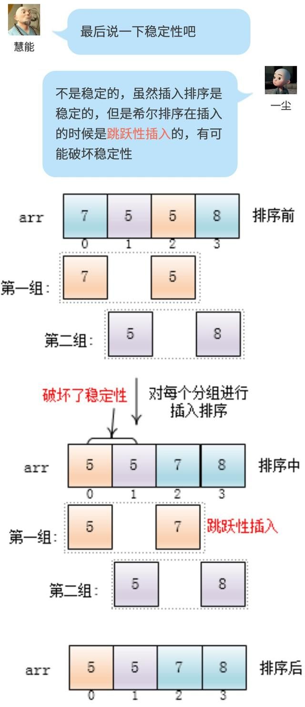

说完，一尘继续玩起了扑克。
