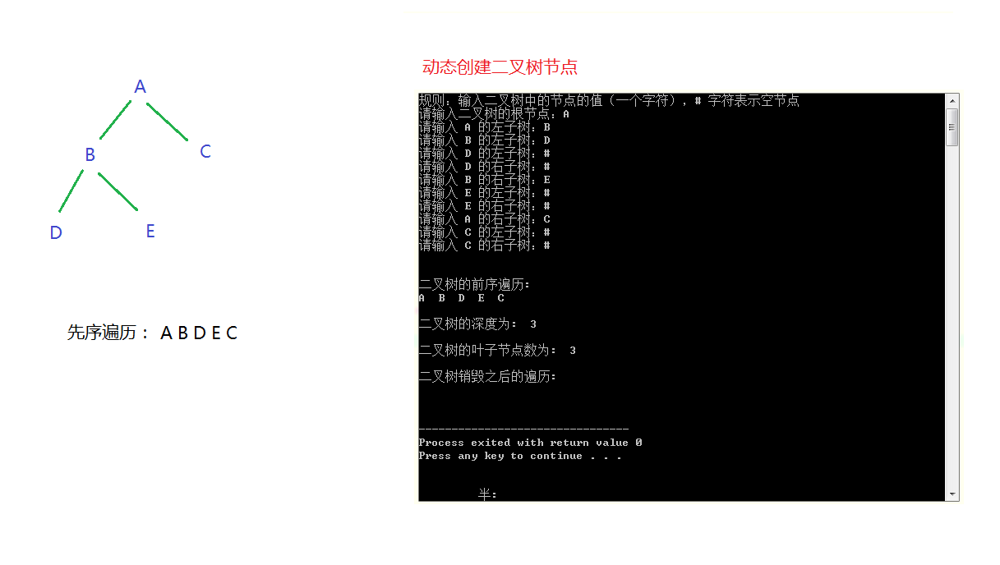

###### 1. 代码实现
```
#include <stdio.h>
#include <stdlib.h>     // 包含了 malloc 和 exit 函数
#include <stdbool.h>    // 包含 bool 类型

// 结构体定义
typedef struct treeNode {
    char data;
    struct treeNode *lchild;
    struct treeNode *rchild;
} TreeNode;

// 函数声明
TreeNode *createBTree();
TreeNode * dynamicCreateBTree();
void destroyBTree(TreeNode *T);
void preOrderTraversal(TreeNode *T);
int depthOfBTree(TreeNode *T);
int leafCount(TreeNode *T);

int main() {
    // TreeNode *T = createBTree();
    printf("规则：输入二叉树中的节点的值（一个字符），# 字符表示空节点\n");
    printf("请输入二叉树的根节点：");
    TreeNode *T = dynamicCreateBTree();

    printf("\n\n二叉树的前序遍历:\n");
    preOrderTraversal(T);
    printf("\n\n");

    int depth = depthOfBTree(T);
    printf("二叉树的深度为:  %d\n\n", depth);

    int leaf = leafCount(T);
    printf("二叉树的叶子节点数为:  %d\n\n", leaf);

    destroyBTree(T);
    T = NULL;
    printf("二叉树销毁之后的前序遍历:\n");
    preOrderTraversal(T);
    printf("\n\n");

    return 0;
}

// 创建一个链式二叉树
TreeNode *createBTree() {
    TreeNode *pa = (TreeNode *)malloc(sizeof(TreeNode));
    TreeNode *pb = (TreeNode *)malloc(sizeof(TreeNode));
    TreeNode *pc = (TreeNode *)malloc(sizeof(TreeNode));
    TreeNode *pd = (TreeNode *)malloc(sizeof(TreeNode));
    TreeNode *pe = (TreeNode *)malloc(sizeof(TreeNode));

    pa->data = 'A';
    pa->lchild = pb;
    pa->rchild = pc;

    pb->data = 'B';
    pb->lchild = pd;
    pb->rchild = pe;

    pc->data = 'C';
    pc->lchild = pc->rchild = NULL;

    pd->data = 'D';
    pd->lchild = pd->rchild = NULL;

    pe->data = 'E';
    pe->lchild = pe->rchild = NULL;

    return pa;
}

// 动态创建一个链式二叉树
// 输入二叉树中的节点的值（一个字符），# 字符表示空节点
TreeNode * dynamicCreateBTree() {
    // 接收用户的输入
    char data;
    scanf("%c", &data);
    char temp;
    while((temp = getchar()) != EOF && temp != '\n') {
        // 每次输入后，清除缓冲区里的剩余内容，直到读到缓冲区的 \n 或者是空值;
        ;
    }

    if (data == '#') {
        // 如果为空，则视该节点为空节点
        return NULL;
    } else {
        TreeNode *T = (TreeNode *)malloc(sizeof(TreeNode));
        if (NULL == T) {
            return NULL;
        }

        T->data = data;                            // 生成根节点
        printf("请输入 %c 的左子树：", data);
        T->lchild = dynamicCreateBTree();          // 构造左子树
        printf("请输入 %c 的右子树：", data);
        T->rchild = dynamicCreateBTree();          // 构造右子树
        return T;
    }
}

// 树的遍历：前序遍历
void preOrderTraversal(TreeNode *T) {
    if (T == NULL) {
        return;
    } else {
        printf("%c  ", T->data);
        preOrderTraversal(T->lchild);
        preOrderTraversal(T->rchild);
    }
}

// 递归销毁一颗二叉树
void destroyBTree(TreeNode *T) {
    if (T == NULL) {
        return;
    } else {
        destroyBTree(T->lchild);
        destroyBTree(T->rchild);
        free(T);
    }
}

// 求二叉树的深度
int depthOfBTree(TreeNode *T) {
    if (T == NULL) {
        return 0;
    } else {
        int leftDepth = depthOfBTree(T->lchild);
        int rightDepth = depthOfBTree(T->rchild);
        int depth = leftDepth > rightDepth ? leftDepth + 1 : rightDepth + 1;
        return depth;
    }
}

// 求二叉树的叶子节点个数
int leafCount(TreeNode *T) {
    if (T == NULL) {
        return 0;
    } else {
        int leftLeaf = leafCount(T->lchild);
        int rightLeaf = leafCount(T->rchild);
        if (leftLeaf == 0 && rightLeaf == 0) {
            return 1;
        } else {
            return leftLeaf + rightLeaf;
        }
    }
}
```

###### 2. 示意图

