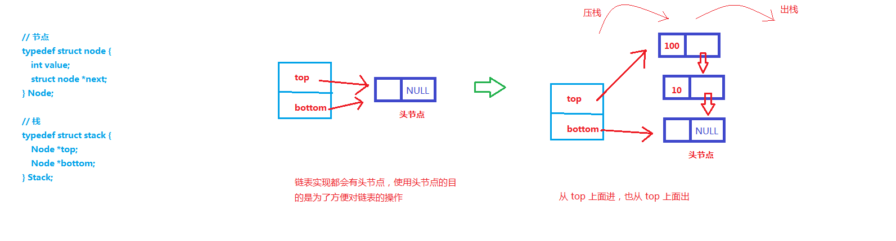

###### 1. 示意图



###### 2. 代码实现
```
#include <stdio.h>
#include <stdlib.h>
#include <stdbool.h>

// 节点
typedef struct node {
    int value;
    struct node *next;
} Node;

// 栈
typedef struct stack {
    Node *top;
    Node *bottom;
} Stack;

void initStack(Stack *ps);
bool pushStack(Stack *ps, int value);
void traverseStack(Stack *ps);
bool isEmpty(Stack *ps);
bool popStack(Stack *ps, int *value);
void clear(Stack *ps);

int main() {
    Stack s;
    initStack(&s);      // 目的是造出一个空栈

    pushStack(&s, 1);   // 压栈
    pushStack(&s, 2);
    pushStack(&s, 3);
    printf("当前栈中的数据：\n");
    traverseStack(&s);  // 遍历输出
    printf("\n");

    int value;
    if ( popStack(&s, &value) == true ) {   // 出栈
        printf("出栈成功！出栈的数据为：%d\n", value);
    }
    printf("执行出栈操作后，栈中的数据：\n");
    traverseStack(&s);  // 遍历输出
    printf("\n");

    clear(&s);
    printf("执行清空栈的操作后，栈中的数据：\n");
    traverseStack(&s);  // 遍历输出

    return 0;
}

// 栈的初始化
void initStack(Stack *ps) {
    Node *p = (Node *)malloc(sizeof(Node));

    if (NULL == p) {
        printf("动态内存分配失败！\n");
        exit(-1);
    } else {
        p->next = NULL;
        ps->top = p;
        ps->bottom = p;
    }

    return;
}

// 压栈操作
bool pushStack(Stack *ps, int value) {
    Node *n = (Node *)malloc(sizeof(Node));

    if (NULL == n) {
        printf("动态内存分配失败！\n");
        return false;
    } else {
        n->value = value;
        n->next = ps->top;
        ps->top = n;
        return true;
    }
}

// 遍历栈
void traverseStack(Stack *ps) {
    Node *p = ps->top;

    while (p != ps->bottom) {
        printf("%d  ", p->value);
        p = p->next;
    }
    printf("\n");

    return;
}

// 判断栈当前状态是否为空
bool isEmpty(Stack *ps) {
    if (ps->top == ps->bottom) {
        return true;
    } else {
        return false;
    }
}

// 出栈操作
bool popStack(Stack *ps, int *value) {
    if ( isEmpty(ps) == true ) {
        printf("当前栈为空的状态，不能够进行出栈操作！\n");
        return false;
    } else {
        Node *p = ps->top;
        *value = p->value;
        ps->top = p->next;
        free(p);
        p = NULL;

        return true;
    }
}

// 清空栈
void clear(Stack *ps) {
    if ( isEmpty(ps) == true ) {
        return;
    } else {
        Node *p = ps->top;
        Node *q = NULL;

        while (p != ps->bottom) {
            q = p->next;
            free(p);
            p = q;
        }
        ps->top = ps->bottom;

        return;
    }
}

```
