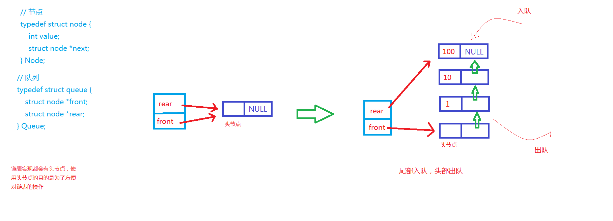

###### 1. 示意图



###### 2. 代码实现
```
#include <stdio.h>
#include <stdlib.h>
#include <stdbool.h>

// 节点
typedef struct node {
    int value;
    struct node *next;
} Node;

// 队列
typedef struct queue {
    struct node *front;
    struct node *rear;
} Queue;

void initQueue(Queue *pq);
bool inQueue(Queue *pq, int value);
bool isEmpty(Queue *pq);
void traverseQueue(Queue *pq);
bool outQueue(Queue *pq, int *value);
void clear(Queue *pq);

int main() {
    Queue q;
    initQueue(&q);  // 初始化队列，造出一个空的队列

    // 入队操作
    inQueue(&q, 10);
    inQueue(&q, 12);
    inQueue(&q, 13);
    printf("队列的遍历\n");
    traverseQueue(&q);
    printf("\n");

    // int value;
    // if ( outQueue(&q, &value) ) {
    //     printf("出队的元素是：%d\n", value);
    // }
    // if ( outQueue(&q, &value) ) {
    //     printf("出队的元素是：%d\n", value);
    // }
    // if ( outQueue(&q, &value) ) {
    //     printf("出队的元素是：%d\n", value);
    // }
    // if ( outQueue(&q, &value) ) {
    //     printf("出队的元素是：%d\n", value);
    // }
    // printf("队列的遍历\n");
    // traverseQueue(&q);

    printf("使用 clear 函数来清空队列!\n");
    clear(&q);
    printf("队列的遍历\n");
    traverseQueue(&q);
    printf("\n");

    inQueue(&q, 12);
    inQueue(&q, 13);
    printf("队列的遍历\n");
    traverseQueue(&q);
    printf("\n");

    return 0;
}

// 队列的初始化
void initQueue(Queue *pq) {
    Node *p = (Node *)malloc(sizeof(Node));

    if (NULL == p) {
        printf("动态内存分配失败！\n");
        exit(-1);
    } else {
        p->next = NULL;
        pq->front = p;
        pq->rear = p;
    }

    return;
}

// 入队操作
bool inQueue(Queue *pq, int value) {
    Node *n = (Node *)malloc(sizeof(Node));

    if (NULL == n) {
        printf("动态内存分配失败！\n");
        return false;
    } else {
        n->value = value;
        n->next = NULL;

        pq->rear->next = n;     // 将新节点挂到队列尾部
        pq->rear = n;           // 将尾指针指向新的节点

        return true;
    }
}

// 判断当前队列是否为空
bool isEmpty(Queue *pq) {
    if (pq->front == pq->rear) {
        return true;
    } else {
        return false;
    }
}

// 遍历队列
void traverseQueue(Queue *pq) {
    if ( isEmpty(pq) ) {
        printf("队列为空，遍历的结果为空！\n");
    } else {
        Node *p = pq->front->next;

        while (p != NULL) {
            printf("%d  ", p->value);
            p = p->next;
        }
        printf("\n");
    }

    return;
}

// 出队操作
bool outQueue(Queue *pq, int *value) {
    if ( isEmpty(pq) ) {
        printf("队列为空，无法出队！\n");
        return false;
    } else {
        Node *p = pq->front->next;
        pq->front->next = p->next;
        *value = p->value;
        free(p);

        if (NULL == pq->front->next) {  // 出队后，如果队列为空
            pq->rear = pq->front;       // 将尾指针也指向无用的头节点
        }

        return true;
    }
}

// 清空队列
void clear(Queue *pq) {
    while ( isEmpty(pq) == false ) {
        int value;
        outQueue(pq, &value);
    }
}

// 清空队列
// void clear(Queue *pq) {
//     if ( isEmpty(pq) ) {
//         return;
//     } else {
//         Node *p = pq->front->next;
//         Node *q = NULL;
//         while (p != NULL) {
//             q = p->next;
//             free(p);
//             p = q;
//         }
//         pq->front->next = NULL;
//         pq->rear = pq->front;

//         return;
//     }
// }
```
