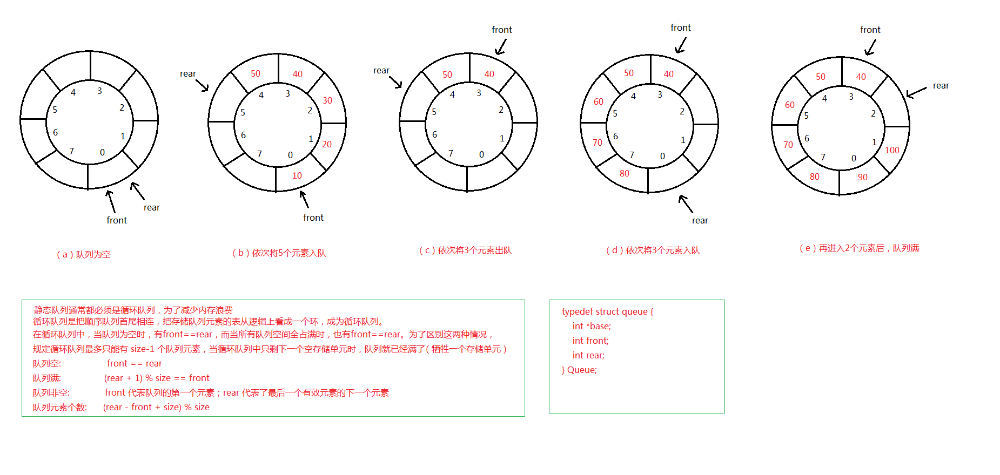

### 1. 示意图



### 2. 代码实现
```
#include <stdio.h>
#include <stdlib.h>         // 包含了 malloc 和 exit 函数
#include <stdbool.h>        // 包含 bool 类型

#define MAX_QUEUE_SIZE 11    // 最大队列长度 + 1，当循环队列只剩一个空存储单元，队列就已经满了

typedef struct queue {
    int *base;      // 初始化的动态分配存储空间，存储的是数组第一个元素的地址
    int front;      // 队列的头，若队列不为空，指向队列头元素
    int rear;       // 队列的尾，若队列不为空，指向队列尾元素的下一个位置
} Queue;

void initQueue(Queue *pq);
bool isFull(Queue *pq);
void enQueue(Queue *pq, int value);
void traverseQueue(Queue *pq);
bool isEmpty(Queue *pq);
bool outQueue(Queue *pq, int *value);
int queueCount(Queue *pq);

int main() {
    Queue q;

    initQueue(&q);

    enQueue(&q, 1);
    enQueue(&q, 2);
    enQueue(&q, 3);
    enQueue(&q, 4);
    enQueue(&q, 5);
    enQueue(&q, 6);
    enQueue(&q, 7);
    enQueue(&q, 8);
    enQueue(&q, 9);
    enQueue(&q, 10);
    enQueue(&q, 11);
    printf("遍历队列：\n");
    traverseQueue(&q);
    printf("当前队列中有 %d 个元素\n", queueCount(&q));
    printf("\n");

    int value;
    if (outQueue(&q, &value)) {
        printf("出队操作执行成功，出队的元素是：%d\n", value);
    }
    if (outQueue(&q, &value)) {
        printf("出队操作执行成功，出队的元素是：%d\n", value);
    }
    if (outQueue(&q, &value)) {
        printf("出队操作执行成功，出队的元素是：%d\n", value);
    }
    printf("遍历队列：\n");
    traverseQueue(&q);
    printf("当前队列中有 %d 个元素\n", queueCount(&q));
    printf("\n");

    if (outQueue(&q, &value)) {
        printf("出队操作执行成功，出队的元素是：%d\n", value);
    }
    if (outQueue(&q, &value)) {
        printf("出队操作执行成功，出队的元素是：%d\n", value);
    }
    if (outQueue(&q, &value)) {
        printf("出队操作执行成功，出队的元素是：%d\n", value);
    }
    printf("遍历队列：\n");
    traverseQueue(&q);
    printf("当前队列中有 %d 个元素\n", queueCount(&q));
    printf("\n");

    return 0;
}

// 队列的初始化
void initQueue(Queue *pq) {
    int *p = (int *)malloc(sizeof(int) * MAX_QUEUE_SIZE);
    if (NULL == p) {
        printf("动态内存分配失败！\n");
        exit(-1);
    } else {
        pq->base = p;
        pq->front = 0;
        pq->rear = 0;
    }
}

// 判断队列是否已满
bool isFull(Queue *pq) {
    if ( (pq->rear + 1) % MAX_QUEUE_SIZE == pq->front ) {
        return true;
    } else {
        return false;
    }
}

// 入队
void enQueue(Queue *pq, int value) {
    if ( isFull(pq) ) {
        printf("队列已满，不能再执行入队操作！\n");
    } else {
        pq->base[pq->rear] = value;
        pq->rear = (pq->rear + 1) % MAX_QUEUE_SIZE;
    }
}

// 遍历队列
void traverseQueue(Queue *pq) {
    int i = pq->front;

    while (i != pq->rear) {
        printf("%d  ", pq->base[i]);
        i = (i + 1) % MAX_QUEUE_SIZE;
    }
    printf("\n");

    return;
}

// 判断队列是否为空
bool isEmpty(Queue *pq) {
    if (pq->front == pq->rear) {
        return true;
    } else {
        return false;
    }
}

// 出队
bool outQueue(Queue *pq, int *value) {
    if ( isEmpty(pq) ) {
        printf("队列为空，不能执行出队操作！\n");
        return false;
    } else {
        *value = pq->base[pq->front];
        pq->front = (pq->front + 1) % MAX_QUEUE_SIZE;
        return true;
    }
}

// 当前队列的有效长度
int queueCount(Queue *pq) {
    int len = (pq->rear - pq->front + MAX_QUEUE_SIZE) % MAX_QUEUE_SIZE;

    return len;
}
```
