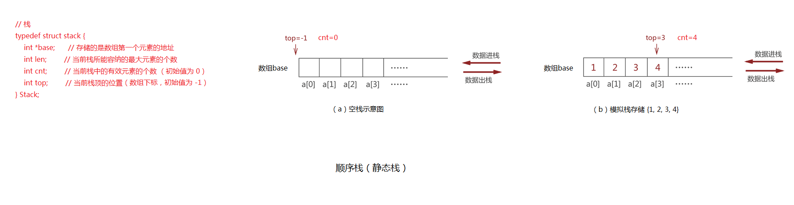

###### 1. 示意图



###### 2. 代码实现
```
#include <stdio.h>
#include <stdlib.h>     // 包含了 malloc 和 exit 函数
#include <stdbool.h>    // 包含 bool 类型

// 栈
typedef struct stack {
    int *base;      // 存储的是数组第一个元素的地址
    int len;        // 当前栈所能容纳的最大元素的个数
    int cnt;        // 当前栈中的有效元素的个数（初始值为 0）
    int top;        // 当前栈顶的位置（数组下标，初始值为 -1）
} Stack;

// 函数声明
void initStack(Stack *ps, int length);
bool isFull(Stack *ps);
void pushStack(Stack *ps, int value);
bool isEmpty(Stack *ps);
void traverseStack(Stack *ps);
void popStack(Stack *ps);
void clear(Stack *ps);

int main() {
    Stack s;
    initStack(&s, 100);      // 目的是造出一个空栈

    pushStack(&s, 1);   // 压栈
    pushStack(&s, 2);
    pushStack(&s, 3);
    pushStack(&s, 4);
    printf("当前栈中的数据：\n");
    traverseStack(&s);  // 遍历输出
    printf("\n");

    for (int i = 0; i < 2; i++) {
        popStack(&s);
        printf("执行出栈操作后，栈中的数据：\n");
        traverseStack(&s);  // 遍历输出
        printf("\n\n");
    }

    clear(&s);
    printf("执行清空栈的操作后，栈中的数据：\n");
    traverseStack(&s);  // 遍历输出

    return 0;
}

// 栈的初始化
void initStack(Stack *ps, int length) {
    ps->base = (int *)malloc(sizeof(int) * length);

    if (NULL == ps->base) {
        printf("动态内存分配失败！\n");
        exit(-1);
    } else {
        ps->len = length;
        ps->cnt = 0;
        ps->top = -1;
    }

    return;
}

// 判断当前栈是否已满
bool isFull(Stack *ps) {
    if (ps->cnt == ps->len) {
        return true;
    } else {
        return false;
    }
}

// 压栈操作
void pushStack(Stack *ps, int value) {
    if (isFull(ps)) {
        printf("当前栈已满，不能再继续进行压栈操作\n");
    } else {
        ps->top += 1;
        ps->base[ps->top] = value;
        ps->cnt += 1;
        printf("%d 元素压栈成功\n", value);
    }

    return;
}

// 判断栈当前状态是否为空
bool isEmpty(Stack *ps) {
    if (0 == ps->cnt) {
        return true;
    } else {
        return false;
    }
}

// 遍历栈
void traverseStack(Stack *ps) {
    if (isEmpty(ps)) {
        printf("栈为空！\n");
    } else {
        int top = ps->top;

        while (top >= 0) {
            printf("%d  ", ps->base[top]);
            top -= 1;
        }
        printf("\n");
    }

    return;
}

// 出栈操作
void popStack(Stack *ps) {
    if (isEmpty(ps)) {
        printf("当前栈为空的状态，不能够进行出栈操作！\n");
    } else {
        printf("出栈元素为: %d\n", ps->base[ps->top]);
        ps->top -= 1;
        ps->cnt -= 1;
    }

    return;
}

// 清空栈
void clear(Stack *ps) {
    if (isEmpty(ps)) {
        return;
    } else {
        ps->top = -1;
        ps->cnt = 0;
        return;
    }
}

```
