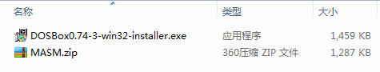
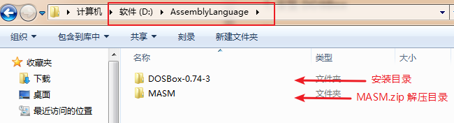
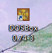
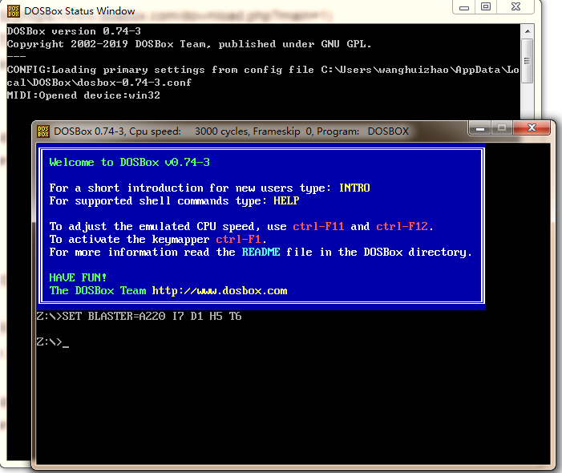
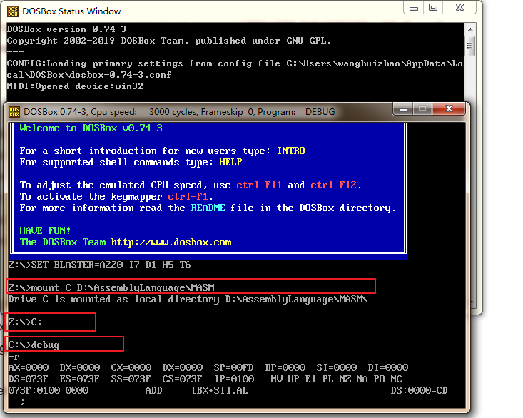

Debug 是 DOS、Windows 都提供的实模式（8086 方式）程序的调试工具。使用它，可以查看 CPU 各种寄存器中的内容、内存的情况和在机器码级跟踪程序的运行。
> 32 位的 Windows 操作系统可以直接通过 cmd命令窗口 输入 debug 就可以调试；
> 64 位的 Windows 操作系统默认不搭载 debug 程序，编写的程序无法用系统自带的虚拟 8086 模式的 DOS 环境调试，因此需要安装额外的软件。

### 1. 软件的下载
#### （1） 下载 DOSBox
[DOSBox 官网下载地址](https://www.dosbox.com/download.php?main=1)
#### （2） 汇编语言学习所需的各种执行文件（debug.exe、link.exe、masm.exe）
>链接：https://pan.baidu.com/s/1j9XSc4L6PCl69kjPX60A5w
>提取码：qb5k




### 2. 软件的安装
#### （1） 安装 DOSBox
> 双击上面下载的 DOSBox0.74-3-win32-installer.exe 文件，注意不要安装在 C 盘，我这边的安装路径是 D 盘
#### （2） 安装 汇编语言学习所需的各种执行文件
> 直接解压 MASM.zip 压缩包，将解压后的 MASM 文件夹跟 “DOSBox 的安装目录” 置于同一目录下




### 3. 启动、配置和运行
#### （1） 启动
双击桌面的 DOSBox 快捷方式，启动 DOSBox

会自动弹出两个窗口（Alt + Enter 可以全屏）


#### （2） 配置
如上图所示，此时为盘符 Z （虚拟磁盘）；首先需要对 debug.exe 文件所在的磁盘（我的 MASM.zip 的解压盘：完整的路径为 D:\AssemblyLanguage\MASM）做一次 mount（挂载）操作，比如我们将其挂载到 DOSbox 的 C 盘：
```
// 挂载的方法：
Z:\>mount C D:\AssemblyLanguage\MASM
// 使用 DOS 命令，进入虚拟盘符 C
Z:\>C:
C:\>
// 启动 debug 调试
C:\>debug
```

#### （3） 运行

