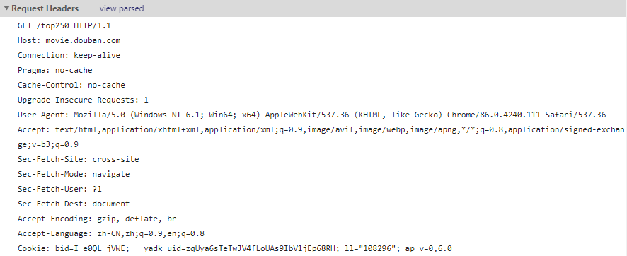

## 1. 问题
使用 python requests 库的 get 方法抓取豆瓣电影top 250，结果返回的是 None，打印状态码看到的是 418
```python
>>> import requests
>>> r = requests.get('https://movie.douban.com/top250')
>>> r.content
b''
>>> r.status_code
418
```
然后在 [HTTP 响应代码](https://developer.mozilla.org/zh-CN/docs/Web/HTTP/Status) 里面查看了下，发现是：
> 418 I'm a teapot
  服务器拒绝尝试用 “茶壶冲泡咖啡”。

## 2. 原因
这应该是豆瓣服务器做了反爬虫措施，拒绝非浏览器的访问，检测到爬虫就返回一个 418 响应。

本质上 **爬虫** 也算是一个客户端，通过发送请求去向服务器请求数据，可能是使用 requests.get 生成的 http request 的 header 过于简短，而不被服务器接收，因此我们模拟浏览器的相关 http 请求的 header 就可以了

>提示：一般的反爬虫机制为：检查请求头的 User-Agent、Referer、Cookies 等

## 3. 解决方案
#### （1） 构造合理的 HTTP 请求头
使用浏览器访问豆瓣电影 top250，然后按 F12 进入浏览器的开发者模式，查看 Requests Headers，将 request headers 中的 User-Agent 字段复制下来（当然，也可以将所有的 headers 信息复制下来）

>步骤： F12 --> NetWork --> F5 刷新页面 --> 查看第一个请求 --> 复制 requests headers



#### （2） 成果
```python
>>> import requests
>>> headers = { 'User-Agent': 'Mozilla/5.0 (Windows NT 6.1; Win64; x64) AppleWebKit/537.36 (KHTML, like Gecko) Chrome/86.0.4240.111 Safari/537.36' }
>>> r = requests.get('https://movie.douban.com/top250', headers=headers)
>>> r.status_code
200
>>> r.content
b'<!DOCTYPE html><html lang="zh-CN" class="ua-windows ua-webkit">......'
```
