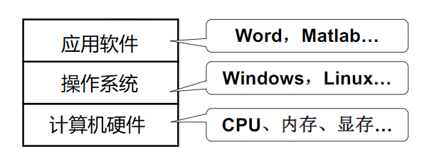
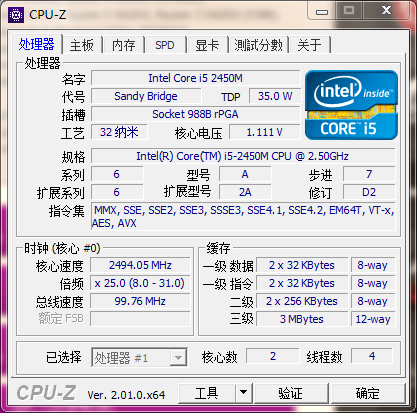

最近正在看《程序是怎样跑起来的》，然后在第七章 “程序是在何种环境中运行的”遇到了一些想不通的问题，经过一番搜索和查阅书籍，终于理解了，这里做一个笔记，方便后面的回顾。

### 1. 前提知识
1. 首先我们要理解“指令集”和“微架构”的概念
详情见我上一篇博客：[指令集和微架构](https://www.cnblogs.com/wanghuizhao/p/16515860.html)

2. 计算机中各个层次的抽象

3. 操作系统 API
操作系统起到对硬件资源的管理的作用，也就是操作系统管理了所有的硬件，然后留出一些接口来（即 API），方便最上层的应用程序调用，也就是说，应用程序想要使用硬件的一些功能，只能通过操作系统提供的 API 来调用。
- 类 Unix 下提供的系统 API 的标准为 POSIX
- Windows 下提供的系统 API 的标准为 Win32

4. 不同的 CPU，所兼容的指令集是不同的

这是我目前使用的一台电脑上的 CPU 信息，可以看到，CPU 兼容了很多指令集，只要编译出的指令包含在这些指令集中，那么程序就可以在当前的 CPU 上运行。

5. 应用程序、操作系统、CPU
- 应用程序和操作系统都是程序，所以需要在 CPU 上运行，它们两经过编译之后，形成的可执行程序所包含的指令，必须是当前 CPU 所支持的，这样才能在当前 CPU 上运行，否则运行的时候会报非法指令的错误。
- 应用程序由操作系统管理，如果想要运行，需要通过操作系统去创建进程，为应用程序分配资源，建立好了相应的运行环境，然后应用程序才能跑起来。
- 如果应用程序想在显示器上显示字符，则需要调用操作系统给定的调用显示器的 API 才能显示，毕竟操作系统全盘接管了硬件，不可能绕过操作系统来调用硬件信息。
- 应用程序真正的运行，还是 CPU 来运行的，操作系统只是提供了一些资源和 API，真正的执行，还得 CPU 来操作。
- 因此通过编译器编译出来的指令，就必须符合当前 CPU 所支持的指令集，如果在编译时选定的指令集不是当前 CPU 所支持的，那么该应用程序在运行的时候，还是会报非法指令的错误的。

### 2. 假设我们现在要让操作系统运行「微信」
1. 双击微信图标
双击图标只是打开方式的一种，还可以用命令行运行
2. 此时操作系统接收到请求之后，就去磁盘上找到「微信」程序的相关信息
检测它的类型是不是可执行文件，同时通过程序首部信息确定代码和数据在可执行文件中的位置并且计算出对应的磁盘块地址。
如果是 txt 文件，则调用其他程序来打开
3. 操作系统做完第 2 步之后，就会创建一个进程，并且将「微信」的可执行文件映射到该进程结构，意思就是，这个进程负责执行「微信」程序。
4. 接下来操作系统会为「微信」程序设置 CPU 上下文环境，此时我们假设这个调度程序选中了「微信」程序，那么操作系统就会跳到程序开始处
5. 接下来执行「微信」程序的第一条指令。

### 3. 总结
1. 操作系统接管了硬件，并提供了硬件操作 如显示器、键盘等硬件的 API，应用程序在操作系统的管理下执行，因此应用程序只能调用 操作系统提供的 API 来操作硬件。当在同一类型的操作系统上，API 不变的情况下，程序也不需要什么变动，如果是从 Windows 换为 Linux 下执行，可能需要改变调用的 API。
2. 应用程序由 CPU 运行，而 CPU 自身有它所支持的指令集，因此应用程序在编译时，需要编译成该 CPU 所支持的指令，才能在这个 CPU 上运行，如果编译的时候指定了某种指令集，而这种指令集也不是当前 CPU 所支持，那么该应用程序在运行时，会有非法指令的报错。
3. 所以说：程序（可执行程序）的运行环境是由操作系统和硬件来决定的。

### 4. 参考
[当双击某程序到它显示运行界面时，操作系统都做了啥？](https://os.51cto.com/article/630455.html)
