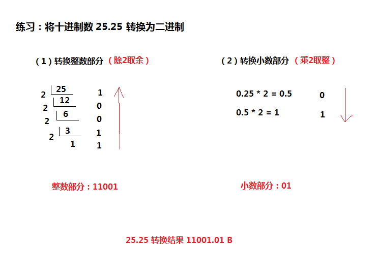

我们人类最习惯的计数制是 **十进制**。
计算机是由具有两种状态的开关器件组成的，因此用 0 和 1 分别可以表示这两种不同的状态，因此计算机最习惯的计数制就是 **二进制**。

### 1. 十进制
>十进制的特点：
>- 以十为底，逢十进一
>- 共有 0~9 是个数字符号，使用 D（decimal）来表示

### 2. 二进制
>二进制的特点：
>- 以 2 为底，逢 2 进 1
>- 只有 0 和 1 两个数字符号，使用 B（Binary）来表示

### 3. 十进制和二进制之间的转换
#### （1） 十进制对二进制的转换：
> 对整数：除 2 取余
> 对小数：乘 2 取整（大约最多乘5次）

#### （2） 二进制对十进制的转换：
> 例：
>   11001.01 B
>= 1x2^4 + 1x2^3 + 0x2^2 + 0x2^1 + 1x2^0 + 0x2^(-1) + 1x2^(-2)
>= 16 + 8 + 0 + 0 + 1 + 0 + 1/4
>= 25.25

#### （3）注意：
像上面 11001.01 B 这样带小数点的表现形式，完全是纸面上的二进制数表现形式，在计算机内部是无法使用的。

实际上，在计算机中，小数点不用专门的器件表示，而是按约定的方式标出，共有两种方法表示小数点的存在，即 定点表示 和 浮点表示。

具体请看 [数的定点表示和浮点表示（包含-IEEE-标准的浮点数在计算机中的表示）](https://www.cnblogs.com/wanghuizhao/p/16307607.html)