在计算机中，小数点不用专门的器件表示，而是按约定的方式标出，共有两种方法表示小数点的存在，即 **定点表示** 和 **浮点表示**。
>定点表示的数称为定点数。
>浮点表示的数称为浮点数。

## 1. 定点表示
小数点固定在某一位置的数为定点数。
计算机中，采用定点数的机器称为定点机。

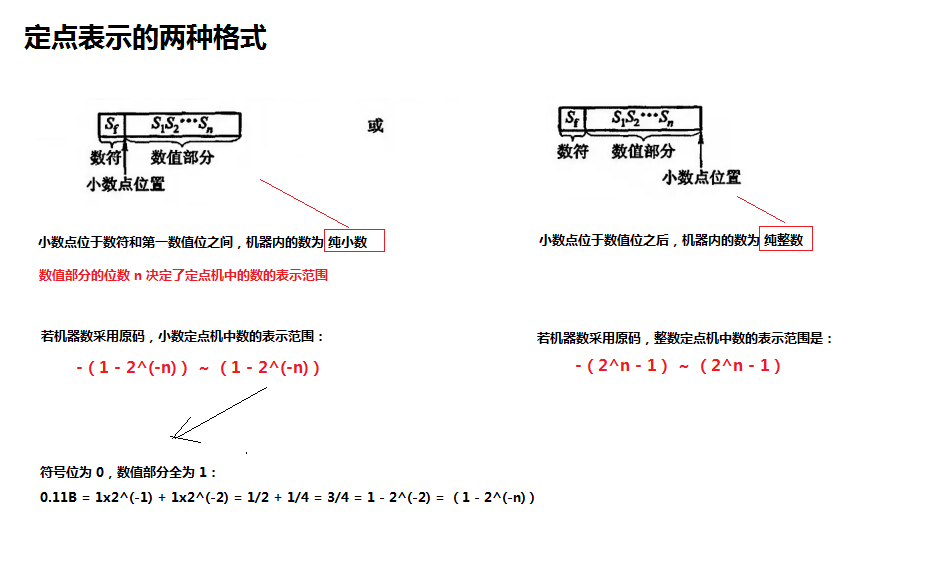


>在定点机中，由于小数点的位置固定不变，故当及其处理的数不是纯小数或纯整数时，必须乘上一个比例因子，否则会产生“溢出”。


## 2. 浮点表示
浮点数即小数点的位置可以浮动的数。
计算机中，采用浮点数的数据格式的机器称为浮点机。
>为什么要引入浮点数表示？
> 1. 计算机处理的数不一定是纯小数或纯整数，比如 圆周率 3.1415926
> 2. 定点数表示的范围太小，如果为了能表示两个大小相差很大的数据，则需要很长的机器字长，就会出现数据存储单元的利用率很低的情况。
例如：电子的质量 9x10^(-28) g，太阳的质量 2x10^33 g，
>--------------------------------------------------------------------------------------------
> 而上面的这些问题均可以用浮点数表示

**1）浮点数的表示形式**
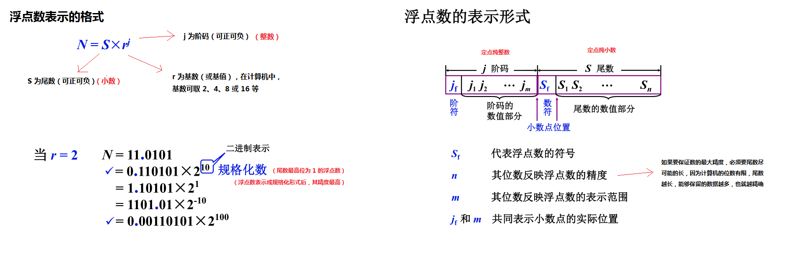

**2）浮点数的表示范围**
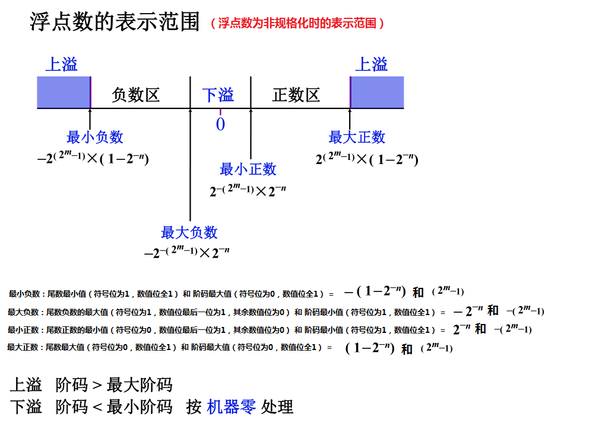

**3）浮点数的规格化形式**
为了提高浮点数的精度，其尾数必须为规格化数。
如果不是规格化数，就要通过修改阶码并同时左右移尾数的办法，使其变成规格化数。
将非规格化数转换成规格化数的过程称为规格化。
> 1. 当基数为 2 时，尾数最高位为 1 的数为规格化数
> - 规格化时，尾数左移 1 位，阶码减 1 （左规，向左规格化）
> - 规格化时，尾数右移 1 位，阶码加 1（右规，向右规格化）
> - 尾数规格化后的浮点数表示范围
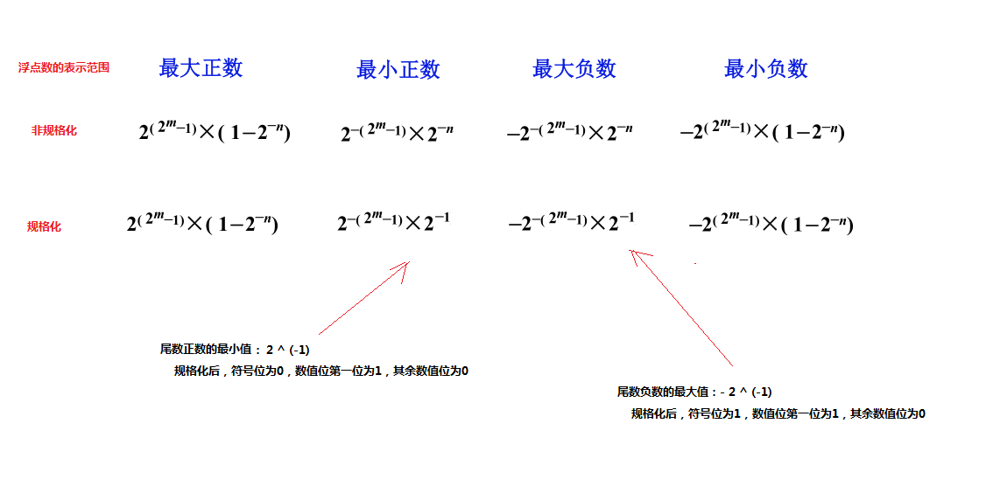
> 2. 当基数为 4 时，尾数最高两位不全为零的数为规格化数
> - 规格化时，尾数左移 2 位，阶码减 1
> - 规格化时，尾数右移 2 位，阶码加 1
> 3. 当基数为 8 时，尾数最高三位不全为零的数为规格化数
> - 规格化时，尾数左移 3 位，阶码减 1
> - 规格化时，尾数右移 3 位，阶码加 1
> 4. 同理类推基数为 16 或 2^n 时的规格化过程

**基数不同，对数的表示范围和精度都有影响**
> 一般来说，基数 r 越大，可表示的浮点数范围越大，而且所表示的数的个数越多，但是精度反而会下降
> 例如： r=16 的浮点数，因其规格化数的尾数最高三位可能出现零，故与其尾数位数相同的 r=2 的浮点数相比，后者可能比前者多三位精度。

**规格化原因**
>对浮点数进行规格化，就是尽可能的保证数据的精度，如果不进行规格化，小数点后面可能会有若干个 0，如果我们用原码表示，那么这些 0 就表示真正的 0，放到计算机当中的话，尾数的长度是有限的，超出给定长度的那部分尾数的值，就要被扔掉，严重影响数据的精度，为了尽可能保证数据的精度，那么我们要让有效的位数尽可能的多，所以我们采用规格化的形式

## 3. 练习
- 求数值在定点机和浮点机中的机器数形式
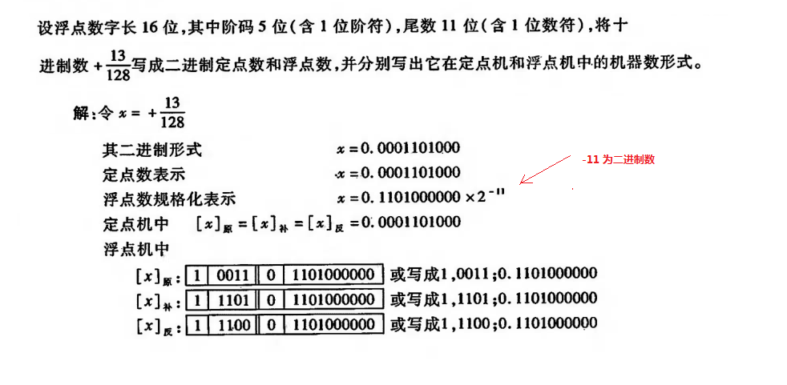

- 根据给定的数，逆推阶码和尾数的位数
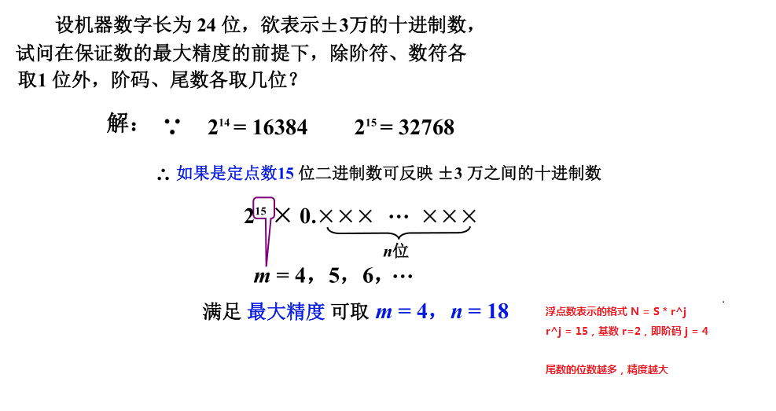

- 求阶码为移码、尾数为补码的形式
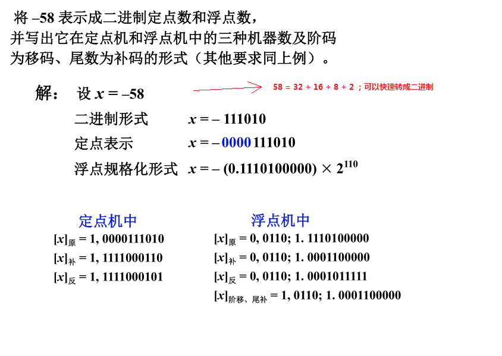


## 4. 机器零
>1. 当浮点数 尾数为 0 时，不论其阶码为何值，按机器零处理
>2. 当浮点数 阶码等于或小于它所表示的最小数 时（补码中最小值为 -2^m），不论尾数为何值，机器都把该浮点数作为零看待，按机器零处理
>- 以上两种情况的示意图**（阶码和尾数都用补码表示的情况）**
>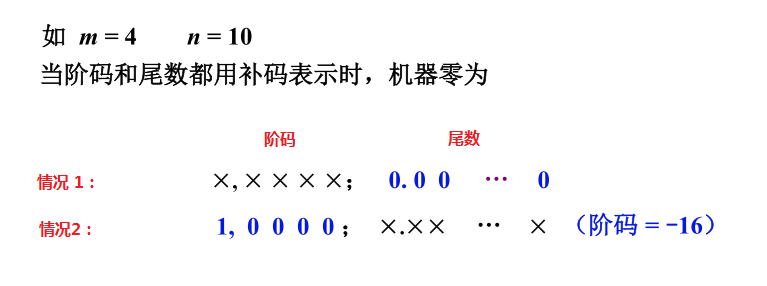
>------------------------------------------------------------------------
>3. 当浮点数的**阶码用移码表示，尾数用补码表示**
> 当阶码为它所能表示的最小值（补码中最小值为 -2^m）且尾数为 0 时，阶码（移码）全为 0，尾数（补码）也全为 0，这样的机器零为全零表示，更有利于简化机器中“判 0”电路
>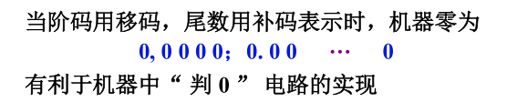

## 5. IEEE 574 标准
现代计算机中，浮点数一般采用 IEEE 指定的国际标准，这种标准形式如下：
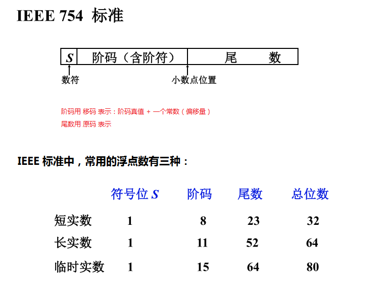

> 1. S 为数符，它表示浮点数的正负，但与其有效位（尾数）是分开的。
> 2. 阶码用**移码**表示：阶码真值 + 一个常数（偏移量）
> 1）短实数的偏移量为（十六进制数表示）：7FH
> 2）长实数的偏移量为（十六进制数表示）：3FFH
> 3）临时实数的偏移量为（十六进制数表示）：3FFFH
> 3. 尾数用**原码**表示，尾数部分通常都是规格化表示，即非“0”的有效位最高位总是“1”；但是在 IEEE 标准中，有效位呈现以下形式：
1）1▲fff······fff     ====>      1 后面的▲为假想的二进制小数点。在实际表示中，对短实数和长实数，这个整数位的 1 是省略的，称为隐藏位；对于临时实数不采用隐藏位方案。
2）非“0”的有效位最高位为“1”（隐含），既然第一位一定是 1（整数位），**那么第一位我们就可以把它隐含，就不在数据当中进行表示了，计算的过程当中，我们再把它补齐就可以了**，这样做的一个好处是实际上增加了尾数的位数，增大了尾数能够表示的精度

#### 5.1） 练习
- 实数 178.125 在计算机中的表示（IEEE 标准）
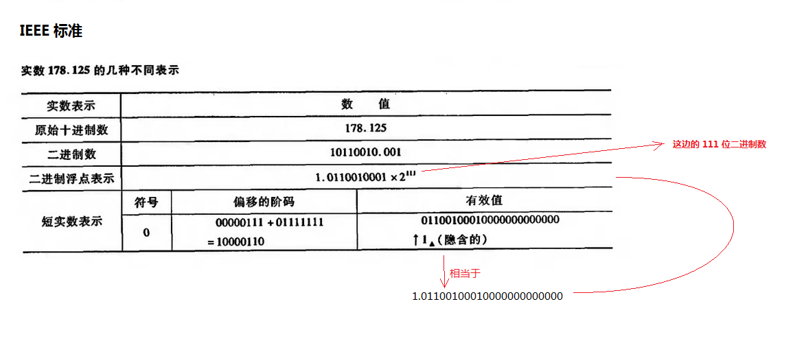


- 实数 1.25 在计算机中的表示（IEEE 标准）（详解）
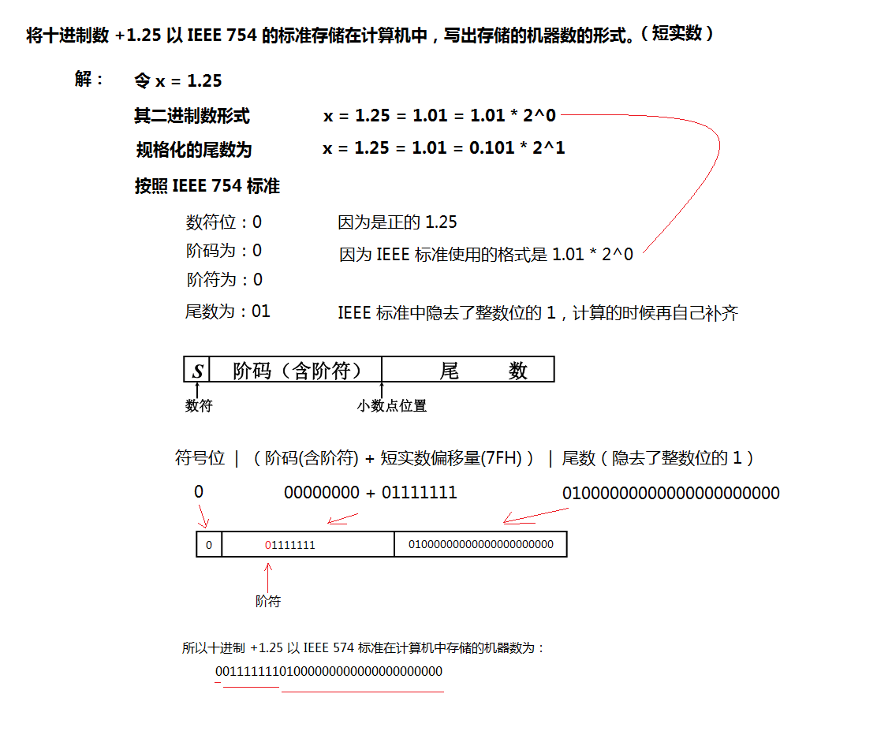


- 从计算机存储的浮点数的机器数逆推出十进制（IEEE 标准）
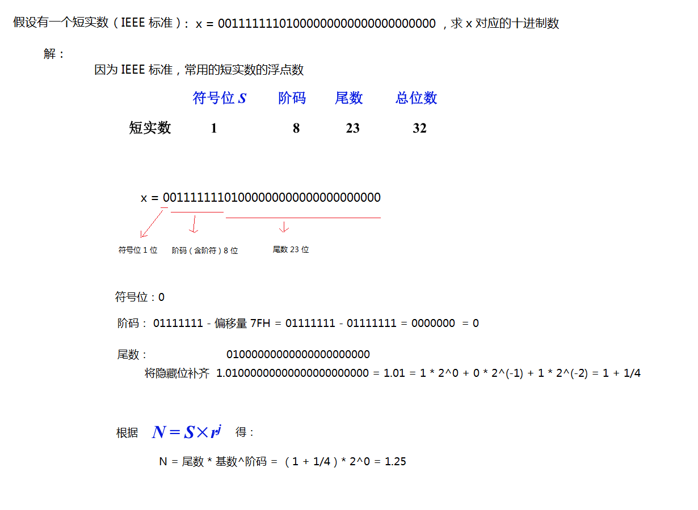


#### 5.2） C语言代码，计算一个 float 类型（32 位，即短实数）在计算机中存储的机器数
```
#include <stdio.h>

void numToBinary(float num) {
	int *p = (int *)&num;

    // printf("%%d = %d\n", *p);
    // printf("%%f = %f\n", *p);

    for (int i = sizeof(int) * 8 - 1; i >= 0; i--) {
        // 将 1 左移，再进行与操作
        int mask = 1 << i;
        if (*p & mask) {
            printf("1");
        } else {
            printf("0");
        }
    }
    printf("\n");
}

int main() {
    printf("1.25 to binary is:\n");
    numToBinary(1.25);
    /*
        结果：
            1.25 to binary is:
            0 01111111 01000000000000000000000
    */

    printf("-1.25 to binary is:\n");
    numToBinary(-1.25);
    /*
        结果：
            -1.25 to binary is:
            1 01111111 01000000000000000000000
    */

    return 0;
}
```
