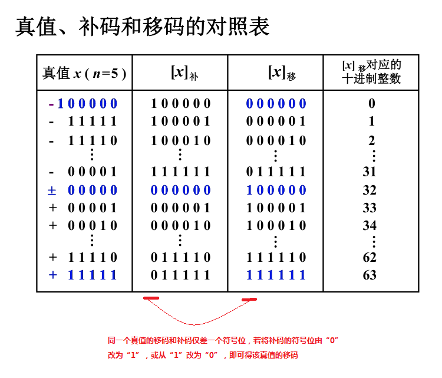

计算机的应用领域极其广泛，但不论其应用在什么地方，信息在机器内部的形式都是一样的，即均为 0 和 1 组成的各种编码。

# 一 概念
在计算机中参与运算的数有两大类：无符号数和有符号数。
## （一） 无符号数
计算机中的数均放在寄存器中，通常称寄存器的位数为机器字长。
所谓无符号数，即没有符号的数，在寄存器中的每一位均可用来存放数值。当存放有符号数时，则需留出位置存放符号。
因此在机器字长相同时，无符号数与有符号数所对应的数值范围是不同的。
>以机器字长为 4 位为例（或假设 一个 int 类型有 4 位）
>0000 ~ 1111
>无符号数的表示范围为：0 ~ 15        （unsigned int）
>有符号数的表示范围为：-8 ~ 7        （int，此值对应补码表示）

## （二） 有符号数
对于有符号数而言，符号的“正”“负”机器是无法识别的，但由于“正”“负”恰好是两种截然不同的状态，如果用 “0” 表示 “正”，用“1”表示“负”，这样符号也被数字化了，并且规定将它放在有效数字的前面，即组成了有符号数。
>还是以机器字长为 4 位为例，以下为 真值 和 机器数 的区别
>+2       （真值）
>0010     （机器数）
>把带“+”或“-”符号的数称为真值，而把符号“数字化”的数称为机器数。

一旦符号数字化后，符号和数值就形成了一种新的编码。在运算过程中，符号位能否和数值部分一起参加运算？如果参加运算，符号位又需作哪些处理？这些问题都与符号位和数值位所构成的编码有关，这些就是原码、反码、补码和移码。

### 1. 原码
原码是机器数中最简单的一种表示形式，符号位为 0 表示正数，符号位为 1 表示负数，数值位即真值的绝对值，故原码表示又称为带符号的绝对值表示。
>7 -----转成原码----> 0111
-7 -----转成原码----> 1111
>最前面的 0 和 1 为符号位，0 表示正数，1 表示负数

### 2. 反码
“反码”通常用来作为 由“原码”求“补码” 或者 由“补码”求“原码” 的中间过渡。

>正数的反码和原码一样
>例如：7
>原码：0111
>反码：0111
---
>负数：原码和反码的转换方法：符号位不变，数值位取反
>例如：-7
>转为二进制原码：1111
>从原码转为反码：1000

### 3. 补码
#### （1） 补数的概念
日常生活中经常会遇到“补数”的概念。例如，时钟指示 6 点，想要使它指示 3 点，既可以按顺时针方向将分针转动 9 圈，又可以按逆时针方向将分针转 3 圈，结果是一致的。
>假设顺时针方向转为正，逆时针方向转为负，那么：
>6 + （- 3） = 3
>6 + （+9）= 15
>由于时针最大指向的值为 12，因此对于超出的值将不被显示而自动丢失，即 15 - 12 = 3，所以 15 点和 3 点均显示 3 点。

这样 -3 和 +9 对时钟而言其作用是一致的。在数学上称 12 为模，写作 mod 12，而 +9 是 -3 以 12 为模的补数
>-3 ≡ +9 （mod 12）
>-4 ≡ +8 （mod 12）
>-5 ≡ +7 （mod 12）
>对于模 12 而言，-3 的补数为 +9、-4 的补数为 +8、-5 的补数为 +7
---
>3 ≡ 3 + 12 ≡ 3 + 24 （mod 12）
>3 ≡ 15 ≡ 27 （mod 12）
>这说明正数相对于 “模”的补数就是正数本身。

可见，只要确定了“模”，就可找到一个与负数等价的正数（该正数即为负数的补数）来代替此负数，这样就可以**把减法运算用加法实现**。

结论：
- 一个负数可用它的正补数来代替，而这个正补数可以用模加上负数本身求得。
- 一个正数和一个负数互为补数时，它们绝对值之和即为模数。
- 正数的补数即该正数本身。

将补数的概念用到计算机中，便出现了补码这种机器数

#### （2） 补码的概述
**为什么有模？因为我们想将减法变成加法操作**
**引入补码的概念是为了消除减法运算，使得减法运算变为加法运算。**

>正数的补码、反码和原码一样
>例如：7
>原码：0111
>反码：0111
>补码：0111
---
>负数：通过原码求补码的转换方法：符号位不变，每个数值位求反，末位加 1（简称：求反加 1）
>例如：-7
>转为二进制原码：1111
>从原码转为反码：1000
>从反码转为补码：1001

#### （3） 补数、补码 示意图

#### （4） 补码的意义（补码的价值）
- 它解决了 0 唯一性的问题（原码和反码都没有解决 0 唯一性问题）
- 使得减法、乘法、除法运算都变成了加法运算，硬件简单了，也更便宜了（人所做的加减乘除，在计算机里只通过 相加和移位 就能解决）

### 4. 以上三种机器数的总结
- **三种机器数的最高位均为符号位**
- **当真值为正时，原码、反码和补码的表示形式均相同，即符号位用“0”表示，数值部分与真值相同。**
- **当真值为负时，原码、反码和补码的表示形式不同，但其符号位都用“1” 表示，而数值部分有这样的关系，即补码是原码的“求反加1”，反码是原码的“每位求反”。**
- 三种机器数的真值范围表（假设机器数字长为 8 位，其中 1 位位符号位）：

### 5. 移码
因为**补码运算时，符号位和数值部分一起参与运算**，人们无法从补码上直观的判断其真值的大小，因此就出现了移码。

>提示：忽略符号位，只计算数值部分，逗号是为了区分符号位和数值部分
>十进制数 x = 21，对应的二进制数为 +10101，则 x的补码 = 0,10101
>十进制数 x = -21，对应的二进制数为 -10101，则 x的补码 = 1,01011
>从上面可以看出 -21 的补码看着比 21 的补码大，但是真实的情况却是相反的，所以才出现了移码
---
> x = 21 = 10101   ---------加上 2^n -------> 10101 + 100000 = 110101
> x = -21 = -10101   ---------加上 2^n -------> -10101 + 100000 = 001011
>通过加上 2^n 后的机器数很容易看出，110101 > 001011 （即移码可以区分机器数的大小）
---
>**1. 移码就是在其真值上加一个常数 2^n（n 为整数的位数）**
>**2. 同一个真值的移码和补码仅差一个符号位，若将补码的符号位由“0”改为“1”，或从“1”改为“0”，即可得该真值的移码**

> 计算真值的移码的方法有两种：
> 1. 根据移码的定义来计算：2^n + x
> 2. 先算得数值的补码，然后将补码的符号位由“0”改为“1”，或从“1”改为“0”，即可得该真值的移码

# 二 练习

