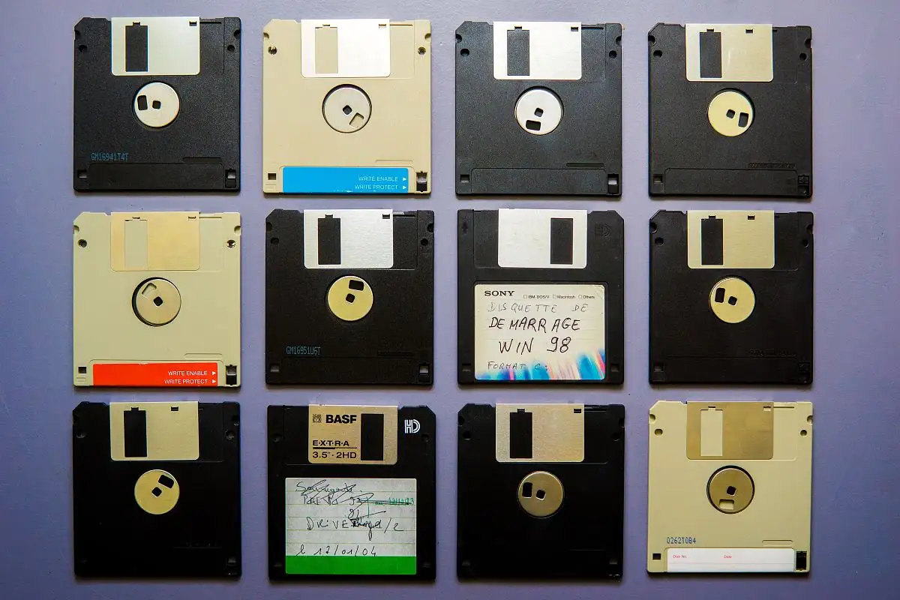
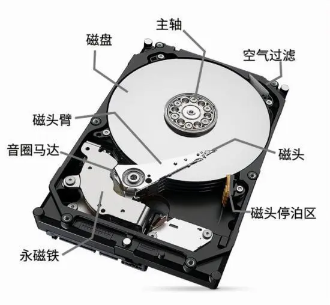
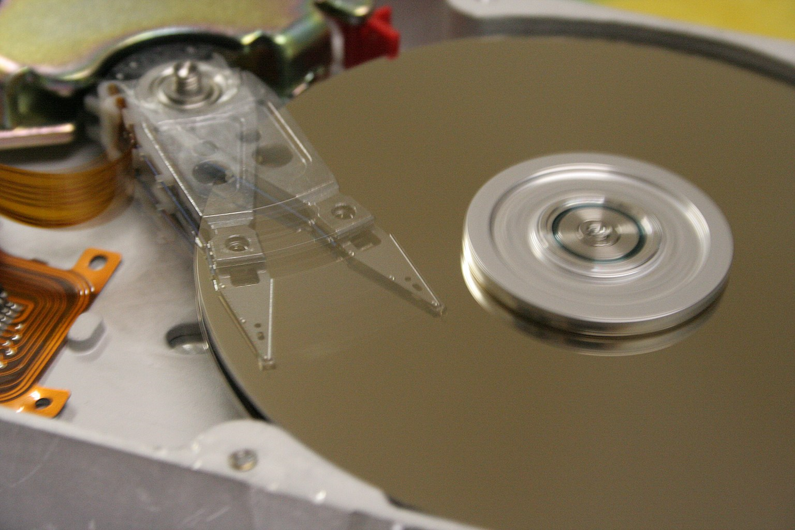
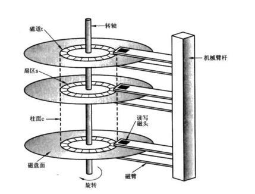
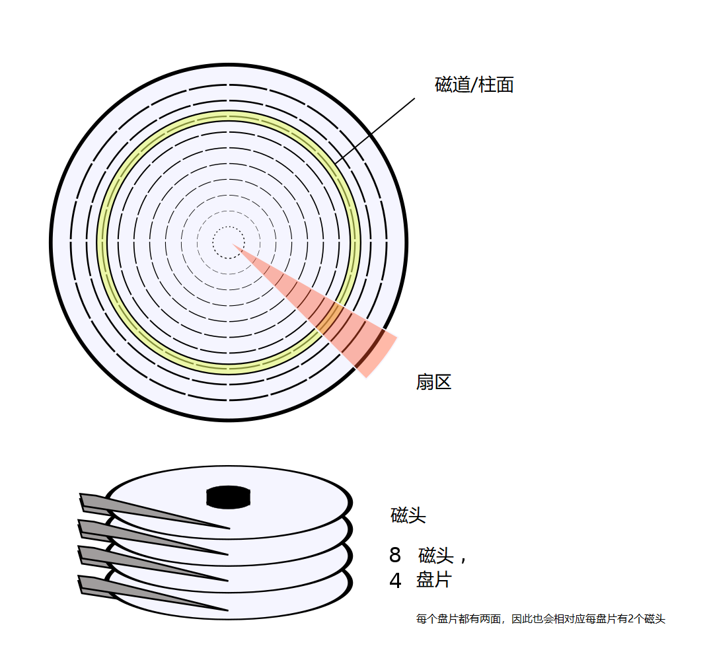
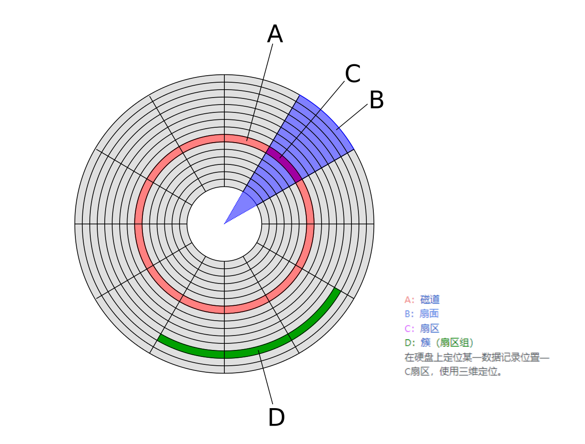
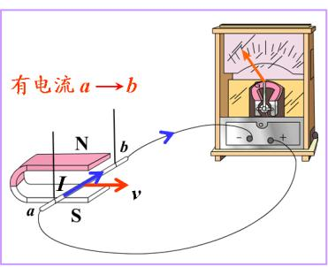
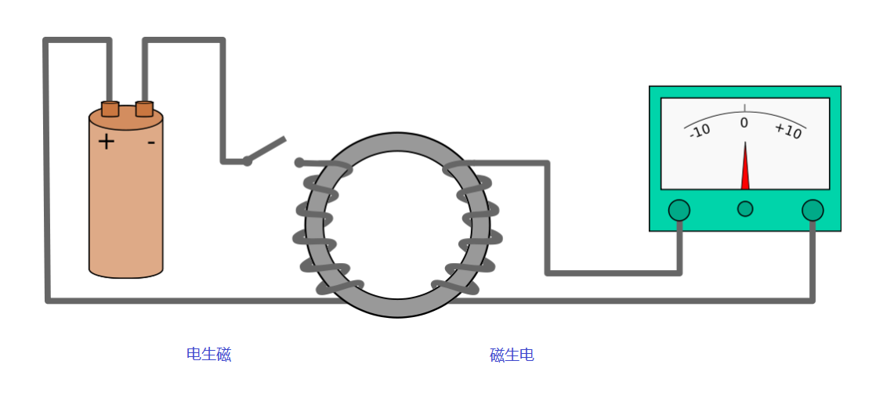

### 1. 什么是磁盘（disk）
磁盘是指利用磁记录技术存储数据的存储器。

### 2. 磁盘的作用和分类
磁盘是计算机主要的存储介质，可以存储大量的二进制数据，并且断电后也能保持数据不丢失。

早期计算机使用的磁盘是软磁盘（Floppy Disk，简称软盘），如今常用的磁盘是硬磁盘（Hard disk，简称硬盘）。

1. 软盘

2. 硬盘

### 3. 硬盘的物理结构
硬盘（英语：Hard Disk Drive，缩写：HDD，有时为了与和固态硬盘区分开，又称为“机械硬盘”）。

硬盘的物理结构一般由磁头与盘片、电动机、主控芯片与排线等部件组成；当主电动机带动盘片旋转时，副电动机带动一组（磁头）到相对应的盘片上并确定读取正面还是反面的盘面，磁头悬浮在盘面上画出一个与盘片同心的圆形轨道（磁轨或称柱面），这时由磁头的磁感线圈感应盘面上的磁性与使用硬盘厂商指定的读取时间或数据间隔定位扇区，从而得到该扇区的数据内容；

封闭的硬盘内部包含若干个磁盘片，磁盘片的每一面都被以转轴为轴心、以一定的磁密度为间隔划分成数量相同的多个磁道，并从外缘“0”开始编号，具有相同编号的磁道形成一个圆柱，即为柱面。而每个磁道又被划分为若干个扇区，每个扇区规定是 512 个字节，因此，通常 硬盘的存储容量 = 盘面数 × 柱面数 × 扇区数 × 512 字节。

### 4. 硬盘的工作原理
硬盘是采用**磁介质**进行数据存储的。在硬盘的盘片表面都涂有磁性介质，这些磁性介质被划分成磁道，在每个磁道上就好像有无数的任意排列的小磁铁，它们分别代表着 0 和 1 的状态。当这些小磁铁受到来自磁头的磁力影响时，其排列的方向会随之改变。利用磁头的磁力控制指定的一些小磁铁的方向，使每个小磁铁都可以用来存储数据。

**信息存储与读取的基本原理**是物理学中的**电磁感应**。奥斯特发现电流通过导体时，导体周围会产生磁场；随后法拉第发现导体的磁通量发生变化时，闭合回路会产生电流。

硬盘是电脑上使用坚硬的旋转盘片为基础的非易失性存储器，它在平整的磁性表面存储和检索数字数据，磁盘片的每个磁盘面都相应有一个磁头。
- **在磁盘写入时**，电流通过磁头而产生的感应磁场将改变磁盘各个区域中组成磁涂层的磁颗粒的磁化方向，数据从而被写入到磁盘上；当给磁头施加不同的电流方向时，使磁盘局部产生不同的磁极，产生的磁极在未受到外部磁场干扰下是不会改变的，这样便将**输入数据时的电信号转化为磁信号**持久化到磁盘上。
- **在磁盘读取时**，磁头就相当于一个探测器，磁头经过盘片的上方时盘片本身的磁场导致读取线圈中电气讯号改变，各个区域中**磁颗粒的不同磁化方向被感应转换成相应的电信号**，电信号的变化进而被表达为 “0” 和 “1”，成为所有数据的原始译码。

通过这种双向的电磁感应作用便完成了磁盘数据的记录和读取。硬盘的读写是采用半随机存取的方式，可以以任意顺序读取硬盘中的资料，但读取不同位置的资料速度不相同。

### 5. 硬盘使用注意事项：
1. 在工作时不能突然关机
当硬盘开始工作时，一般都处于高速旋转之中，如果我们中途突然关闭电源，可能会导致磁头与盘片发生强烈磨擦而损坏硬盘，因此要避免突然关机。
2. 防止灰尘进入
灰尘对硬盘的损害是非常大的，这是因为灰尘长期积累在硬盘的内部电路元器件上，会影响电子元器件的热量散发，使得电路元器件的温度上升，长久下来由于散热功能的破坏，可能会发生漏电或烧坏元件的情况。
3. 要防止温度过高或过低
温度对硬盘的寿命也是有影响的。硬盘工作时会产生一定热量，使用中存在散热问题。温度以 20～25℃ 为宜，过高或过低都会使晶体振荡器的时钟主频发生改变。温度还会造成硬盘电路元器件失灵，磁介质也会因热胀效应而造成记录错误。

### 6. 参考
[一文带你了解硬盘的工作原理，一起来涨知识吧](https://www.xianjichina.com/news/details_254687.html)
[维基百科-硬盘](https://zh.m.wikipedia.org/zh-hans/%E7%A1%AC%E7%9B%98#)