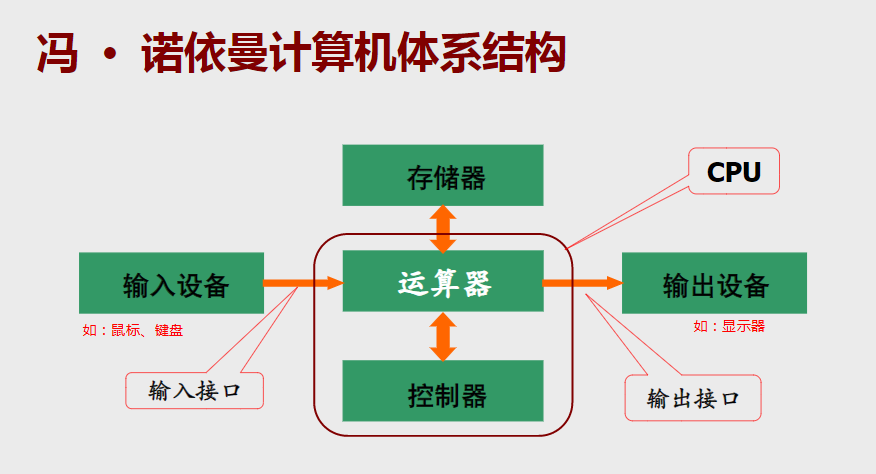

### 1. 硬件上
1. 寄存器、SRAM、DRAM
    a. 寄存器是由触发器组成的
    b. SRAM（静态随机存取存储器-缓存）也是由触发器组成的
    c. DRAM（动态随机存取存储器-内存）是由触发器和电容组成的
    d. 以上三种存储器都是通过存储电荷来代表一个二进制比特（bit）是 1 还是 0，关机后，存储的数据将随着断电而消失。
2. 硬盘
    a. 硬盘是采用磁介质进行数据存储的。在硬盘的盘片表面都涂有磁性介质，这些磁性介质被划分成磁道，在每个磁道上就好像有无数的任意排列的小磁铁，它们分别代表着 0 和 1 的状态。
    b. **在磁盘写入时**，电流通过磁头而产生的感应磁场将改变磁盘各个区域中组成磁涂层的磁颗粒的磁化方向，数据从而被写入到磁盘上；当给磁头施加不同的电流方向时，使磁盘局部产生不同的磁极，产生的磁极在未受到外部磁场干扰下是不会改变的，这样便将输入数据时的电信号转化为磁信号持久化到磁盘上。
    c. **在磁盘读取时**，磁头就相当于一个探测器，磁头经过盘片的上方时盘片本身的磁场导致读取线圈中电气讯号改变，各个区域中磁颗粒的不同磁化方向被感应转换成相应的电信号，电信号的变化进而被表达为 “0” 和 “1”，成为所有数据的原始译码。

通过寄存器、SRAM、DRAM上电荷的有无（电平的高低？）抽象出 0 和 1，以及硬盘上磁颗粒的磁化方向（磁极的方向？）抽象出 0 和 1，我们就可以认为这些存储设备上存储的都是 0 和 1，也就是通常所说的二进制，所以说计算机中存储的是 0 和 1 的二进制数据。


### 2. 软件上
#### （1）计算机所能识别的二进制数串
- 从上面可得知，我们已经从硬件上抽象出来了 0 和 1
- 存储设备中只有 0 和 1 ，按照冯·诺依曼体系结构的特点，**指令**和**数据**以同等地位存于存储器，所以说指令和数据用二进制表示，也就是说 **指令** 和 **数据** 用 0 和 1 来表示。
指令是能被 CPU 所识别的特定一串二进制数，而不能被 CPU 识别的二进制数串，可以被认为是数据
- 计算机最主要的部件是 CPU，不同厂商生产出来的 CPU 所支持的指令集是不一样的
比如：一串二进制数：1010 ，在 Intel 生产的 CPU 中，可能被认为是加法，而在 AMD 生产的 CPU 中可能被认为是减法
- 计算机的工作就是按照一定的顺序，一条条地执行指令（程序 = 指令 + 数据）。
- **狭义上指令集等于机器语言，也可以视为机器语言和硬件功能的对应**
- 关于指令集的博客文章：[指令集和微架构](https://www.cnblogs.com/wanghuizhao/p/16515860.html)

#### （2）编程语言
- 机器语言
a. 机器语言是用二进制代码 0 和 1 来表示的、计算机能直接识别和执行的一种机器指令的集合。它是计算机的设计者通过计算机的硬件结构赋予计算机的操作功能。机器语言具有灵活、直接执行和速度快等特点。不同种类的处理器其机器语言是不相容的，按某种处理器的机器指令编制的程序不能在另一种处理器上执行。
b. 要用机器语言编写程序，编程人员需首先熟记所用计算机的全部指令代码和代码的涵义。手编程序时，程序员要自己处理每条指令和每一数据的存储分配和输入输出，还需记住编程过程中每步所使用的工作单元处在何种状态。这是一件十分繁琐的工作，编写程序花费的时间往往是实际运行时间的几十倍或几百倍。而且，这样编写出的程序完全是0与1的指令代码，可读性差且容易出错。在现今，除了计算机生产厂家的专业人员外，绝大多数程序员已经不再学习机器语言。
- 汇编语言
a. 由于机器语言比较适合硬件来直接执行，不适合人来记忆和书写，因此发明了一种机器语言的助记符来方便人类来记忆和书写，也就汇编语言
b. 汇编指令是机器指令的助记符，同机器指令一一对应，所以人们可以用汇编语言直接控制硬件系统进行工作。汇编指令只是机器指令便于记忆的书写格式。
c. 汇编语言 ----汇编----> 机器语言
d. 机器语言 ----反汇编----> 汇编语言
e. 因为汇编语言只是机器语言的助记符，也就是便于记忆的书写格式，所以汇编语言是和具体的微处理器相联系的，也就是说 Intel 生产的 CPU 所能执行的汇编语言，在 AMD 生产的 CPU 上可能不能执行，因为这两种 CPU 使用的是不同的机器语言，也就是不同的指令集。（每一种微处理器的汇编语言都不一样，每一种 CPU 都有自己的汇编指令集）
- 高级语言
a. 高级编程语言是高度封装了的编程语言，是相对于汇编语言而言的。它是以人类的日常语言为基础的一种编程语言，比较接近自然语言和数学公式的编程语言，基本脱离了机器的硬件系统，用人们更易理解的方式编写程序，但机器是无法直接执行的，需要最终编译链接成二进制的机器代码才可被计算机直接执行。
b. 高级语言并不特指某一种具体编程语言，而是包括很多编程语言在内。如目前流行的 JAVA、C、C++、C#、Pascal、Python、PHP、VC 语言等等

#### （3）编译型语言和解释型语言
- 编译型语言
编译语言是一种编程语言类型，通过编译器来实现。先将代码编译为机器代码，再加以执行。
针对计算机硬件结构而生成的机器语言是无法跨平台运行。
- 解释型语言
解释型语言也是一种编程语言类型。解释型语言需要利用解释器，在执行期，动态将程序码逐句解释为机器码，之后再执行。
还有一种方法，先将源程序编译成字节码（可以理解为一个中间语言），再在运行的时候由运载解释型语言的环境将字节码翻译成机器语言。但这个过程中可以依靠运载环境根据不同的计算机硬件结构生成相应的机器语言，从而具有跨平台的特性。

一般而言，用编译语言写成的程序，在执行期的执行速度，通常比用解释型语言写的程序快。因为程序在编译期，已经被预先编译成机器代码，可以直接执行，不用像解释型语言一样，还要多一道解释程序。

但是要先进行编译，之后才能执行程序，这也造成了编译语言的缺点。一般而言，编译语言的程序开发速度，以及调试时间，都是比较长的。因为它不像解释型语言可以写完一行，或一小段程序之后，马上执行，马上调试。解释型语言通常让程序开发的整体时间变少，在开发过程中，程序师也可以更弹性、快速的测试自己的想法。

为了改善编译语言的效率而发展出的即时编译技术，已经缩小了这两种语言间的差距。这种技术混合了编译语言与解释型语言的优点，它像编译语言一样，先把程序原始码编译成字节码。到执行期时，再将字节码解释，之后执行。Java 与 LLVM 是这种技术的代表产物。

理论上，任何程序语言都可以是编译式，或解释式的。它们之间的区别，仅与程序的应用有关。许多程序语言同时采用编译器与解释器来操作，其中包括 Lisp、Pascal、BASIC 与 Python。JAVA 及 C# 采用混合方式，先将程序码编译为字节码，在执行时再进行解释。


### 3. 题外话（冯·诺依曼体系结构）
1. 冯·诺依曼体系结构
1946年美籍匈牙利科学家冯·诺伊曼提出 存储程序原理，把程序本身当作数据来对待，**程序**和**该程序处理的数据**用同样的方式存储（以二进制的方式存储在计算机中），并确定了存储程序计算机的五大组成部分和基本工作方法。而我们现在的个人计算机，大部分还是属于冯·诺依曼体系结构的。
2. 冯·诺依曼计算机的特点
```
a. 计算机由五大部件组成：运算器、控制器、存储器、输入设备、输出设备
    运算器 ==> 算术运算/逻辑运算
    控制器 ==> 指挥程序运行
    存储器 ==> 存放数据和程序
    输入设备 ==> 将信息转换成机器能识别的形式
    输出设备 ==> 将结果转换成人们熟悉的形式
b. 指令和数据以同等地位存于存储器，可按地址寻访
c. 指令和数据用二进制表示
d. 指令由操作码和地址码组成
e. 存储程序工作原理
f. 以运算器为中心
```


