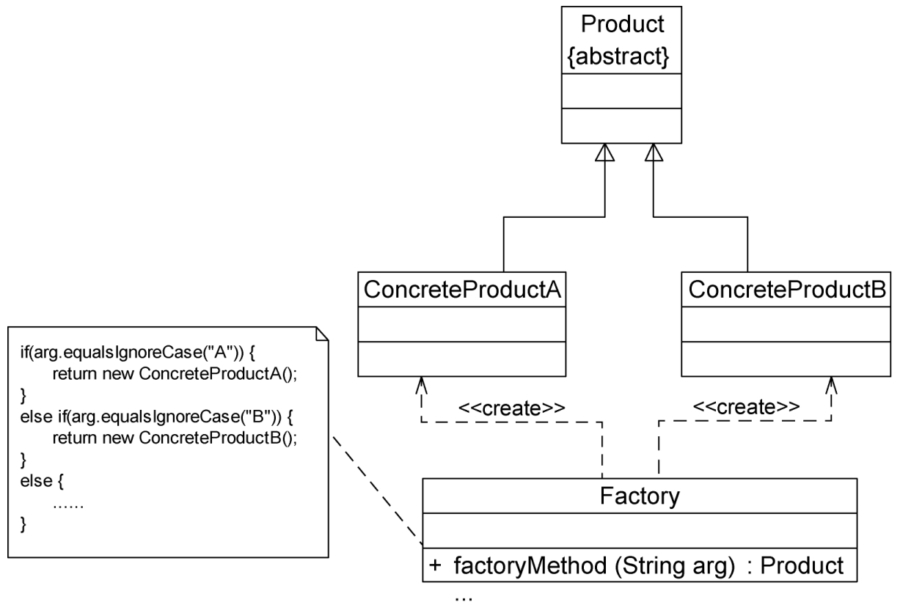
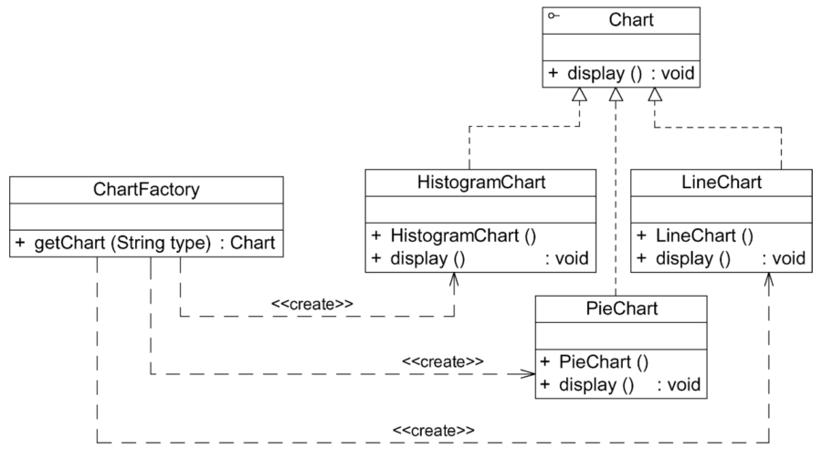
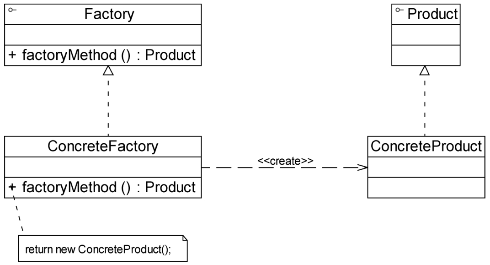
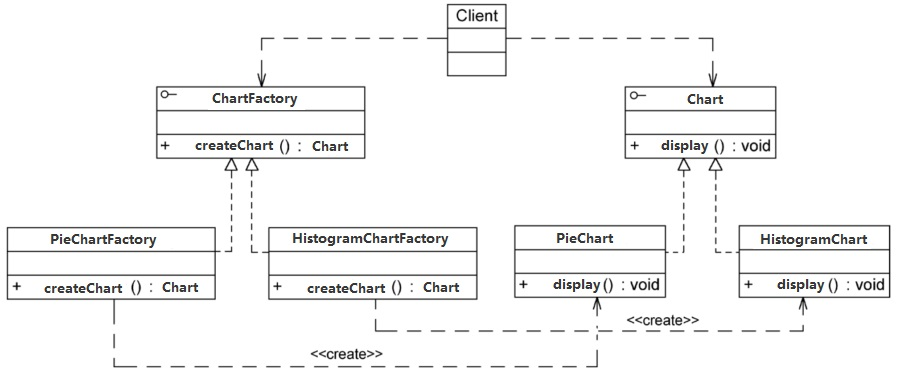

工厂模式是最常用的一类创建型设计模式。创建型模式关注对象的创建过程，是一类最常用的设计模式，在软件开发中应用非常广泛。

创建型模式将对象的创建和使用分离，在使用对象时无须关心对象的创建细节，从而降低系统的耦合度，让设计方案更易于修改和扩展。每个创建型模式都通过采用不同的解决方案来回答3个问题：创建什么（What），由谁创建（Who）和何时创建（When）。

## （一） 传统类代码的编写方案
### 1. 示例代码
```java
class Chart {
    private String type;    // 图表类型

    public Chart(Object[][] data, String type) {
        this.type = type;

        if (type.equalsIgnoreCase("histogram")) {
            // 初始化柱状图
        } else if (type.equalsIgnoreCase("pie")) {
            // 初始化饼状图
        } else if (type.equalsIgnoreCase("line")) {
            // 初始化折线图
        }
    }

    public void display() {
        if (this.type.equalsIgnoreCase("histogram")) {
            // 显示柱状图
        } else if (this.type.equalsIgnoreCase("pie")) {
            // 显示化饼状图
        } else if (this.type.equalsIgnoreCase("line")) {
            // 显示化折线图
        }
    }
}

// 客户端代码
class Client {
    public static void main(String args[]) {
        Chart chart = new Chart("histogram");  // 通过工厂类创建产品对象
        chart.display()
    }
}
```

客户端代码通过调用 Chart 类的构造函数来创建图表对象，根据参数 type 的不同可以得到不同类型的图表，然后再调用 display() 方法来显示相应的图表。

### 2. 存在的问题
Chart 类是一个“巨大的”类，在该类的设计中存在以下几个问题：
1. 在 Chart 类中包含很多 if…else… 代码块，整个类的代码相当冗长，代码越长，阅读难度、维护难度和测试难度也越大
2. Chart 类的职责过重，它负责初始化和显示所有的图表对象，将各种图表对象的初始化代码和显示代码集中在一个类中实现，违反了单一职责原则，不利于类的重用和维护；而且将大量的对象初始化代码都写在构造函数中将导致构造函数非常庞大，对象在创建时需要进行条件判断，降低了对象创建的效率。
3. 当需要增加新类型的图表时，必须修改 Chart 类的源代码，违反了开闭原则。
4. 客户端只能通过 new 关键字来直接创建 Chart 对象，Chart 类与客户端类耦合度较高，对象的创建和使用无法分离。


## （二） 简单工厂模式
### 1. 简介
简单工厂模式是工厂方法模式的“小弟”，它不属于 GoF 23 种设计模式，但在软件开发中应用也较为频繁，通常将它作为学习其他工厂模式的入门。

### 2. 定义
简单工厂模式：定义一个工厂类，它可以根据参数的不同返回不同类的实例，被创建的实例通常都具有共同的父类。因为在简单工厂模式中用于创建实例的方法是静态方法，因此简单工厂模式又被称为静态工厂方法模式，它属于类创建型模式。

### 3. 简单工厂模式结构图


简单工厂模式包含 3 个角色：
（1）Factory（工厂角色）：即工厂类，它是简单工厂模式的核心，负责实现创建所有产品实例的内部逻辑。工厂类可以被外界直接调用，创建所需的产品对象。在工厂类中提供了静态的工厂方法factoryMethod()，它的返回类型为抽象产品类型Product。
（2）Product（抽象产品角色）：它是工厂类所创建的所有对象的父类，封装了各种产品对象的公有方法。抽象产品的引入将提高系统的灵活性，使得在工厂类中只需定义一个通用的工厂方法，因为所有创建的具体产品对象都是其子类对象。
（3）ConcreteProduct（具体产品角色）：它是简单工厂模式的创建目标，所有被创建的对象都充当这个角色的某个具体类的实例。每个具体产品角色都继承了抽象产品角色，需要实现在抽象产品中声明的抽象方法。


### 4. 示例代码
将 Chart 类的职责分离，同时将 Chart 对象的创建和使用分离

```java
/*
简单工厂模式包含 3 个角色：
    Chart （抽象产品角色）
    HistogramChart （具体产品角色）
    ChartFactory （工厂角色）
*/


// 抽象图表接口：抽象产品类
interface Chart {
    public void display();
}

// 柱状图类：具体产品类
class HistogramChart implements Chart {
    public HistogramChart() {
        System.out.println("创建柱状图！");
    }

    public void display() {
        System.out.println("显示柱状图！");
    }
}

// 饼状图类：具体产品类
class PieChart implements Chart {
    public PieChart() {
        System.out.println("创建饼状图！");
    }

    public void display() {
        System.out.println("显示饼状图！");
    }
}

// 折线图类：具体产品类
class LineChart implements Chart {
    public LineChart() {
        System.out.println("创建折线图！");
    }

    public void display() {
        System.out.println("显示折线图！");
    }
}

// 图表工厂类：工厂类
class ChartFactory {
    // 静态工厂方法
    public static Chart getChart(String type) {
        Chart chart = null;

        if (type.equalsIgnoreCase("histogram")) {
            chart = new HistogramChart()
            System.out.println("初始化设置柱状图！");
        } else if (type.equalsIgnoreCase("pie")) {
            chart = new PieChart()
            System.out.println("初始化设置饼状图！");
        } else if (type.equalsIgnoreCase("line")) {
            chart = new LineChart()
            System.out.println("初始化设置折线图！");
        }

        return chart;
    }
}

// 客户端代码
class Client {
    public static void main(String args[]) {
        Chart chart = ChartFactory.getChart("histogram");  // 通过静态工厂方法创建产品
        chart.display();
    }
}
```

在客户端测试类中，使用工厂类的静态工厂方法创建产品对象。如果需要更换产品，只需修改静态工厂方法中的参数即可，例如将柱状图改为饼状图，只需将代码 ```Chart chart = ChartFactory.getChart("histogram");``` 更换为 ```Chart chart = ChartFactory.getChart("pie");```

### 5. 使用简单工厂模式设计的图表库的结构图


### 6. 方案改进
在创建具体 Chart 对象时，每更换一个 Chart 对象都需要修改客户端代码中静态工厂方法的参数，客户端代码将要重新编译，这对于客户端而言，违反了开闭原则（对扩展开放，对修改关闭）。

```java
/*
改进方案：
    可以将静态工厂方法的参数存储在 XML 或 properties 格式的配置文件中，然后动态的从配置文件中读取，
    如果需要更换具体图表对象，只需修改配置文件，无须修改任何源代码，符合开闭原则。
*/


// 抽象图表接口：抽象产品类
interface Chart {
    public void display();
}

// 柱状图类：具体产品类
class HistogramChart implements Chart {
    public HistogramChart() {
        System.out.println("创建柱状图！");
    }

    public void display() {
        System.out.println("显示柱状图！");
    }
}

// 饼状图类：具体产品类
class PieChart implements Chart {
    public PieChart() {
        System.out.println("创建饼状图！");
    }

    public void display() {
        System.out.println("显示饼状图！");
    }
}

// 折线图类：具体产品类
class LineChart implements Chart {
    public LineChart() {
        System.out.println("创建折线图！");
    }

    public void display() {
        System.out.println("显示折线图！");
    }
}

// 图表工厂类：工厂类
class ChartFactory {
    // 静态工厂方法
    public static Chart getChart(String type) {
        Chart chart = null;

        if (type.equalsIgnoreCase("histogram")) {
            chart = new HistogramChart()
            System.out.println("初始化设置柱状图！");
        } else if (type.equalsIgnoreCase("pie")) {
            chart = new PieChart()
            System.out.println("初始化设置饼状图！");
        } else if (type.equalsIgnoreCase("line")) {
            chart = new LineChart()
            System.out.println("初始化设置折线图！");
        }

        return chart;
    }
}

public class XMLUtil {
    // 该方法用于从配置文件中提取图标类型，并返回类型名
    public static String getChartType() {
        try {
            // TODO
            // 从配置文件中获取图表类型
        } catch(Exception e) {
            return null;
        }
    }
}

// 客户端代码
class Client {
    public static void main(String args[]) {
        String type = XMLUtil.getChartType();        // 读取配置文件中的参数
        Chart chart = ChartFactory.getChart(type);        // 通过静态工厂方法创建产品
        chart.display();
    }
}

```

### 7. 简单工厂模式总结
简单工厂模式的要点在于：当你需要什么，只需要向工厂类传入一个正确的参数，就可以获取你所需要的对象，而无须知道其创建细节。

#### （1） 简单工厂模式的主要优点
1. 工厂类包含必要的判断逻辑，可以决定在什么时候创建哪一个产品类的实例。客户端可以免除直接创建产品对象的职责，而仅仅“消费”产品。简单工厂模式实现了对象创建和使用的分离。
2. 客户端无须知道所创建的具体产品类的类名，只需要知道具体产品类所对应的参数即可。对于一些复杂的类名，通过简单工厂模式可以在一定程度减少使用者的记忆量。
3. 通过引入配置文件，可以在不修改任何客户端代码的情况下更换和增加新的具体产品类，在一定程度上提高了系统的灵活性。

#### （2） 简单工厂模式的主要缺点
1. 由于工厂类集中了所有产品的创建逻辑，职责过重，一旦不能正常工作，整个系统都要受到影响。
2. 使用简单工厂模式势必会增加系统中类的个数（引入了新的工厂类），增加了系统的复杂度和理解难度。
3. 系统扩展困难。一旦添加新产品就不得不修改工厂逻辑，在产品类型较多时，有可能造成工厂逻辑过于复杂，不利于系统的扩展和维护。
4. 简单工厂模式由于使用了静态工厂方法，造成工厂角色无法形成基于继承的等级结构。

#### （3） 适用场景
1. 工厂类负责创建的对象比较少。由于创建的对象较少，不会造成工厂方法中的业务逻辑太过复杂。
2. 客户端只知道传入工厂类的参数，对于如何创建对象并不关心。


## （三） 工厂方法模式
简单工厂模式虽然简单，但存在一个很严重的问题：当系统中需要引入新产品时，由于静态工厂方法通过所传入参数的不同来创建不同的产品，这必定要修改工厂类的源代码，将违背开闭原则。如何实现增加新产品而不影响已有代码？工厂方法模式为此应运而生。

在工厂方法模式中，**不再提供一个统一的工厂类来创建所有的产品对象，而是针对不同的产品提供不同的工厂**，系统提供一个与产品等级结构对应的工厂等级结构。

### 1. 简介
工厂模式是最常用的一类创建型设计模式。通常所说的工厂模式是指工厂方法模式，它也是使用频率最高的工厂模式。

### 2. 定义
工厂方法模式：定义一个用于创建对象的接口，让子类决定将哪一个类实例化。工厂方法模式让一个类的实例化延迟到其子类。工厂方法模式又简称为工厂模式（Factory Pattern），又可称作虚拟构造器模式或多态工厂模式。工厂方法模式是一种类创建型模式。

### 3. 工厂方法模式结构图


在工厂方法模式结构图中包含以下 4 个角色：
1. Product（抽象产品角色）：它是定义产品的接口，是工厂方法模式所创建对象的超类型，也就是产品对象的公共父类。
2. ConcreteProduct（具体产品角色）：它实现了抽象产品接口，某种类型的具体产品由专门的具体工厂创建，具体工厂和具体产品之间一一对应。
3. Factory（抽象工厂角色）：在抽象工厂类中，声明了工厂方法（Factory Method），用于返回一个产品。抽象工厂是工厂方法模式的核心，所有创建对象的工厂类都必须实现该接口。
4. ConcreteFactory（具体工厂角色）：它是抽象工厂类的子类，实现了抽象工厂中定义的工厂方法，并可由客户端调用，返回一个具体产品类的实例。


与**简单工厂模式**相比，**工厂方法模式**最重要的区别是引入了**抽象工厂角色**。

### 4. 示例代码

```java
/*
工厂方法模式又简称为工厂模式（Factory Pattern）
工厂模式包含 4 个角色：
Factory（抽象工厂角色）
ConcreteFactory（具体工厂角色）
Product（抽象产品角色）
ConcreteProduct（具体产品角色）
*/


// 图表接口：抽象产品
interface Chart {
    public void display();
}

// 柱状图：具体产品类
class HistogramChart implements Chart {
    public HistogramChart() {
        System.out.println("创建柱状图！");
    }

    public void display() {
        System.out.println("显示柱状图！");
    }
}

// 饼状图：具体产品类
class PieChart implements Chart {
    public PieChart() {
        System.out.println("创建饼状图！");
    }

    public void display() {
        System.out.println("显示饼状图！");
    }
}

// 图表工厂接口：抽象工厂
interface ChartFactory {
    public Chart createChart();
}

// 图表柱状图工厂类：具体工厂
class HistogramChartFactory implements ChartFactory {
    public Chart createChart() {
        // 创建柱状图对象
        Chart chart = new HistogramChart();

        return chart;
    }
}

// 图表饼状图工厂类：具体工厂
class PieChartFactory implements ChartFactory {
    public Chart createChart() {
        // 创建饼状图对象
        Chart chart = new PieChart();

        return chart;
    }
}

// 客户端测试代码
class Client {
    public static void main(String args[]) {
        ChartFactory factory = new HistogramChartFactory();      // 可引入配置文件实现
        Chart chart = factory.createChart();
        chart.display();
    }
}
```

### 5. 使用工厂方法模式设计的图表库的结构图



### 6. 方案改进
使用配置文件来存储具体图表工厂类类名，这样就不再直接使用 new 关键字来创建具体的工厂类，具体的步骤为：
1. 使用配置文件存储具体图表工厂类类名
2. 新增一个类用来读取配置文件中存储的类名
3. 通过类名生成实例对象并将其返回
4. 编译新增的具体图表类和具体图表工厂类，运行客户端测试类即可使用新的图表，而原有类库代码无须做任何修改，完全符合开闭原则

```java
/*
工厂方法模式又简称为工厂模式（Factory Pattern）
工厂模式包含 4 个角色：
Factory（抽象工厂角色）
ConcreteFactory（具体工厂角色）
Product（抽象产品角色）
ConcreteProduct（具体产品角色）
*/

// 图表接口：抽象产品
interface Chart {
    public void display();
}

// 柱状图：具体产品类
class HistogramChart implements Chart {
    public HistogramChart() {
        System.out.println("创建柱状图！");
    }

    public void display() {
        System.out.println("显示柱状图！");
    }
}

// 饼状图：具体产品类
class PieChart implements Chart {
    public PieChart() {
        System.out.println("创建饼状图！");
    }

    public void display() {
        System.out.println("显示饼状图！");
    }
}

// 图表工厂接口：抽象工厂
interface ChartFactory {
    public Chart createChart();
}

// 图表柱状图工厂类：具体工厂
class HistogramChartFactory implements ChartFactory {
    public Chart createChart() {
        // 创建柱状图对象
        Chart chart = new HistogramChart();

        return chart;
    }
}

// 图表饼状图工厂类：具体工厂
class PieChartFactory implements ChartFactory {
    public Chart createChart() {
        // 创建饼状图对象
        Chart chart = new PieChart();

        return chart;
    }
}

public class XMLUtil {
    // 该方法用于从配置文件中提取具体工厂类类名，并返回一个实例对象
    public static Object getBean() {
        try {
            // TODO
            // 从配置文件中获取具体工厂类类名
            // 通过类名生成实例对象，然后将其返回
        } catch(Exception e) {
            return null;
        }
    }
}

// 客户端测试代码
class Client {
    public static void main(String args[]) {
        // 有了 XMLUtil 类后，可以对图表库的客户端代码进行修改，不再直接使用new关键字来创建具体的工厂类，
        // 而是将具体工厂类的类名存储在XML文件中，再通过XMLUtil类的静态工厂方法getBean()方法进行对象的实例化。
        ChartFactory factory = (ChartFactory) XMLUtil.getBean()      // getBean() 的返回类型为 Object，需要进行强制类型转换
        Chart chart = factory.createChart();
        chart.display();
    }
}
```

### 7. 工厂方法模式总结
工厂方法模式是简单工厂模式的延伸，它继承了简单工厂模式的优点，同时还弥补了简单工厂模式的不足。工厂方法模式是使用频率最高的设计模式之一，是很多开源框架和 API 类库的核心模式。

#### （1） 工厂方法模式的主要优点
1. 在工厂方法模式中，工厂方法用来创建客户所需要的产品，同时还向客户隐藏了哪种具体产品类将被实例化这一细节。用户只需要关心所需产品对应的工厂，无须关心创建细节，甚至无须知道具体产品类的类名。
2. 基于工厂角色和产品角色的多态性设计是工厂方法模式的关键。它能够让工厂可以自主确定创建何种产品对象，而如何创建这个对象的细节则完全封装在具体工厂内部。工厂方法模式之所以又被称为多态工厂模式，正是因为所有的具体工厂类都具有同一抽象父类。
3. 使用工厂方法模式的另一个优点是在系统中加入新产品时，无须修改抽象工厂和抽象产品提供的接口，无须修改客户端，也无须修改其他的具体工厂和具体产品，而只要添加一个具体工厂和具体产品就可以了。这样，系统的可扩展性也就变得非常好，完全符合开闭原则。

#### （2） 工厂方法模式的主要缺点
1. 在添加新产品时，需要编写新的具体产品类，而且还要提供与之对应的具体工厂类，系统中类的个数将成对增加，在一定程度上增加了系统的复杂度，有更多的类需要编译和运行，会给系统带来一些额外的开销。
2. 由于考虑到系统的可扩展性，需要引入抽象层，在客户端代码中均使用抽象层进行定义，增加了系统的抽象性和理解难度，且在实现时可能需要用到DOM、反射等技术，增加了系统的实现难度。

#### （3） 适用场景
1. 客户端不知道其所需要的对象的类。在工厂方法模式中，客户端不需要知道具体产品类的类名，只需要知道所对应的工厂即可，具体的产品对象由具体工厂类创建，可将具体工厂类的类名存储在配置文件或数据库中。
2. 抽象工厂类通过其子类来指定创建哪个对象。在工厂方法模式中，抽象工厂类只需要提供一个创建产品的接口，而由其子类来确定具体要创建的对象，利用面向对象的多态性和里氏代换原则，在程序运行时，子类对象将覆盖父类对象，从而使得系统更容易扩展。


## （四） 参考
[《设计模式的艺术 : 一本实例驱动的设计模式实践指南》](https://book.douban.com/subject/35163478/)
这本书写得非常好，深入浅出，有原理讲解和实际代码参考，博客中的内容大部分都学习自这本书。